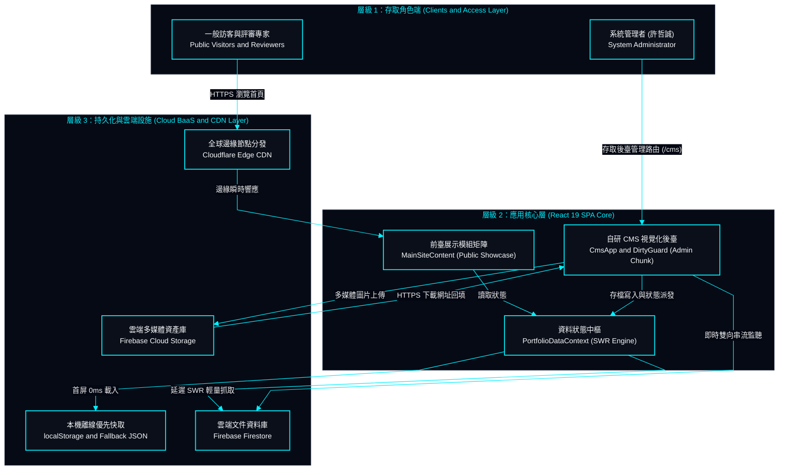
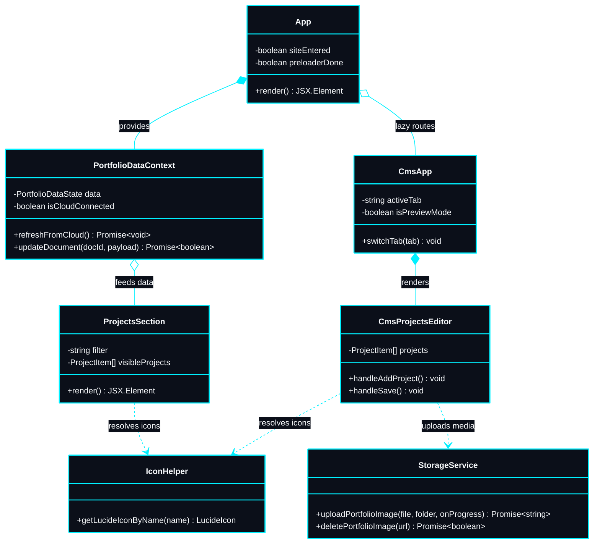
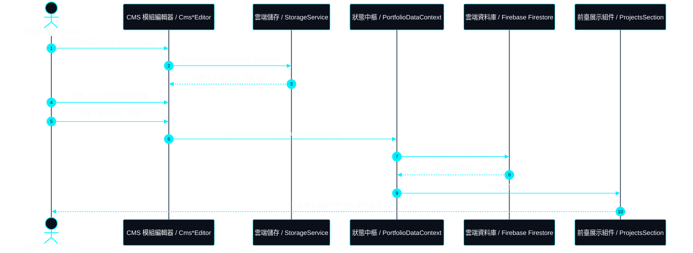

# My-Portfolio-Website + CMS (個人作品集網站含內容管理系統)

> 採用 React 19、TypeScript、Vite 與 Tailwind CSS 建置，融合賽博龐克戰術 HUD 設計體系之企業級高效能作品集與自研視覺化內容管理系統（CMS）。  
> *An enterprise-grade, high-performance web portfolio and proprietary visual CMS engineered with React 19, TypeScript, Vite, and Tailwind CSS under a Tactical Cyberpunk HUD design system.*

---

## 1. 專案願景與核心價值 | Project Overview

本系統為一套企業級單頁應用程式（SPA），兼具沉浸式互動作品展示與自主研發之視覺化內容管理系統（CMS）。全站部署於 Cloudflare 全球 Anycast 邊緣網絡，將高階網頁軟體工程與獨特之賽博龐克戰術 HUD 美學深度融合，實現極致首屏載入效能與零版面位移。  
*This application is an enterprise-grade Single Page Application (SPA) designed to serve as both an immersive interactive portfolio and an in-house visual Content Management System (CMS). Deployed on Cloudflare global Anycast edge network, the system combines high-performance web engineering with a unique Tactical Cyberpunk HUD aesthetic, delivering sub-second load times and zero layout shift.*

> [!NOTE]
> **核心架構亮點 | Core Architecture Highlights**:
> - **100% 靜態預編譯 SPA** 依託 Cloudflare 全球邊緣快取，首屏渲染嚴格壓制於 `< 600ms`。
> - **前後臺代碼物理隔離**：自研視覺化 CMS 獨立封裝於 `chunk-cms.js`，前臺一般訪客零負擔（僅 ~19 kB 入口核心）。
> - **雙軌資料持久化架構**：離線優先快取（Offline-First SWR）結合 Firebase Firestore 雲端資料庫與 Firebase Storage 官方多媒體存儲中心。
> - **無障礙雙主題標準**：深淺雙模式全面符合 `WCAG 2.2 AAA/AA` 高對比標準（深色對比度 18.7:1，淺色對比度 17.9:1）。

- **專案作者資訊 (Author Profile)**：許哲誠 (HSU, CHE-CHENG)，新媒體藝術碩士，專注於互動應用開發、全端系統工程與多媒體美學實踐。
- **高效能邊緣架構 (High-Performance Edge Architecture)**：依託 Cloudflare Anycast 全球邊緣節點極速分發，具備零冷啟動延遲與零伺服器維護成本。
- **自研視覺化後臺 (Proprietary Visual CMS)**：自主研發全功能內容管理後臺，涵蓋首頁、全域設定、簡歷、技能、專案、證照、經歷與畫廊八大模組，免除手動修改 JSON 代碼。
- **雲端資產管線 (Cloud Media Pipeline)**：全面接入 Firebase Cloud Storage 官方儲存庫，支援多媒體檔案非同步上傳、進度百分比即時監控與安全持久化。
- **細粒度顯示開關 (Fine-Grained Visibility Toggles)**：全站各模組之專案、卡片、技能分類與行動按鈕皆具備嚴密之 `visible` 雙向綁定與跨語系同步。

---

## 2. 系統架構與工程模型 | Architecture Design

本系統遵循嚴格之單一職責原則 (SRP) 與高內聚低耦合標準，將資料模型契約、全域狀態 Context、展示組件、CI/CD 自動化管線與後端雲端持久化層進行物理隔離。  
*The application adheres to strict Single Responsibility and High Cohesion / Low Coupling principles, isolating data schemas, state management contexts, presentation components, CI/CD pipelines, and backend cloud services.*

### 2.1 C4 容器級架構模型 | C4 Model Architecture

本系統之 C4 容器模型清晰定義了訪客端、管理者端、前端單頁應用程式、本機快取與 Firebase 雲端設施之間的資料交互拓撲。  
*The C4 Container Diagram defines the communication topology across public visitors, administrators, the React SPA runtime, local caches, and Firebase cloud services.*



### 2.2 核心架構 UML 類別關聯圖 | Core UML Class Diagram

本類別圖展示展示層、狀態協調層、儲存層與雲端配接模組之間的物件模型與實作契約。  
*This class diagram illustrates the object model and implementation contracts between the presentation layer, context coordinators, storage services, and cloud adapters.*



### 2.3 雙向即時熱更新與持久化循序圖 | Hot Sync Sequence Diagram

本循序圖展示管理者在視覺化 CMS 進行欄位修改、上傳圖片並存檔時，資料如何同步至 Firebase 雲端與前臺展示層。  
*This sequence diagram illustrates how modifications, cloud media uploads, and save operations in the CMS propagate to Firebase and reflect on public showcase views.*



---

## 3. 技術棧選型矩陣 | Technology Stack

全系統技術選型均依據嚴謹之工程權衡矩陣制定，涵蓋視圖層、建置系統、狀態管理、雲端 BaaS 與 CI/CD 自動化運維。  
*The architectural stack is determined based on strict engineering trade-offs spanning the presentation layer, build toolchains, BaaS infrastructure, and CI/CD pipelines.*

| 架構維度 (Tier) | 選用技術與版本 (Technology and Version) | 選型理由與工程考量 (Architectural Rationale) |
| :--- | :--- | :--- |
| **前端視圖框架 (UI Framework)** | **React 19 (19.2+)** | 宣告式組件架構、全新並發渲染管線、精準虛擬 DOM 比較與高效能 Transitions。 |
| **前端開發語言 (Language)** | **TypeScript 5.8+** | 強型別靜態安全檢查、嚴格介面契約保證、杜絕 `any` 侵蝕與編譯期防禦。 |
| **建置與模組引擎 (Build Engine)** | **Vite 8+ (Vite 8.1)** | 次秒級熱模組替換 (HMR)、智慧代碼分塊 (Chunk Splitting) 與現代瀏覽器原生 ES Modules 分發。 |
| **設計體系樣式 (Styling)** | **Tailwind CSS 4 + CSS3** | 最新原子化樣式編譯器，結合自研 Cyber HUD 戰術變數體系與全裝置自適應排版。 |
| **雲端文件資料庫 (Database)** | **Firebase Firestore (v12)** | 無伺服器 NoSQL 集合，支援離線優先 SWR 快取機制與後臺雙向即時監聽。 |
| **雲端多媒體儲存 (Media Storage)** | **Firebase Cloud Storage (v12)** | 高可靠度物件存儲，支援二進位檔案串流上傳、自訂快取控制與全域 CDN 下載。 |
| **安全身分驗證 (Auth BaaS)** | **Firebase Authentication** | 官方高強度管理員身分鑑別，徹底杜絕模擬放行與旁路存取漏洞。 |
| **邊緣部署分發 (Edge CDN)** | **Cloudflare Pages and Workers** | 全球 300+ Anycast 邊緣節點極速分發，首屏 TTFB 壓制於次秒級，無限頻寬防禦。 |
| **品質檢驗閘門 (Quality Gate)** | **oxlint + tsc** | Rust 原生極速語法檢查與靜態型別編譯校驗，確保全代碼庫 0 錯誤與高標準風格一致性。 |

---

## 4. 系統功能與專案作品深度矩陣 | System Specifications & Projects Matrix

本章節詳盡展示全站八大功能模組之設計規格，並深度公開 14 項代表性專案作品之完整架構、實作亮點、得獎紀錄與展示連結。  
*This section provides complete technical specifications for all 8 core modules and an exhaustive technical showcase for all 14 landmark projects.*

### 4.1 專案作品矩陣 (Projects Showcase Matrix)

作品集涵蓋「互動應用與遊戲引擎」以及「現代全端與雲端架構」兩大核心技術主軸，所有作品均具備扎實的軟體工程架構與跨領域實踐。  
*The portfolio spans Interactive Applications and Modern Fullstack Architecture with rigorous software engineering implementations.*

#### 互動應用與遊戲引擎作品 (Interactive & Game Engineering)

1. **覺醒協議 (Awakening Protocol)**
   - **專案定位**：基於皮亞傑認知發展理論設計之 VR 哲學解謎遊戲。體驗者化身虛擬生命體 12T06，經歷感知探索、符號表徵至抽象推理之意識覺醒歷程。
   - **核心技術棧**：`Unity (C#)`、`XR Interaction Toolkit`、`Universal Render Pipeline (URP)`、`DOTween Pro`、`Timeline`、`Blender`、`DeepVoice Pro`、`Suno AI`。
   - **架構與實作亮點**：
     - **事件驅動架構 (EDA)**：採用事件委派機制整合 Singleton、Observer 與 Registry 設計模式，徹底解耦 UI、空間音訊、物理機關與動畫狀態組件。
     - **6-DoF 物理互動與關卡狀態機**：基於 XR Interaction Toolkit 實作手部控制器 6 自由度抓取與物理回饋；獨立編寫音階序列觸發、代數算式驗證與迷宮動態路徑演算法。
     - **自訂著色器與 URP 管線**：採用 UV 頂點對齊色票技術，手寫 Hard Edge Outline 拓撲線條著色器插件，實現極簡賽博龐克幾何美學。
     - **AIGC 聲場演算**：結合 DeepVoice Pro 語音合成與 Suno AI 音訊演算，建構沉浸式 3D 空間音效。
   - **獲獎殊榮**：國立臺灣藝術大學設計學院多媒體動畫藝術學系 114 學年度畢業創作影片補助。
   - **相關連結**：[YouTube 完整示範影片](https://www.youtube.com/watch?v=b7NXCFqxN38) ｜ [GitHub 原始碼倉儲](https://github.com/EricXJason/awakening-protocol)

2. **滅境之星 (Planet of Extinction)**
   - **專案定位**：基於 Unreal Engine 5 開發之 3D 多人合作第一人稱射擊 (FPS) 遊戲。玩家需於限時內協同作戰抵抗敵群並採集星球能源。
   - **核心技術棧**：`Unreal Engine 5`、`Gameplay Blueprints`、`Behavior Tree`、`AIPerception`、`Blender`、`Substance Painter`。
   - **架構與實作亮點**：
     - **全藍圖核心狀態機**：獨立建構玩家第一人稱控制器、射擊彈道運算、關卡狀態機切換與 HUD 即時戰況儀表板。
     - **進階 AI 戰術感知**：整合 Behavior Tree 與 AIPerception 系統，實作群體巡邏、視野感知追擊、動態包圍圍剿與受傷逃脫之行為樹邏輯。
     - **地形拓撲與資產效能調校**：負責巨型星際地表 Landscape 編輯、3D 戰術槍械建模、材質貼圖烘焙與 LOD 引擎效能最佳化。
   - **獲獎殊榮**：
     - **第一名**：2022 全國大專及高中職學生專題製作競賽成果展示
     - **佳作**：2022 Unreal Engine 5 臺灣遊戲創意設計大賽
     - **初選入圍**：2023 放視大賞遊戲組
   - **相關連結**：[YouTube 展示影片](https://www.youtube.com/watch?v=amEg9Cjix10) ｜ [GitHub 原始碼倉儲](https://github.com/EricXJason/planet-of-extinction)

3. **節奏同奏 (RhythmSync)**
   - **專案定位**：灰階懷舊賽博風格之 2D 音效同步動作跑酷遊戲。以即時音訊頻譜動態驅動視覺特效、鏡頭運動與關卡節奏。
   - **核心技術棧**：`Unity (C#)`、`Cinemachine`、`Web Audio / Spectrum Analysis`、`DOTween`。
   - **架構與實作亮點**：
     - **即時頻譜解析與映射**：調用 `AudioSource.GetSpectrumData` 演算法解析即時音訊頻譜，將特定低音與高音頻段動態映射至場景物件震幅、背景形變與粒子特效。
     - **Cinemachine 程序化動態運鏡**：結合節奏打擊點即時觸發鏡頭震動 (Camera Shake) 與動態追焦軌跡。
     - **全域狀態單例架構**：以 Singleton 模式管理全域音訊狀態機與關卡流程。
   - **相關連結**：[YouTube 示範影片](https://www.youtube.com/watch?v=0h3oy0Y8f0o) ｜ [GitHub 原始碼倉儲](https://github.com/EricXJason/rhythm-sync)

4. **社影流光 (Temporal Shrine)**
   - **專案定位**：結合 AR 空間感測技術之新竹神社歷史文化導覽互動遊戲，透過虛實疊加探索歷史場景與互動解謎。
   - **核心技術棧**：`Unity (C#)`、`Vuforia SDK`、`Timeline`、`3D Modeling`。
   - **架構與實作亮點**：
     - **AR 圖像識別與空間定位**：整合 Vuforia SDK 實作高精度特徵點識別與空間座標定位，處理虛擬神社會堂與實體古蹟之無縫疊加。
     - **多鏡頭 Timeline 過場編排**：運用 Timeline 系統精確調度過場動畫、解鎖成就音效與答題測驗狀態機。
   - **相關連結**：[YouTube 示範影片](https://www.youtube.com/watch?v=VR360ch3UmI)

5. **環保投籃王 (EcoHoops)**
   - **專案定位**：結合物理投擲與環保分類教育之兒童 VR 沉浸式體驗遊戲，於虛擬體育館中進行垃圾辨識投擲訓練。
   - **核心技術棧**：`Unity (C#)`、`Meta Quest SDK`、`PhysX 物理引擎`。
   - **架構與實作亮點**：
     - **VR 物理手勢追蹤**：運用 Meta Quest SDK 實作控制器手勢抓取與投擲拋物線軌跡模擬，處理實體碰撞反饋。
     - **計分與關卡流程控管**：採用狀態機管理計時倒數、連擊加分演算法與垃圾分類統計。
   - **相關連結**：[YouTube 示範影片](https://www.youtube.com/watch?v=O-GtG-Gwb78)

6. **飛機檢修行動學習平臺 (Aircraft Maintenance Action Learning Platform)**
   - **專案定位**：空中巴士 A330 客機檢修訓練之跨平臺行動學習系統，以煞車器拆解與安裝模擬為核心教案。
   - **核心技術棧**：`Unity (C#)`、`UGUI`、`Photoshop`、`Illustrator`。
   - **架構與實作亮點**：
     - **專業航空介面視覺系統**：獨立設計全套高精度航空機械介面、戰術 HUD 指示標誌與步驟指南。
     - **UGUI 檢修狀態機**：以有限狀態機 (FSM) 嚴格管控 20+ 步驟拆解與組裝防呆流程，具備即時錯誤校驗與計時。
   - **獲獎殊榮**：**銀賞**（2021 第四屆臺灣數位媒體設計獎 - 大專組互動科技應用）。
   - **相關連結**：[YouTube 示範影片](https://www.youtube.com/watch?v=bY66zTSSS6Y)

7. **小王子帶你去旅行 (Traveling with The Little Prince)**
   - **專案定位**：情境教學與語言學習之 VTuber 虛擬角色直播互動與簡報展演系統 (VAILSS)。
   - **核心技術棧**：`Unity (C#)`、`Blender`、`Substance Painter`、`Premiere`。
   - **架構與實作亮點**：
     - **3D 角色與場景資產建置**：獨立製作高面數童話角色與場景模型，進行拓撲減面與引擎效能最佳化。
     - **動態導覽與展演影像**：編排即時動作捕捉導覽流程，製作展演影像與虛擬分身直播互動。
   - **獲獎殊榮**：**決賽入圍**（2023 通訊大賽聯網未來挑戰賽）。
   - **相關連結**：[YouTube 示範影片](https://www.youtube.com/watch?v=dQw4w9WgXcQ)

---

#### 現代全端與雲端架構作品 (Fullstack & Cloud Architecture)

8. **個人作品集網站含視覺化 CMS (My Portfolio Website + CMS)**
   - **專案定位**：本專案本體。採用 React 19 與 TypeScript 打造之賽博龐克 HUD 全端作品集網站與自研模組化 CMS 內容管理後臺。
   - **核心技術棧**：`React 19`、`TypeScript`、`Tailwind CSS 4`、`Vite 8`、`Firebase Firestore`、`Firebase Cloud Storage`、`Firebase Auth`、`Cloudflare Pages`、`Canvas API`。
   - **架構與實作亮點**：
     - **自研模組化視覺 CMS 後臺**：獨立開發涵蓋首頁、全域設定、簡歷、技能、專案、證照、經歷與畫廊八大模組之視覺管理後臺，實作未存檔智慧阻斷防護（Unsaved State Guard）。
     - **前後臺物理代碼隔離**：前臺一般訪客首屏入口壓制至 ~19 kB，CMS 後臺代碼完全隔離至獨立分塊 `chunk-cms.js`。
     - **離線優先 SWR 與雲端多媒體管線**：前臺 0ms 靜態快取優先，後臺啟用 Firestore 雙向即時同步與 Firebase Cloud Storage 官方圖片非同步上傳。
     - **賽博龐克 HUD 與無障礙標準**：深淺雙主題完全符合 WCAG 2.2 AAA/AA 標準，整合 Canvas 粒子流動網絡、發光自訂游標與 Web Audio 合成音效。
   - **相關連結**：[線上正式站點](https://my-portfolio-website.user46972.workers.dev/) ｜ [視覺化後臺管理入口](https://my-portfolio-website.user46972.workers.dev/cms) ｜ [GitHub 原始碼倉儲](https://github.com/EricXJason/my-portfolio-website)

9. **動態問卷系統 (SurveyFlow Dynamic Survey Engine)**
   - **專案定位**：企業級動態問卷引擎，實作宣告式動態表單驗證、非同步資料串流處理、多階題型渲染與即時問卷分析儀表板。
   - **核心技術棧**：`Angular`、`TypeScript`、`RxJS`、`Tailwind CSS`、`RESTful API`、`Node.js`。
   - **架構與實作亮點**：
     - **動態響應式表單與狀態串流**：運用 Angular Reactive Forms 與 RxJS 操作符實作條件題型跳轉邏輯與即時表單校驗。
     - **模組化題型體系**：獨立元件架構支援單複選、多階量表、文字填答與作答進度快照。
     - **DTO 傳輸合約與離線暫存**：設計強型別 API 合約，結合非同步 HttpClient 與自動快照機制。
   - **相關連結**：[線上演示系統](https://survey-flow.pages.dev/) ｜ [管理員儀表板](https://survey-flow.pages.dev/admin) ｜ [GitHub 原始碼倉儲](https://github.com/EricXJason/survey-flow)

10. **雲端電商平臺 (Cloud E-Commerce Platform)**
    - **專案定位**：現代無伺服器架構打造之全端電商平臺，具備即時庫存快取、購物車持久化、模擬安全金流與銷售指標分析。
    - **核心技術棧**：`React`、`TypeScript`、`Node.js`、`Express`、`PostgreSQL`、`Tailwind CSS`。
    - **架構與實作亮點**：
      - **購物車全域狀態中樞**：採用雙軌同步機制實現毫秒級購物車計算、優惠券折抵與併發防禦。
      - **資料庫設計與交易隔離**：設計高內聚 RESTful 端點與關聯式 Schema，落實 ACID 交易隔離防超賣機制。
      - **海量商品虛擬列表**：實作虛擬列表渲染海量商品資料，搭配即時多條件模糊搜尋演算法。
    - **相關連結**：[線上演示平臺](https://cloud-ecommerce.pages.dev/) ｜ [管理後臺入口](https://cloud-ecommerce.pages.dev/admin) ｜ [GitHub 原始碼倉儲](https://github.com/EricXJason/cloud-ecommerce)

11. **臺灣天氣預報網站 (Taiwan Weather Forecast Website)**
    - **專案定位**：即時氣象觀測與氣候資訊視覺化平臺（規劃與開發中）。
    - **核心技術棧**：`React`、`TypeScript`、`Open Weather API`、`Tailwind CSS`。

12. **電影收藏網站 (Movie Collection Website)**
    - **專案定位**：個人化電影收藏、評分推薦與清單管理平臺（規劃與開發中）。
    - **核心技術棧**：`React`、`TypeScript`、`TMDB API`、`Tailwind CSS`。

13. **餐廳點餐網站 (Restaurant Ordering Website)**
    - **專案定位**：桌邊掃碼點餐、即時廚房出餐狀態更新與營業額統計系統（規劃與開發中）。
    - **核心技術棧**：`React`、`TypeScript`、`WebSocket`、`Tailwind CSS`。

14. **銀行網站 (Banking System Website)**
    - **專案定位**：模擬現代金融體系之虛擬銀行帳戶管理、轉帳交易與收支分析系統（規劃與開發中）。
    - **核心技術棧**：`React`、`TypeScript`、`RESTful API`、`Tailwind CSS`。

---

### 4.2 自研視覺化後臺系統 (In-House Visual CMS)

自研 CMS 針對創作者與工程師進行深度定制，結合資安防護、直覺拖曳與雲端多媒體串接。  
*The in-house visual CMS is designed with robust security, drag-and-drop mechanics, and cloud media integrations.*

- **零代碼全視覺化編輯 (Zero-Code Content Management)**：八大模組全部採用視覺化表單控制，免除直接改動原始 JSON 代碼之風險。
- **Firebase Storage 圖片上傳器 (Cloud Image Picker)**：整合上傳進度百分比、霓虹 HUD 狀態指示、貼上 URL 模式與清除確認彈窗。
- **全模組細粒度 visible 綁定 (Full-Section Visibility Toggles)**：每個專案、每張指標卡片、技能分類皆具備獨立顯示開關，且跨語系狀態自動同步。
- **雙軌排序支援 (Dual Reordering Controls)**：支援直覺滑鼠拖曳握把 (Grip) 與微調箭頭按鈕 (`↑` / `↓`)。
- **未存檔智慧防護 (Unsaved State Guard)**：欄位異動自動點亮戰術紅點並鎖定未存狀態，導航時彈出二階防護視窗。

---

## 5. 目錄結構拓撲 | Directory Topology

本專案遵循現代 Web 前端工程標準命名慣例（一般檔案與目錄採用 `kebab-case`、React 元件採用 `PascalCase.tsx`）。  
*The repository follows standard frontend conventions: `kebab-case` for general files/directories, `PascalCase.tsx` for React components.*

```text
my-portfolio-website/
├── docs/                      # 全域系統設計文檔庫 (SSOT)
│   └── system-design/         # 系統分析規格清單 (遵循 AGENTS.md 條款 3.2 拓撲)
│       ├── 01-overview.md     # 系統願景與 C4 容器架構模型
│       ├── 02-tech-stack.md   # 技術棧選型矩陣與依賴庫理由
│       ├── 03-architecture.md # 代碼庫結構與 DDD 模組依賴拓撲
│       ├── 04-specs-frontend.md # 前端展示模組與 CMS 編輯器合約
│       ├── 05-specs-database.md # Firestore 集合 ERD 與 SWR 快取策略
│       ├── 06-flowcharts.md   # 核心操作流程圖與狀態轉移
│       ├── 07-uml-diagrams.md # Mermaid UML 類別圖與循序圖
│       ├── 08-ui-ux-standards.md # Cyber HUD 設計體系與 WCAG 無障礙標準
│       └── 09-devops-deployment.md # 邊緣運算部署與 CI/CD 管線
├── public/                    # 靜態公開資產與 SEO 規範檔案
│   ├── assets/                # 本地壓縮 WebP 圖片與多媒體
│   ├── favicon.svg            # 向量網站圖標
│   ├── llms.txt               # AI 爬蟲標準規格檔
│   └── sitemap.xml            # 搜尋引擎檢索地圖
├── src/
│   ├── cms/                   # 自研 CMS 視覺化後臺 (獨立代碼分割 chunk-cms)
│   │   ├── components/        # 各模組專屬編輯器 (Projects, Skills, About 等)
│   │   ├── context/           # 表單異動防護 (CmsDirtyContext)
│   │   └── CmsApp.tsx         # CMS 管理後臺主入口
│   ├── components/            # 前臺展示核心組件 (PascalCase.tsx)
│   ├── context/               # 全域狀態上下文 (PortfolioDataContext, LangContext, ThemeContext)
│   ├── data/                  # 靜態結構化 JSON 資料庫基準 (備援降級)
│   ├── hooks/                 # 可複用 React 自定義 Hooks (滾動浮現、捲動指示)
│   ├── services/              # 雲端與外部服務層 (firebase.ts, storageService.ts, portfolioDataService.ts)
│   ├── types/                 # 全域型別契約 (portfolio.ts)
│   ├── utils/                 # 圖示解析 (iconHelper.ts)、音訊合成與格式化工具
│   ├── App.tsx                # 路由分流與開場生命週期協調者
│   ├── index.css              # Cyber HUD 戰術美學變數與全域動效
│   └── main.tsx               # 客戶端 DOM 渲染入口
├── CHANGELOG.md               # 唯一全域修訂歷程紀錄 (SSOT)
├── package.json               # 專案依賴宣告與建置指令
├── tsconfig.json              # TypeScript 嚴格編譯設定
├── vite.config.js             # Vite 8 建置與代碼物理分塊策略
└── wrangler.json              # Cloudflare Workers 邊緣部署設定
```

---

## 6. 本地開發與建置指引 | Build & Run Setup

所有開發與建置步驟均依循現代前端標準流程執行。  
*Development and production build workflows adhere to modern frontend best practices:*

### 前置環境要求 | Prerequisites
- **Node.js**：v18.0.0 或更高版本 (v18.0.0 or higher)
- **套件管理工具 (Package Manager)**：**`pnpm`**（強制規範標準 / Mandatory standard）

```bash
# 1. 複製儲存庫並進入專案目錄 (Clone repository and enter directory)
git clone git@github.com:EricXJason/my-portfolio-website.git
cd my-portfolio-website

# 2. 透過 pnpm 安裝純淨相依套件 (Install dependencies cleanly via pnpm)
pnpm install

# 3. 啟動本地開發伺服器，具備次秒級極速 HMR (Start dev server with instant HMR)
pnpm run dev

# 4. 執行 TypeScript 靜態型別安全檢查 (Execute static typecheck - 0 Errors)
pnpm exec tsc --noEmit

# 5. 執行 oxlint 語法與代碼風格檢查 (Execute code linting)
pnpm run lint

# 6. 編譯生產環境最佳化 Bundle (Build production bundle)
pnpm run build
```

---

## 7. 工程品質與效能指標 | Engineering Metrics

所有效能參數、代碼分塊尺寸與無障礙標準均經由客觀自動化建置與標準稽核工具驗證。  
*All performance parameters, bundle chunks, and accessibility compliance are verified through objective automated audits:*

- **型別安全與編譯驗證 (0 Type Errors)**：經 `tsc --noEmit` 嚴格校驗保證編譯期 0 型別錯誤；打包構建於次秒級內完成，0 錯誤。
- **物理代碼分割基準 (Strict Physical Chunk Splitting)**：
  - **首屏進入核心 (Public Entry Core)**：`index.js` 僅 **19.3 kB** (gzip ~6.5 kB)，`index.css` ~120 kB (gzip ~19.8 kB)。
  - **前臺展示主視圖 (Showcase Bundle)**：`MainSiteContent.js` 僅 **68.9 kB** (gzip ~16.6 kB)。
  - **後臺管理獨立分塊 (Isolated Admin Chunk)**：`chunk-cms.js` (~1,026 kB) 透過 `React.lazy` 動態延遲加載，前臺一般訪客 0 負擔。
- **Lighthouse 全向指標最佳化 (Lighthouse All-Green Standards)**：
  - **Accessibility (無障礙)**：**100 滿分**
  - **Best Practices (最佳實踐)**：**100 滿分**
  - **SEO (搜尋引擎最佳化)**：**100 滿分**
  - **Performance (效能)**：首屏 FCP `< 0.6s`、LCP `< 0.8s`、TBT `0ms`、CLS `0`。
- **WCAG 2.2 色彩對比度客觀驗證 (WCAG 2.2 Contrast)**：
  - **深色模式 (Dark Mode)**：主文字 (`#f8fafc`) 於背景 (`#030712`) 對比度達 **18.7:1**（遠超 WCAG AAA 7:1 門檻）。
  - **淺色模式 (Light Mode)**：主文字 (`#0f172a`) 於背景 (`#f8fafc`) 對比度達 **17.9:1**（遠超 WCAG AAA 7:1 門檻）。
- **輔助功能與動態偏好降級 (Accessibility & Motion)**：
  - 完整支援系統級減弱動態偏好（`@media (prefers-reduced-motion: reduce)`），自動凍結背景代碼雨 Canvas 運算，保障光敏與前庭敏感使用者安全。
  - 所有可互動按鈕、彈窗與輸入元件全面配置高清晰雙層焦點指示環 (`focus-visible:ring-2`)。
