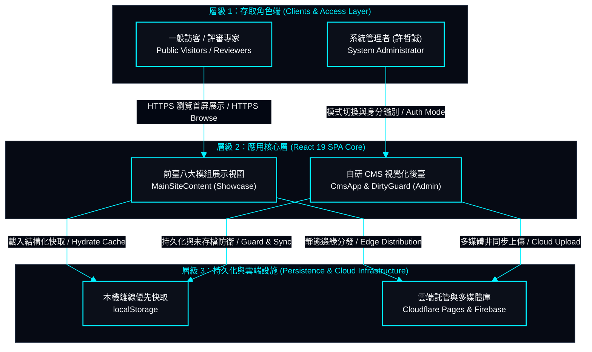
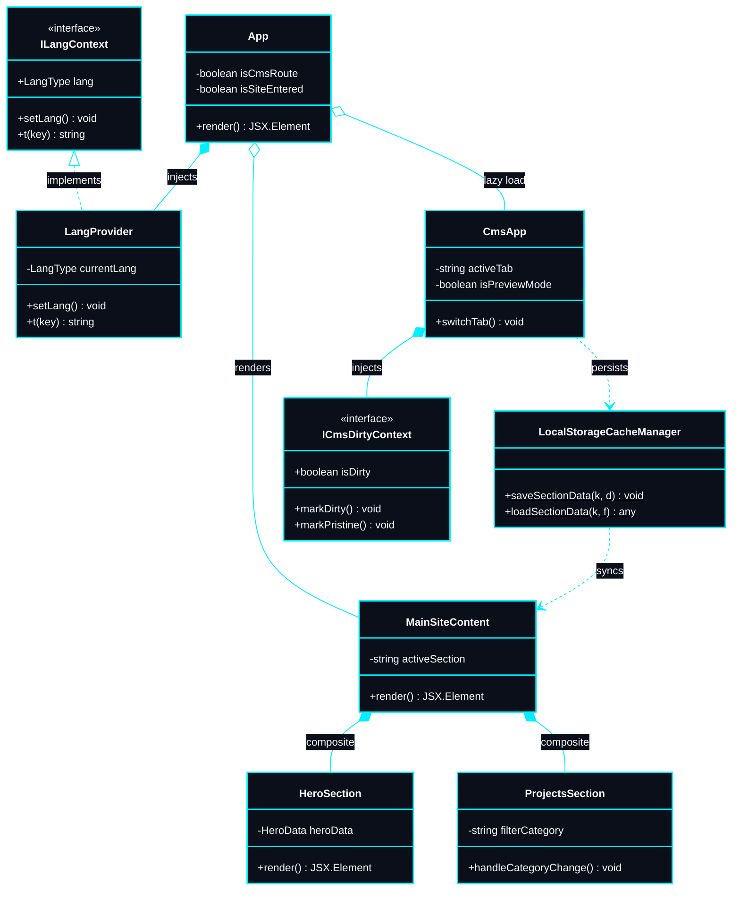

# My-Portfolio-Website + CMS (個人作品集網站含內容管理系統)

> An enterprise-grade, high-performance web portfolio and proprietary visual CMS engineered with React 19, TypeScript, Vite, and Tailwind CSS under a Tactical Cyberpunk HUD design system.  
> 採用 React 19、TypeScript、Vite 與 Tailwind CSS 建置，融合賽博龐克戰術 HUD 設計體系之企業級高效能作品集與自研視覺化內容管理系統（CMS）。

---

## 1. System Overview (系統簡介)

This application is an enterprise-grade Single Page Application (SPA) designed to serve as both an immersive interactive portfolio and an in-house visual Content Management System (CMS). Deployed on Cloudflare Pages global edge network, the system combines high-performance web engineering with a unique Tactical Cyberpunk HUD aesthetic, delivering sub-second load times and zero layout shift.

本系統為一套企業級單頁應用程式（SPA），兼具沉浸式互動作品展示與自主研發之視覺化內容管理系統（CMS）。全站部署於 Cloudflare Pages 全球邊緣網路，將高效能網頁工程與獨特之賽博龐克戰術 HUD 美學深度融合，實現次秒級首屏載入與零版面位移。

- **High-Performance Architecture (高效能架構)**: Pre-compiled static SPA leveraging Cloudflare Anycast edge caching with zero cold-start delay and zero server maintenance overhead.  
  預編譯靜態 SPA 架構，依託 Cloudflare 全球 Anycast 邊緣快取，具備零冷啟動延遲與零伺服器維護成本。
- **In-House Visual CMS (自研視覺化後臺)**: Proprietary, zero-framework content manager enabling direct in-browser data manipulation, reordering, and media linking without editing raw JSON files.  
  自主研發之視覺化內容管理系統，支援在瀏覽器中直接進行模組資料編輯、即時排序與多媒體連結維護，免除手動修改 JSON 代碼。
- **Bi-Directional Hot Sync (雙向即時熱更新)**: Instant data propagation between the admin CMS and public showcase views powered by `CustomEvent` dispatchers and local storage caching.  
  透過 `CustomEvent` 事件匯流排與本機儲存快取，實現後臺編輯至前臺展示視圖之 0 延遲即時熱更新。
- **WCAG 2.2 AAA/AA Standards (無障礙對比標準)**: Dual-theme color palettes engineered to exceed WCAG contrast ratios across both deep dark mode and pure light mode without compromising visual style.  
  深色與淺色雙主題經過精確計算，全面符合 WCAG 2.2 AAA/AA 無障礙對比標準，兼顧極致視覺風格與可讀性。

---

## 2. System Architecture & Design (系統架構與設計)

The application adheres to strict Single Responsibility and High Cohesion / Low Coupling principles, isolating data schemas, state management contexts, presentation components, CI/CD pipelines, and backend cloud services.

本系統遵循嚴格之單一職責原則 (SRP) 與高內聚低耦合標準，將資料結構模型、全域狀態 Context、視圖展示組件、CI/CD 自動化管線與後端雲端持久化層進行物理隔離。

### 2.1 C4 Model Architecture (C4 容器級架構模型)



### 2.2 Core UML Class Diagram (核心架構 UML 類別關聯圖)



### 2.3 Bi-Directional Hot Sync Sequence Diagram (雙向即時熱更新循序圖)


### 2.4 Physical Code Splitting & Performance Defense (物理代碼分割與效能防禦)
- **Zero-Waterfall Showcase (首屏展示零瀑布流)**: Public showcase components and critical CSS are bundled into the core entrypoint, ensuring instant render without secondary network waterfalls.  
  前臺展示組件與核心 HUD 樣式編譯於初始主 Bundle，確保首屏渲染無需經歷次級網路請求瀑布流。
- **Lazy Loaded Admin Chunk (CMS 管理模組非同步延遲載入)**: The entire CMS module (`CmsApp`, Markdown editors, drag-and-drop algorithms, and Firebase adapters) is compiled into a separate chunk (`chunk-cms.js`) via dynamic `import()`, keeping the public bundle footprint under ~67 kB.  
  管理後臺全部編輯器、拖曳排序演算法與 Firebase 配接器透過動態 `import()` 獨立編譯為 `chunk-cms.js`，使一般訪客之核心 Payload 壓制於 ~67 kB 以內。
- **Unsaved State Guard (未存檔狀態安全攔截)**: Mutations across form fields toggle `isDirty = true`. Attempting to navigate across modules or exit the CMS triggers an intercepting modal (`CmsUnsavedModal`), providing three recovery paths: "Save & Leave", "Discard & Leave", or "Stay on Page".  
  表單欄位異動自動標記 `isDirty = true`。管理者在未儲存狀態下嘗試切換模組或離開時，系統強制彈出 `CmsUnsavedModal`，提供「儲存變更並離開」、「放棄變更並離開」與「取消並留在本頁」三項明確決策。

---

## 3. Technology Stack (技術棧選型)

The technology stack follows a strict architectural pipeline: **Frontend Client ➔ Continuous Integration (CI) ➔ Continuous Delivery (CD) ➔ Backend & Cloud Services**.  
技術棧依循嚴格之架構階層推進：**前端視圖層 ➔ 持續整合 (CI) ➔ 持續部署 (CD) ➔ 後端與雲端服務**。

| Pipeline Tier (架構階層) | Technology & Version (技術與版本) | Role & Architectural Rationale (架構角色與選型考量) |
| :--- | :--- | :--- |
| **Frontend: UI Framework** | React 19 (19.2+) | Declarative component architecture, optimized Virtual DOM reconciliation, and concurrent rendering pipelines. (宣告式組件架構、虛擬 DOM 渲染優化與並發渲染管線) |
| **Frontend: Language** | TypeScript 5.8+ | Strict compile-time type safety, static interface contracts, and boundary error defense. (強型別安全檢查、介面契約保證與編譯期邊界防禦) |
| **Frontend: Build Tool** | Vite 8+ | Next-generation build tool with sub-second Hot Module Replacement (HMR) and Rollup-based chunk optimization. (次秒級熱模組替換與 Rollup 智慧代碼分塊) |
| **Frontend: Styling** | Tailwind CSS 4 + CSS3 | Atomic utility classes combined with custom Cyber HUD design tokens (`cyber-cut-sm`, `hud-corner-brackets`). (原子化樣式編譯器結合自研 Cyber HUD 幾何切角標記) |
| **DevOps: CI Pipeline** | GitHub Actions (CI) | Continuous automated build checks, TypeScript verification, and lint enforcement. (持續整合自動化構建校驗與型別安全閘門) |
| **DevOps: CD & Edge** | Cloudflare Pages (CD) | Infinite bandwidth and instant edge distribution across 300+ global Anycast edge locations. (全球 300+ Anycast 邊緣節點極速分發與無限頻寬) |
| **Backend: Cloud BaaS** | Firebase Storage & Auth | Serverless asset pipeline for media uploads and authenticated admin session management. (無伺服器多媒體資產儲存庫與管理員身分鑑別) |

---

## 4. System Functional Specifications (系統功能與模組設計)

### 4.1 Public Showcase System (前臺展示系統)
- **Hero Module (首頁看板)**: Interactive Sci-Fi Robot Mecha Avatar with real-time cursor pupil tracking, audio-reactive waveform animations, dual-language typewriter headers, and one-click contact copying.  
  賽博龐克機甲微表情機器人，具備滑鼠軌跡眼球追蹤、音波跳動、雙語打字機動效與剪貼簿聯絡資訊複製。
- **About Module (關於我)**: Professional profile, academic background, and metric summary HUD cards.  
  專業背景簡介、多媒體藝術學術歷程與核心指標 HUD 卡片。
- **Skills Matrix (技能矩陣)**: Tech radar categorizing Game Development (Unity, C#, ShaderLab, Blender) and Full-Stack Engineering (React, TypeScript, Vite, Tailwind, Node.js) into tech-chip tags.  
  科技晶片標籤矩陣，分流遊戲開發與全端系統工程兩大核心領域。
- **Projects Showcase (專案作品)**: Interactive gallery featuring multi-category filtering, horizontal spotlight slider, dual-column detail lightbox, and embedded YouTube demo players.  
  多維度即時過濾展示網格、精選作品橫向看板、雙欄詳情燈箱與 YouTube 影音示範嵌入。
- **Chronicle Module (經歷學術)**: Unified timeline combining academic degrees, professional work history, research programs, and published academic papers with external verification links.  
  時間軸依序整合學歷歷程、工作經歷、國科會研習與期刊論文發表，支援外部雲端驗證連結。
- **Certifications (專業證照)**: Language proficiency and professional engineering certifications with verified credential access.  
  語言檢定與專業技術證照清單，支援外部官方證明文件直接存取。
- **Art Gallery (美術畫廊)**: 3D turntable showcases, embedded interactive 3D WebGL viewers (Sketchfab), and high-resolution 2D concept art lightboxes.  
  3D 道具輪盤展示、互動 3D 檢視器（Sketchfab 嵌入）與 2D 概念設計高解析度燈箱。
- **Navigation & Audio HUD (導覽與音效控制)**: Sticky HUD navbar featuring section anchor spy, dual-language switcher (`zh` / `en`), theme toggler (`dark` / `light`), and Web Audio API synthesized cyber sound effects.  
  懸浮戰術導覽列，整合錨點跳轉、雙語切換、深淺色切換與 Web Audio 合成科技音效引擎。

### 4.2 In-House Visual CMS (自研視覺化後臺)
- **Zero-Code Visual Editing (零代碼視覺化編輯)**: Form-based content management for all public modules without directly modifying raw JSON structures.  
  全後臺視覺化表單操作，管理者無需直接改動原始 JSON 代碼。
- **Dual Reordering Controls (雙軌排序支援)**: Every list item supports both intuitive drag-and-drop handles and accessible `↑`/`↓` step buttons.  
  所有清單項目皆支援直覺拖曳把手（Grip）與無障礙 `↑`、`↓` 箭頭微調。
- **Two-Step Deletion Portals (刪除二次確認防禦)**: Destructive actions require confirmation via `CmsConfirmDialog`, mounted directly onto `document.body` via React Portal to prevent CSS stacking or parent overflow clipping.  
  所有刪除操作強制透過 `CmsConfirmDialog` 彈出二次確認，使用 React `createPortal` 置中渲染於 `document.body`，杜絕被父級容器裁切。
- **Safe Protocol URL Tester (安全連結測試器)**: Embedded URL input component with protocol validation and instant preview navigation before committing changes.  
  內建 URL 即時測試器，儲存前可直接點擊驗證通訊協定與目標網站有效性。

---

## 5. Directory Structure (目錄結構與模組職責)

```text
my-portfolio-website/
├── docs/                      # Global Dynamic Documentation Suite (SSOT - 系統文檔庫)
│   ├── check-list.md          # Single-Session Checklist (單次對話點收清單)
│   ├── change-log.md          # Pure Chinese Append-Only Changelog (全中文修訂歷程)
│   └── system-design/         # Full System Architecture Specifications (Mermaid 規格庫)
│       ├── 01-overview.md     # Vision, SLA & C4 Model Diagrams (系統願景與 C4 拓撲)
│       ├── 02-tech-stack.md   # Tech Stack Matrix & Trade-offs (技術選型與權衡取捨)
│       ├── 03-project-structure.md # Directory Tree & Topology (專案結構與依賴拓撲)
│       ├── 04-functional-specs.md  # Functional Specs & Boundary Guards (功能規格與邊界防禦)
│       ├── 05-flowcharts.md   # Flowcharts & State Machines (業務流程圖與狀態機)
│       ├── 07-uml-diagrams.md # UML Class & Sequence Diagrams (類別圖與循序圖)
│       └── 10-ui-ux-standards.md # Cyber HUD System & WCAG (設計體系與無障礙標準)
├── public/                    # Static Public Assets & SEO Infrastructure (靜態公開資產)
│   ├── assets/                # Localized WebP Images & Gallery Media (本地壓縮資材)
│   ├── tech-icons/            # Standalone Vector Brand SVGs (實體向量圖示庫)
│   ├── favicon.svg            # Scalable Vector Favicon (向量網站圖標)
│   ├── llms.txt               # AI Agent & Web Crawler Spec (AI 代理與爬蟲規範)
│   └── sitemap.xml            # Search Engine Discovery Map (網站地圖)
├── src/
│   ├── cms/                   # In-House Visual CMS Suite (自研 CMS 管理系統 - chunk-cms)
│   │   ├── components/        # Dedicated editors for all sections (各模組專屬編輯器)
│   │   ├── context/           # Form dirty tracking (CmsDirtyContext 未存檔防護)
│   │   └── CmsApp.tsx         # CMS Admin root component (CMS 後臺主入口)
│   ├── components/            # Public Showcase Components (前臺展示核心組件)
│   ├── context/               # Global Contexts (LangContext, ThemeContext 全域狀態)
│   ├── data/                  # Baseline JSON Schema Databases (結構化資料庫基準)
│   ├── hooks/                 # Reusable Custom React Hooks (自定義 Hooks)
│   ├── utils/                 # Audio synthesis, formatting & SEO (工具函式庫)
│   ├── App.tsx                # View routing & layout shell (視圖分流路由與版面外殼)
│   ├── index.css              # Cyber HUD design tokens & utilities (全域樣式與動效)
│   └── main.tsx               # Client DOM entrypoint (DOM 渲染掛載入口)
├── package.json
└── vite.config.js
```

---

## 6. Local Development & Setup (本地開發與建置配置)

### Prerequisites (前置環境)
- **Node.js**: v18.0.0 or higher (v18.0.0 以上版本)
- **Package Manager**: **`pnpm`** (Mandatory standard / 強制規範標準)

```bash
# 1. Clone the repository and enter directory (複製儲存庫並進入目錄)
git clone git@github.com:EricXJason/my-portfolio-website.git
cd my-portfolio-website

# 2. Install dependencies cleanly via pnpm (安裝純淨依賴)
pnpm install

# 3. Start local development server with instant HMR (啟動本地開發伺服器)
pnpm run dev

# 4. Execute TypeScript static typecheck (執行靜態型別安全檢查 - 0 錯誤閘門)
pnpm exec tsc --noEmit

# 5. Build optimized production bundle (編譯生產環境最佳化 Bundle)
pnpm run build
```

---

## 7. Performance & Quality Benchmarks (效能指標與工程標準)

All performance, bundling, and accessibility parameters are verified through automated builds and deterministic engineering specifications.  
所有效能、分塊尺寸與無障礙參數均經過自動化構建與客觀工程測試驗證：

- **Type Safety & Build Verification (型別安全與編譯驗證)**: Strictly verified with `tsc --noEmit` guaranteeing zero compile-time type errors. Production bundles compile deterministically within sub-second thresholds (< 400ms) with zero build errors.  
  經 `tsc --noEmit` 嚴格校驗保證編譯期 0 型別錯誤；生產打包全站於次秒級（< 400ms）內確定性完成，0 警告與 0 構建錯誤。
- **Deterministic Chunk Splitting Benchmarks (物理代碼分割基準)**:
  - **Public Initial View (首屏進入點)**: `index.js` (~18.9 kB, gzip ~6.4 kB), `index.css` (~113 kB, gzip ~18.6 kB).
  - **Isolated Admin Chunk (CMS 後臺獨立分塊)**: `chunk-cms.js` (~416 kB, gzip ~113.6 kB) is strictly dynamic-imported via `React.lazy`, eliminating administrative payload overhead for public visitors.
  - **Vendor Isolation (第三方核心依賴隔離)**: React 19 core isolated in `vendor-react.js` (~174.8 kB, gzip ~55.1 kB).
- **WCAG 2.2 Contrast Verification (WCAG 對比度客觀驗證)**:
  - **Dark Mode (深色模式)**: Primary text (`#f8fafc`) on background (`#030712`) achieves a contrast ratio of **18.7:1** (exceeding WCAG AAA 7:1 threshold).
  - **Light Mode (淺色模式)**: Primary text (`#0f172a`) on background (`#f8fafc`) achieves a contrast ratio of **17.9:1** (exceeding WCAG AAA 7:1 threshold).
  - **Accent Override (高對比標籤防護)**: Under light theme, cyan badge backgrounds enforce pure white text (`--neon-cyan-fg: #ffffff`) to guarantee text readability.
- **Accessibility & Motion Adaptation (輔助功能與動態偏好降級)**:
  - Fully honors `@media (prefers-reduced-motion: reduce)`, automatically freezing background canvas code streams and orbital rotation animations for vestibular disorder safety.  
    完整支援系統級減弱動態偏好，自動凍結背景代碼雨 Canvas 運算與旋轉動效，保障光敏使用者安全。
  - Dual-layer high-contrast `focus-visible` rings across all interactive buttons, dialog portals, and input fields.  
    所有可互動按鈕、彈窗表單與輸入元件全面配置雙層高清晰外觀焦點環。
