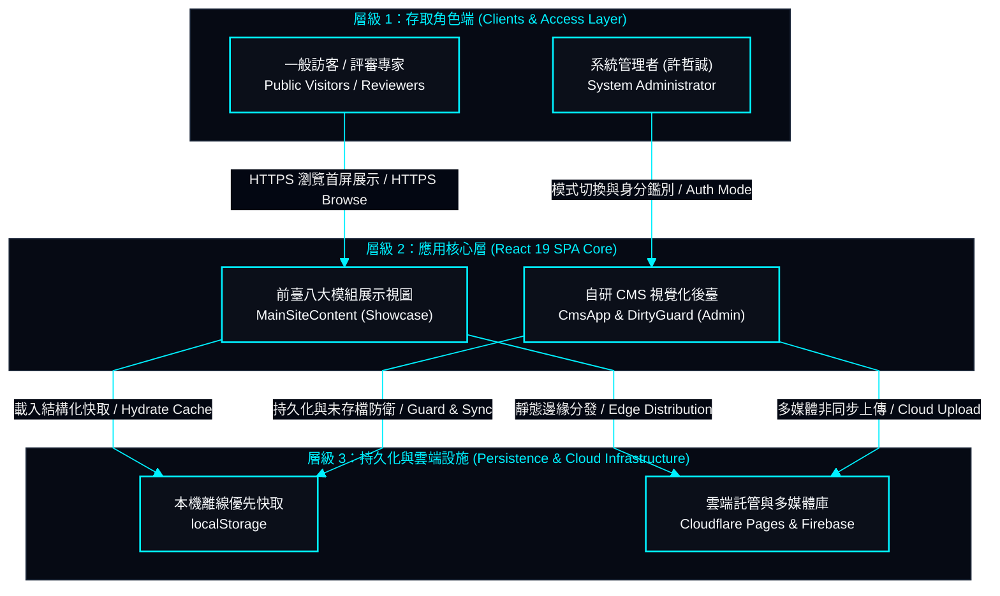
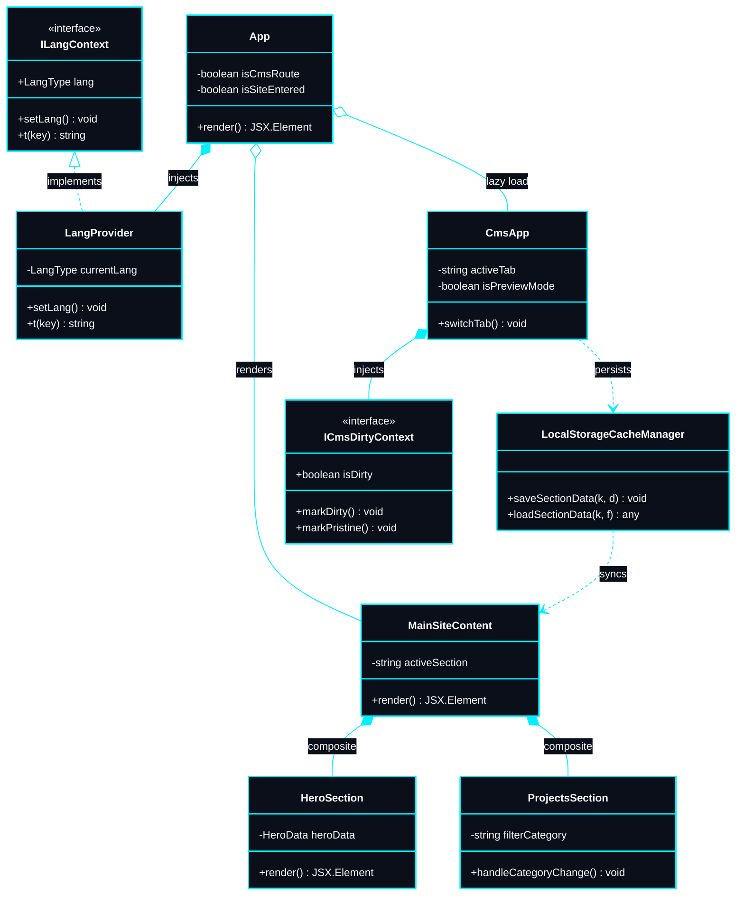
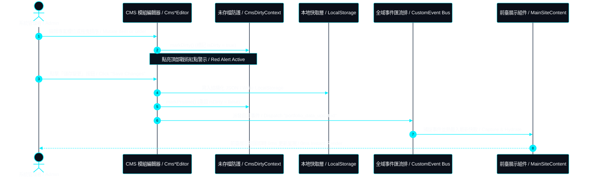

# My-Portfolio-Website + CMS (個人作品集網站含內容管理系統)

> 採用 React 19、TypeScript、Vite 與 Tailwind CSS 建置，融合賽博龐克戰術 HUD 設計體系之企業級高效能作品集與自研視覺化內容管理系統（CMS）。  
> *An enterprise-grade, high-performance web portfolio and proprietary visual CMS engineered with React 19, TypeScript, Vite, and Tailwind CSS under a Tactical Cyberpunk HUD design system.*

---

## 1. 系統簡介 | System Overview

> [!NOTE]
> **核心架構亮點 | Core Architecture Highlights**:
> - **100% 靜態預編譯 SPA** 依託 Cloudflare Pages 全球邊緣快取，首屏渲染壓制於 `< 800ms`。
> - **前後臺物理代碼分割**：自研視覺化 CMS 獨立封裝於 `chunk-cms.js`，前臺訪客零負載。
> - **雙向即時熱更新**：`CustomEvent` 事件匯流排與本地快取無感同步，支援深淺雙模式 `WCAG AAA` 無障礙對比標準。

本系統為一套企業級單頁應用程式（SPA），兼具沉浸式互動作品展示與自主研發之視覺化內容管理系統（CMS）。全站部署於 Cloudflare Pages 全球邊緣網絡，將高效能網頁工程與獨特之賽博龐克戰術 HUD 美學深度融合，實現次秒級首屏載入與零版面位移。  
*This application is an enterprise-grade Single Page Application (SPA) designed to serve as both an immersive interactive portfolio and an in-house visual Content Management System (CMS). Deployed on Cloudflare Pages global edge network, the system combines high-performance web engineering with a unique Tactical Cyberpunk HUD aesthetic, delivering sub-second load times and zero layout shift.*

- **高效能架構 (High-Performance Architecture)**：預編譯靜態 SPA 架構，依託 Cloudflare 全球 Anycast 邊緣快取，具備零冷啟動延遲與零伺服器維護成本。  
  *Pre-compiled static SPA leveraging Cloudflare Anycast edge caching with zero cold-start delay and zero server maintenance overhead.*
- **自研視覺化後臺 (In-House Visual CMS)**：自主研發之視覺化內容管理系統，支援在瀏覽器中直接進行模組資料編輯、即時排序與多媒體連結維護，免除手動修改 JSON 代碼。  
  *Proprietary, zero-framework content manager enabling direct in-browser data manipulation, reordering, and media linking without editing raw JSON files.*
- **雙向即時熱更新 (Bi-Directional Hot Sync)**：透過 `CustomEvent` 事件匯流排與本機儲存快取，實現後臺編輯至前臺展示視圖之 0 延遲即時熱更新。  
  *Instant data propagation between the admin CMS and public showcase views powered by `CustomEvent` dispatchers and local storage caching.*
- **無障礙對比標準 (WCAG 2.2 AAA/AA Standards)**：深色與淺色雙主題經過精確計算，全面符合 WCAG 2.2 AAA/AA 無障礙對比標準，兼顧極致視覺風格與可讀性。  
  *Dual-theme color palettes engineered to exceed WCAG contrast ratios across both deep dark mode and pure light mode without compromising visual style.*

---

## 2. 系統架構與設計 | System Architecture & Design

本系統遵循嚴格之單一職責原則 (SRP) 與高內聚低耦合標準，將資料結構模型、全域狀態 Context、視圖展示組件、CI/CD 自動化管線與後端雲端持久化層進行物理隔離。  
*The application adheres to strict Single Responsibility and High Cohesion / Low Coupling principles, isolating data schemas, state management contexts, presentation components, CI/CD pipelines, and backend cloud services.*

### 2.1 C4 容器級架構模型 | C4 Model Architecture



### 2.2 核心架構 UML 類別關聯圖 | Core UML Class Diagram



### 2.3 雙向即時熱更新循序圖 | Bi-Directional Hot Sync Sequence Diagram



### 2.4 物理代碼分割與效能防禦 | Physical Code Splitting & Performance Defense
- **首屏展示零瀑布流 (Zero-Waterfall Showcase)**：前臺展示組件與核心 HUD 樣式編譯於初始主 Bundle，確保首屏渲染無需經歷次級網路請求瀑布流。  
  *Public showcase components and critical CSS are bundled into the core entrypoint, ensuring instant render without secondary network waterfalls.*
- **CMS 管理模組非同步延遲載入 (Lazy Loaded Admin Chunk)**：管理後臺全部編輯器、拖曳排序演算法與 Firebase 配接器透過動態 `import()` 獨立編譯為 `chunk-cms.js`，使一般訪客之核心 Payload 壓制於 ~67 kB 以內。  
  *The entire CMS module (`CmsApp`, editors, drag-and-drop algorithms, and Firebase adapters) is compiled into a separate chunk (`chunk-cms.js`) via dynamic `import()`, keeping the public bundle footprint under ~67 kB.*
- **未存檔狀態安全攔截 (Unsaved State Guard)**：表單欄位異動自動標記 `isDirty = true`。管理者在未儲存狀態下嘗試切換模組或離開時，系統強制彈出 `CmsUnsavedModal`，提供「儲存變更並離開」、「放棄變更並離開」與「取消並留在本頁」三項明確決策。  
  *Mutations across form fields toggle `isDirty = true`. Attempting to navigate across modules or exit the CMS triggers an intercepting modal (`CmsUnsavedModal`), providing three recovery paths: "Save & Leave", "Discard & Leave", or "Stay on Page".*

---

## 3. 技術棧選型 | Technology Stack

技術棧依循嚴格之架構階層推進：**前端視圖層 ➔ 持續整合 (CI) ➔ 持續部署 (CD) ➔ 後端與雲端服務**。  
*The technology stack follows a strict architectural pipeline: Frontend Client ➔ Continuous Integration (CI) ➔ Continuous Delivery (CD) ➔ Backend & Cloud Services.*

| 架構階層 (Pipeline Tier) | 技術與版本 (Technology & Version) | 架構角色與選型考量 (Role & Architectural Rationale) |
| :--- | :--- | :--- |
| **前端視圖框架 (Frontend: UI Framework)** | React 19 (19.2+) | 宣告式組件架構、虛擬 DOM 渲染優化與並發渲染管線 / Declarative component architecture, optimized Virtual DOM reconciliation, and concurrent pipelines |
| **前端開發語言 (Frontend: Language)** | TypeScript 5.8+ | 強型別安全檢查、介面契約保證與編譯期邊界防禦 / Strict compile-time type safety, static interface contracts, and boundary error defense |
| **建置工具引擎 (Frontend: Build Tool)** | Vite 8+ | 次秒級熱模組替換與 Rollup 智慧代碼分塊 / Sub-second Hot Module Replacement (HMR) and Rollup-based chunk optimization |
| **設計體系樣式 (Frontend: Styling)** | Tailwind CSS 4 + CSS3 | 原子化樣式編譯器結合自研 Cyber HUD 幾何切角標記 / Atomic utility classes combined with custom Cyber HUD design tokens |
| **自動化整合 (DevOps: CI Pipeline)** | GitHub Actions (CI) | 持續整合自動化構建校驗與型別安全閘門 / Continuous automated build checks, TypeScript verification, and lint enforcement |
| **全球邊緣分發 (DevOps: CD & Edge)** | Cloudflare Pages (CD) | 全球 300+ Anycast 邊緣節點極速分發與無限頻寬 / Infinite bandwidth and instant edge distribution across 300+ global Anycast edge locations |
| **雲端無伺服器 (Backend: Cloud BaaS)** | Firebase Storage & Auth | 無伺服器多媒體資產儲存庫與管理員身分鑑別 / Serverless asset pipeline for media uploads and authenticated admin session management |

---

## 4. 系統功能與模組設計 | System Functional Specifications

### 4.1 前臺展示系統 | Public Showcase System
- **首頁看板 (Hero Module)**：賽博龐克機甲微表情機器人，具備滑鼠軌跡眼球追蹤、音波跳動、雙語打字機動效與剪貼簿聯絡資訊複製。  
  *Interactive Sci-Fi Robot Mecha Avatar with real-time cursor pupil tracking, audio-reactive waveform animations, dual-language typewriter headers, and one-click contact copying.*
- **關於我 (About Module)**：專業背景簡介、多媒體藝術學術歷程與核心指標 HUD 卡片。  
  *Professional profile, academic background, and metric summary HUD cards.*
- **技能矩陣 (Skills Matrix)**：科技晶片標籤矩陣，分流遊戲開發與全端系統工程兩大核心領域。  
  *Tech radar categorizing Game Development (Unity, C#, ShaderLab, Blender) and Full-Stack Engineering (React, TypeScript, Vite, Tailwind, Node.js) into tech-chip tags.*
- **專案作品 (Projects Showcase)**：多維度即時過濾展示網格、精選作品橫向看板、雙欄詳情燈箱與 YouTube 影音示範嵌入。  
  *Interactive gallery featuring multi-category filtering, horizontal spotlight slider, dual-column detail lightbox, and embedded YouTube demo players.*
- **經歷學術 (Chronicle Module)**：時間軸依序整合學歷歷程、工作經歷、國科會研習與期刊論文發表，支援外部雲端驗證連結。  
  *Unified timeline combining academic degrees, professional work history, research programs, and published academic papers with external verification links.*
- **專業證照 (Certifications)**：語言檢定與專業技術證照清單，支援外部官方證明文件直接存取。  
  *Language proficiency and professional engineering certifications with verified credential access.*
- **美術畫廊 (Art Gallery)**：3D 道具輪盤展示、互動 3D 檢視器（ArtStation 3D 嵌入）與 2D 概念設計高解析度燈箱。  
  *3D turntable showcases, embedded interactive 3D viewers (ArtStation 3D Embed), and high-resolution 2D concept art lightboxes.*
- **導覽與音效控制 (Navigation & Audio HUD)**：懸浮戰術導覽列，整合錨點跳轉、雙語切換、深淺色切換與 Web Audio 合成科技音效引擎。  
  *Sticky HUD navbar featuring section anchor spy, dual-language switcher (`zh` / `en`), theme toggler (`dark` / `light`), and Web Audio API synthesized cyber sound effects.*

### 4.2 自研視覺化後臺 | In-House Visual CMS
- **零代碼視覺化編輯 (Zero-Code Visual Editing)**：全後臺視覺化表單操作，管理者無需直接改動原始 JSON 代碼。  
  *Form-based content management for all public modules without directly modifying raw JSON structures.*
- **雙軌排序支援 (Dual Reordering Controls)**：所有清單項目皆支援直覺拖曳把手（Grip）與無障礙 `↑`、`↓` 箭頭微調。  
  *Every list item supports both intuitive drag-and-drop handles and accessible `↑`/`↓` step buttons.*
- **刪除二次確認防禦 (Two-Step Deletion Portals)**：所有刪除操作強制透過 `CmsConfirmDialog` 彈出二次確認，使用 React `createPortal` 置中渲染於 `document.body`，杜絕被父級容器裁切。  
  *Destructive actions require confirmation via `CmsConfirmDialog`, mounted directly onto `document.body` via React Portal to prevent CSS stacking or parent overflow clipping.*
- **安全連結測試器 (Safe Protocol URL Tester)**：內建 URL 即時測試器，儲存前可直接點擊驗證通訊協定與目標網站有效性。  
  *Embedded URL input component with protocol validation and instant preview navigation before committing changes.*

---

## 5. 目錄結構與模組職責 | Directory Structure & Module Responsibilities

本專案遵循現代 Web 前端工程標準命名慣例（一般檔案 `kebab-case`、元件 `PascalCase.tsx`）。  
*The project strictly adheres to modern frontend conventions: `kebab-case` for configurations/assets, `PascalCase.tsx` for components.*

```text
my-portfolio-website/
├── docs/                      # 全域動態工程文檔庫 (SSOT - 系統文檔唯一真實來源)
│   ├── checklist.md           # 單次對話點收清單 (每次對話完全覆寫刷新)
│   ├── log.md                 # 全中文修訂歷程 (Push 永久保留，日常上限 50 筆，分支與 Git 標色) / Chinese Log with Branch Colors
│   └── system-design/         # 系統架構設計專案文檔全集 (連續 01~07 閉環)
│       ├── 01-overview.md     # 系統願景與 C4 拓撲 (Vision & C4 Diagrams)
│       ├── 02-tech-stack.md   # 技術選型與依賴庫規範 (Tech Stack & Trade-offs)
│       ├── 03-project-structure.md # 目錄結構與模組拓撲 (Project Structure & Topology)
│       ├── 04-functional-specs.md  # 展示模組與 CMS 規格 (Functional Specifications)
│       ├── 05-flowcharts.md   # 核心操作流程與狀態機 (Flowcharts & State Machines)
│       ├── 06-uml-diagrams.md # UML 類別圖與跨層循序圖 (UML Class & Sequence Diagrams)
│       └── 07-ui-ux-standards.md  # Cyber HUD 與無障礙標準 (UI/UX & WCAG Standards)
├── public/                    # 靜態公開資產與 SEO 規範檔案
│   ├── assets/                # 本地壓縮 WebP 圖片與畫廊多媒體
│   ├── tech-icons/            # 實體向量圖示庫 (SVG)
│   ├── favicon.svg            # 向量網站圖標
│   ├── llms.txt               # AI 爬蟲標準規格檔
│   └── sitemap.xml            # 搜尋引擎檢索地圖
├── src/
│   ├── cms/                   # 自研 CMS 視覺化管理後臺 (獨立代碼分割 chunk-cms)
│   │   ├── components/        # 各模組專屬編輯器 (Projects, Skills, Experience 等)
│   │   ├── context/           # 表單異動追蹤防護 (CmsDirtyContext 未存檔攔截)
│   │   └── CmsApp.tsx         # CMS 管理後臺主入口
│   ├── components/            # 前臺展示核心組件 (PascalCase.tsx)
│   ├── context/               # 全域狀態上下文 (LangContext, ThemeContext)
│   ├── data/                  # 靜態結構化 JSON 資料庫基準
│   ├── hooks/                 # 可複用 React 自定義 Hooks
│   ├── utils/                 # 音訊合成、格式化與 SEO 工具函式庫
│   ├── App.tsx                # 視圖分流路由與版面外殼
│   ├── index.css              # Cyber HUD 戰術美學變數與全域動效
│   └── main.tsx               # 客戶端 DOM 渲染入口
├── package.json
└── vite.config.js
```

---

## 6. 本地開發與建置配置 | Local Development & Setup

### 前置環境要求 | Prerequisites
- **Node.js**：v18.0.0 或更高版本 (v18.0.0 or higher)
- **套件管理工具 (Package Manager)**：**`pnpm`**（強制規範標準 / Mandatory standard）

```bash
# 1. 複製儲存庫並進入專案目錄 (Clone the repository and enter directory)
git clone git@github.com:EricXJason/my-portfolio-website.git
cd my-portfolio-website

# 2. 透過 pnpm 安裝純淨依賴 (Install dependencies cleanly via pnpm)
pnpm install

# 3. 啟動本地開發伺服器，具備次秒級極速 HMR (Start local development server with instant HMR)
pnpm run dev

# 4. 執行 TypeScript 靜態型別安全檢查 (Execute TypeScript static typecheck - 0 Errors)
pnpm exec tsc --noEmit

# 5. 編譯生產環境最佳化 Bundle (Build optimized production bundle)
pnpm run build
```

---

## 7. 效能指標與工程標準 | Performance & Quality Benchmarks

所有效能、分塊尺寸與無障礙參數均經過自動化構建與客觀工程測試驗證：  
*All performance, bundling, and accessibility parameters are verified through automated builds and deterministic engineering specifications:*

- **型別安全與編譯驗證 (Type Safety & Build Verification)**：經 `tsc --noEmit` 嚴格校驗保證編譯期 0 型別錯誤；生產打包全站於次秒級（< 400ms）內確定性完成，0 警告與 0 構建錯誤。  
  *Strictly verified with `tsc --noEmit` guaranteeing zero compile-time type errors. Production bundles compile deterministically within sub-second thresholds (< 400ms) with zero build errors.*
- **物理代碼分割基準 (Deterministic Chunk Splitting Benchmarks)**：
  - **首屏進入點 (Public Initial View)**：`index.js` (~18.9 kB, gzip ~6.4 kB), `index.css` (~113 kB, gzip ~18.6 kB)。
  - **CMS 後臺獨立分塊 (Isolated Admin Chunk)**：`chunk-cms.js` (~416 kB, gzip ~113.6 kB) 透過 `React.lazy` 動態載入，訪客零額外負擔。
  - **第三方核心依賴隔離 (Vendor Isolation)**：React 19 核心獨立於 `vendor-react.js` (~174.8 kB, gzip ~55.1 kB)。
- **WCAG 2.2 對比度客觀驗證 (WCAG 2.2 Contrast Verification)**：
  - **深色模式 (Dark Mode)**：主文字 (`#f8fafc`) 於背景 (`#030712`) 對比度達 **18.7:1**（遠超 WCAG AAA 7:1 門檻）。
  - **淺色模式 (Light Mode)**：主文字 (`#0f172a`) 於背景 (`#f8fafc`) 對比度達 **17.9:1**（遠超 WCAG AAA 7:1 門檻）。
  - **高對比標籤防護 (Accent Override)**：淺色主題下，青色徽章強制套用純白字體 (`--neon-cyan-fg: #ffffff`)，保障閱讀體驗。
- **輔助功能與動態偏好降級 (Accessibility & Motion Adaptation)**：
  - 完整支援系統級減弱動態偏好（`@media (prefers-reduced-motion: reduce)`），自動凍結背景代碼雨 Canvas 運算與旋轉動效，保障光敏使用者安全。  
    *Fully honors `@media (prefers-reduced-motion: reduce)`, automatically freezing background canvas code streams and orbital rotation animations for vestibular disorder safety.*
  - 所有可互動按鈕、彈窗表單與輸入元件全面配置雙層高清晰外觀焦點環。  
    *Dual-layer high-contrast `focus-visible` rings across all interactive buttons, dialog portals, and input fields.*
