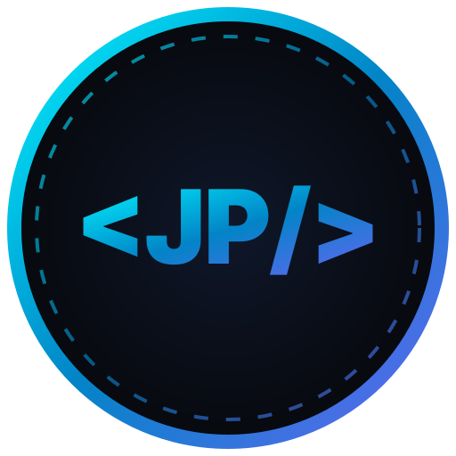

# 許哲誠 個人作品集網站 | Che-Cheng Hsu Personal Portfolio

<p align="center">
  
</p>

<p align="center">
  <b>具備新媒體藝術碩士背景與全端軟體開發實力，專注於 3D 互動遊戲、沉浸式系統與現代化 Web 架構。</b><br/>
  <i>Master of MA in New Media Art, specializing in 3D Interactive Game Dev, Immersive Systems, and Modern Web Architecture.</i>
</p>

---

## 🌐 網站簡介 | Overview

本專案為 **許哲誠 (Jason Hsu)** 之個人官方響應式作品集網站。網站旨在展現其在 **【互動遊戲開發】**、**【全端開發】** 與 **【多媒體設計】** 三大領域的專業技術、專案成果、學術論文、榮譽獎項與美術作品。

This project is the official personal responsive portfolio website for **Che-Cheng Hsu (Jason Hsu)**. It presents his skills, projects, publications, awards, and artwork gallery across **Interactive Game Dev**, **Fullstack Web Engineering**, and **Multimedia Design**.

- 🔗 **Live Demo**: [https://ericxjason.github.io/my-portfolio-website/](https://ericxjason.github.io/my-portfolio-website/)

---

## 🛠️ 開發技術棧 | Tech Stack

本網站採用現代化單頁應用程式 (SPA) 架構，配合自研聲能音效引擎與自動化 CI/CD 部署：

### 💻 前端架構 (Frontend)
- **Framework**: [React 19](https://react.dev/) + [Vite 6](https://vitejs.dev/) (極速構建與 HMR 熱更新)
- **Styling**: [Tailwind CSS v4](https://tailwindcss.com/) + CSS Custom Properties Design System (兼具玻璃擬物 Glassmorphic 與極簡現代美感)
- **Iconography**: [Lucide React](https://lucide.dev/) (輕量化矢量圖示)
- **Audio Engine**: Web Audio API 自研波形合成聲能背景音樂引擎 (Generative Ambient BGM & Sound FX)
- **i18n & Theme**: Context API 全域託管 **繁體中文 / English 雙語即時切換** 與 **深色 (Dark) / 淺色 (Light) 模式無縫切換**

### ⚙️ 自動化與部署 (CI/CD & Deployment)
- **Version Control**: Git / GitHub
- **Automated Workflow**: [GitHub Actions](https://github.com/features/actions) CI/CD 自動化建構與部署 pipeline
- **Hosting**: GitHub Pages

---

## ✨ 核心特色與功能 | Core Features

1. **雙語與雙主題即時切換 (Bilingual & Dual Theme Switch)**
   - 頂部導覽列配置流暢的滑動膠囊開關 (Animated Toggle Switches)，支援繁體中文 (ZH) 與英文 (EN) 無縫切換，以及深色 (Dark Mode) 與高對比質感淺色 (Light Mode) 模式切換。

2. **多媒體互動與 Demo 展示 (Interactive Demos & Media Lightbox)**
   - 專案卡片整合線上 YouTube 嵌入式影音播放器，可直接於網頁內部串流點閱實機 Preview。
   - 美術作品集 (Art Gallery) 支援分類篩選 (3D 場景, 3D 物件, 2D 素描, 2D 麥克筆) 與高解析度 Lightbox 彈窗檢視。

3. **低調科技感背景音樂引擎 (Ambient Sound Engine)**
   - 內建自研 Web Audio 合成器音效引擎，可隨意切換背景音樂 (BGM) 並調整音量。

4. **全裝置極致響應式體驗 (Ultra-Responsive RWD & Accessibility)**
   - 針對 Mobile、Tablet 與 Desktop 進行完美 RWD 佈局校正：
     - 導覽列標籤在行動端精簡為純標誌圖示。
     - 桌面端配備專屬 Cyber Blue 箭頭游標與右側懸浮區塊進度導引點。
     - 行動端自動切換為原生觸控體驗並停用客製游標，滾動條隨裝置寬度動態適配。

---

## 📁 專案目錄結構 | Directory Structure

```text
PortfolioWebsite/
├── info.md                   # 原始個人資料與專案完整文字數據
├── public/
│   ├── favicon.svg           # 客製化極簡幾何標誌 Icon
│   └── assets/               # 壓縮優化之 3D/2D 作品與專案圖檔 (JPG)
├── src/
│   ├── components/           # 模組化 React UI 組件 (Hero, About, Skills, Projects, ArtGallery, etc.)
│   ├── context/              # i18n 多國語言與 Theme 主題全域 State
│   ├── data/                 # 雙語字典數據 (i18n.js) 與 專案結構數據 (projectsData.js)
│   ├── utils/                # 通用 Utility (Base URL 轉換, BGM 音效引擎)
│   ├── App.jsx               # 主應用程式進入點
│   ├── index.css             # Tailwind v4 核心與 Design System 樣式集
│   └── main.jsx              # React DOM 渲染進入點
├── .github/workflows/        # GitHub Actions CI/CD 部署工作流配置文件
├── index.html                # 頁面 HTML 進入點與 SEO Meta
├── vite.config.js            # Vite 構建配置 (Base path & Plugins)
└── README.md                 # 專案雙語說明文件
```

---

## 🚀 本地開發與構建 | Local Setup & Build

```bash
# 1. 克隆專案 (Clone Repository)
git clone https://github.com/EricXJason/my-portfolio-website.git
cd my-portfolio-website

# 2. 安裝依賴 (Install Dependencies)
npm install

# 3. 啟動本地開發伺服器 (Start Dev Server)
npm run dev

# 4. 生產環境構建 (Build for Production)
npm run build
```

---

## 📄 版權與許可 | License

© 2026 **許哲誠 (HSU, CHE-CHENG)**. All Rights Reserved.
