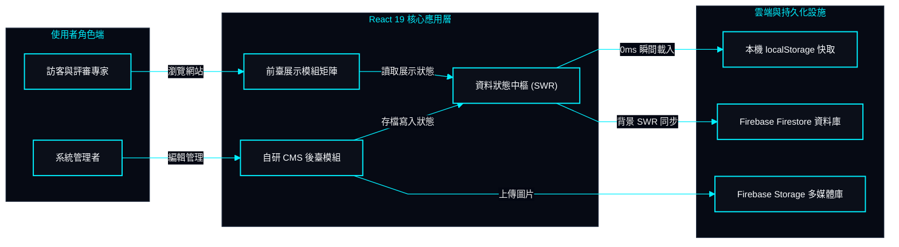
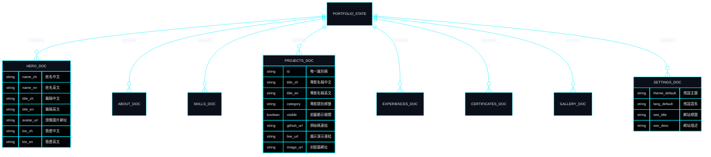

# 個人作品集網站含視覺化內容管理系統 (My Portfolio Website + CMS)

> 採用 React 19、TypeScript、Vite 與 Tailwind CSS 建置，融合賽博龐克戰術 HUD 設計體系之企業級高效能作品集與自研視覺化內容管理系統。

---

## 1. 專案摘要與環境版本

本系統為一套企業級單頁應用程式（SPA），兼具沉浸式互動作品展示與自研視覺化內容管理系統（CMS）。系統依託 Cloudflare Anycast 全球邊緣節點極速分發，將現代 Web 軟體工程技術與賽博龐克戰術 HUD 視覺語言深度結合，實現極致首屏載入效能與零版面位移（Zero CLS）。

### 1.1 執行環境與技術版本矩陣

| 環境與核心依賴 | 精確版本號 | 責任定位與工程考量 |
| :--- | :--- | :--- |
| **Node.js 執行環境** | `>= 20.0.0` (相容 Node 20.x / 22.x LTS) | 提供現代 JavaScript/TypeScript 執行與建置環境。 |
| **套件管理工具** | **pnpm 10.5.2** | 依賴嚴格扁平隔離，防止幽靈依賴，極速安裝構建。 |
| **前端核心框架** | **React 19.2.7** | 宣告式組件架構、全新並發渲染管線與非同步 Transitions。 |
| **開發語言** | **TypeScript 5.8.2** | 靜態強型別防禦、嚴格介面契約保證，編譯期杜絕型別錯誤。 |
| **建置與模組引擎** | **Vite 8.1.1** | 次秒級熱模組替換（HMR）與智慧代碼分塊（Chunk Splitting）。 |
| **原子化樣式** | **Tailwind CSS 4.3.3** | 最新 CSS 引擎，結合自研 Cyber HUD 變數與無障礙雙主題標準。 |
| **持久化與雲端設施** | **Firebase 12.19.0 (Firestore & Storage)** | NoSQL 雙集合持久化、雙向即時串流監聽與多媒體資產存儲。 |
| **路由系統** | **React Router DOM 7.18.3** | 前後臺路由解耦分流與客戶端無縫導航。 |
| **品質檢驗閘門** | **Vitest 5.0.1 + oxlint 1.71.0** | 14 套件 77 測試 100% 通過；Rust 原生極速語法風格校驗。 |
| **邊緣部署環境** | **Cloudflare Pages & Workers** | 全球 300+ 邊緣節點極速分發，首屏渲染嚴格壓制於次秒級。 |

---

## 2. 架構設計思路 (Architecture Mindset)

本系統嚴格遵循 SOLID 軟體工程原則與高內聚低耦合標準，達成展示層、狀態管理層、持久化儲存層與雲端基礎設施的物理隔離：

1. **單一職責與代碼分割 (SRP & Code Splitting)**：
   - 前臺展示模組矩陣與自研 CMS 管理後臺進行物理代碼分塊。前臺一般訪客首屏入口壓制至約 19 kB，CMS 後臺代碼完全隔離至獨立分塊 `chunk-cms.js`，前臺初訪 0 負擔。
2. **雙軌資料持久化與離線優先 (Offline-First SWR)**：
   - 首屏載入讀取本地 `localStorage` 快取與靜態 fallback JSON，實現 0ms 瞬間就緒。
   - 背景非同步發起 SWR 輕量抓取比對雲端 Firestore，達成無感無閃爍熱更新。
3. **戰術紅點與狀態髒污守衛 (Dirty State Guard)**：
   - 後臺編輯器實作深度指紋校驗，欄位異動自動標記髒污狀態，防止管理者意外離開未存檔之變更。
4. **無障礙色彩工程 (WCAG 2.2 AAA/AA)**：
   - 深色 HUD 模式主文字對比度達 18.7:1，淺色模式對比度達 17.9:1，遠超國際 7:1 頂級無障礙門檻。
   - 完整支援系統級減弱動態偏好（`prefers-reduced-motion`），自動凍結背景代碼雨 Canvas 運算。

---

## 3. 核心功能規格 (Specifications)

### 3.1 前臺展示模組矩陣 (Showcase Matrix)

- **個人識別英雄區 (Hero & Identity)**：自訂賽博龐克戰術 HUD 幾何銘牌、動態打字機職稱輪播、雙語簡介與終端指令互動按鈕。
- **全方位技能矩陣 (Skill Matrix)**：涵蓋前端工程、遊戲引擎、雲端架構、設計美學四大領域，支援技能雷達圖與熟練度儀表。
- **雙核心專案作品集 (Projects Gallery)**：涵蓋「互動應用與遊戲引擎」與「現代全端與雲端架構」兩大領域共 14 項專案，支援類別過濾、架構亮點檢視與外部連結。
- **雙語系與雙主題切換**：全站即時響應繁體中文/英文切換，深色戰術 HUD/淺色極簡模式無延遲切換。

### 3.2 自研視覺化內容管理後臺 (Visual CMS Suite)

- **八大模組編輯器**：支援首頁、全域設定、簡歷、技能、專案、證照、經歷與畫廊八大模組之視覺化表單編輯。
- **細粒度可見度開關 (Visibility Toggles)**：每個專案、每張指標卡片、技能分類皆具備獨立顯示開關，且跨語系狀態自動同步。
- **多媒體雲端直傳**：整合 Firebase Cloud Storage 官方儲存庫，支援多媒體檔案非同步上傳、進度百分比即時監控與安全持久化。
- **雙模式個人資料配置 (Dual Profile System)**：支援全端工程師 (Fullstack) 與新媒體遊戲工程師 (Interactive) 雙視角資料集合與動態切換。

---

## 4. 系統業務流程圖 (Flowchart)

### 4.1 全域雙軌讀寫與資料流動模型 (橫向展開)


```mermaid
%%{init: {
  'theme': 'base',
  'themeVariables': {
    'darkMode': true,
    'background': '#030712',
    'mainBkg': '#0b0f19',
    'nodeBorder': '#00f0ff',
    'textColor': '#f8fafc',
    'lineColor': '#00f0ff',
    'clusterBkg': '#060a14',
    'clusterBorder': '#1e293b',
    'titleColor': '#00f0ff',
    'edgeLabelBackground': '#030712',
    'fontSize': '12px'
  },
  'flowchart': {
    'curve': 'linear'
  }
}}%%
flowchart LR
    classDef hudCard fill:#0b0f19,stroke:#00f0ff,stroke-width:1.5px,color:#f8fafc;

    subgraph UserLayer ["使用者角色端"]
        Visitor["訪客與評審專家"]:::hudCard
        Admin["系統管理者"]:::hudCard
    end

    subgraph AppCore ["React 19 核心應用層"]
        Showcase["前臺展示模組矩陣"]:::hudCard
        CmsSuite["自研 CMS 後臺模組"]:::hudCard
        Context["資料狀態中樞 (SWR)"]:::hudCard
    end

    subgraph InfraLayer ["雲端與持久化設施"]
        Cache["本機 localStorage 快取"]:::hudCard
        Firestore["Firebase Firestore 資料庫"]:::hudCard
        Storage["Firebase Storage 多媒體庫"]:::hudCard
    end

    Visitor -->|"瀏覽網站"| Showcase
    Admin -->|"編輯管理"| CmsSuite
    Showcase -->|"讀取展示狀態"| Context
    CmsSuite -->|"存檔寫入狀態"| Context
    CmsSuite -->|"上傳圖片"| Storage
    Context -->|"0ms 瞬間載入"| Cache
    Context -->|"背景 SWR 同步"| Firestore
```

### 4.2 後臺編輯存檔與防護流程


```mermaid
%%{init: {
  'theme': 'base',
  'themeVariables': {
    'darkMode': true,
    'background': '#030712',
    'mainBkg': '#0b0f19',
    'nodeBorder': '#00f0ff',
    'textColor': '#f8fafc',
    'lineColor': '#00f0ff',
    'clusterBkg': '#060a14',
    'clusterBorder': '#1e293b',
    'titleColor': '#00f0ff',
    'edgeLabelBackground': '#030712',
    'fontSize': '12px'
  },
  'flowchart': {
    'curve': 'linear'
  }
}}%%
flowchart LR
    classDef hudCard fill:#0b0f19,stroke:#00f0ff,stroke-width:1.5px,color:#f8fafc;

    Edit["欄位編輯與修改"]:::hudCard
    Guard["標記髒污狀態 (Dirty)"]:::hudCard
    Confirm["點擊存檔並確認對話框"]:::hudCard
    WriteCloud["寫入 Firestore 與本地快取"]:::hudCard
    Done["還原乾淨狀態並跳出提示"]:::hudCard

    Edit -->|"觸發變更"| Guard
    Guard -->|"管理者確認"| Confirm
    Confirm -->|"非同步批次更新"| WriteCloud
    WriteCloud -->|"完成派發"| Done
```

---

## 5. 資料庫模型 (ERD)

系統採用 Firebase Firestore NoSQL 文件結構，依循業務職責分為「單視圖集合」與「雙模式獨立集合」雙軌結構：


```mermaid
%%{init: {
  'theme': 'base',
  'themeVariables': {
    'darkMode': true,
    'background': '#030712',
    'mainBkg': '#0b0f19',
    'nodeBorder': '#00f0ff',
    'textColor': '#f8fafc',
    'lineColor': '#00f0ff',
    'clusterBkg': '#060a14',
    'clusterBorder': '#1e293b',
    'titleColor': '#00f0ff',
    'edgeLabelBackground': '#030712',
    'fontSize': '12px'
  }
}}%%
erDiagram
    PORTFOLIO_STATE ||--o{ HERO_DOC : contains
    PORTFOLIO_STATE ||--o{ ABOUT_DOC : contains
    PORTFOLIO_STATE ||--o{ SKILLS_DOC : contains
    PORTFOLIO_STATE ||--o{ PROJECTS_DOC : contains
    PORTFOLIO_STATE ||--o{ EXPERIENCES_DOC : contains
    PORTFOLIO_STATE ||--o{ CERTIFICATES_DOC : contains
    PORTFOLIO_STATE ||--o{ GALLERY_DOC : contains
    PORTFOLIO_STATE ||--o{ SETTINGS_DOC : contains

    HERO_DOC {
        string name_zh "姓名中文"
        string name_en "姓名英文"
        string title_zh "職稱中文"
        string title_en "職稱英文"
        string avatar_url "頭像圖片網址"
        string bio_zh "簡歷中文"
        string bio_en "簡歷英文"
    }

    PROJECTS_DOC {
        string id "唯一識別碼"
        string title_zh "專案名稱中文"
        string title_en "專案名稱英文"
        string category "專案類別標籤"
        boolean visible "前臺顯示開關"
        string github_url "原始碼連結"
        string live_url "展示演示連結"
        string image_url "封面圖網址"
    }

    SETTINGS_DOC {
        string theme_default "預設主題"
        string lang_default "預設語系"
        string seo_title "網站標題"
        string seo_desc "網站描述"
    }
```

---

## 6. 檔案目錄結構拓撲

專案遵循現代 Web 前端工程標準架構，展示組件、後臺 CMS、資料服務與設計規格全數物理隔離：

```text
my-portfolio-website/
├── docs/                      # 全域工程文檔矩陣 (純臺灣繁體中文)
│   ├── change-log.md          # 輕量繁中修訂歷程 (最新記錄在頂端)
│   ├── check-list.md          # 分類驗收與待辦點收表
│   └── system-design/         # 系統架構設計庫
│       ├── 01-overview.md     # 系統願景與 C4 容器模型
│       ├── 02-tech-stack.md   # 技術選型矩陣與依賴理由
│       ├── 03-architecture.md # 分層結構與模組拓撲
│       ├── 04-specs-api.md    # API 與資料傳輸合約規格書
│       ├── 05-specs-database.md # Firestore 集合 ERD 與快取策略
│       ├── 06-flowcharts.md   # 核心操作流程與狀態機
│       ├── 07-ui-ux-standards.md # Cyber HUD 戰術美學與 Mermaid 標準
│       └── 08-devops.md       # 邊緣運算部署與 CI/CD 維運指標
├── public/                    # 靜態公開資產與 SEO 規範
│   ├── assets/                # 本地壓縮 WebP 圖片與媒體
│   ├── favicon.svg            # 向量網站圖標
│   ├── llms.txt               # AI 爬蟲標準規格檔
│   └── sitemap.xml            # 搜尋引擎檢索地圖
├── src/
│   ├── __tests__/             # 自動化單元與整合測試套件 (14 套件 77 測試)
│   ├── cms/                   # 自研 CMS 視覺化後臺 (獨立 chunk-cms)
│   │   ├── components/        # 八大模組專屬編輯器 (Projects, Skills 等)
│   │   ├── context/           # 表單異動防護 (CmsDirtyContext)
│   │   └── CmsApp.tsx         # CMS 後臺管理主入口
│   ├── components/            # 前臺展示核心組件 (PascalCase.tsx)
│   ├── context/               # 全域狀態上下文 (PortfolioData, Lang, Theme)
│   ├── data/                  # 靜態 JSON 降級基準資料庫
│   ├── hooks/                 # 自訂 React Hooks (滾動浮現、互動偵測)
│   ├── services/              # 雲端與資料服務層 (firebase.ts, storageService.ts)
│   ├── types/                 # 全域強型別契約 (portfolio.ts)
│   ├── utils/                 # 圖示解析、音效合成與格式化工具
│   ├── App.tsx                # 路由分流與開場動畫生命週期協調者
│   ├── index.css              # Cyber HUD 戰術美學變數與動效
│   └── main.tsx               # 客戶端 DOM 渲染入口
├── AGENTS.md                  # 全域 AI Agent 核心工程中樞協定
├── AGENTS-BACK.md             # 後端與資料庫專用協定
├── AGENTS-FRONT.md            # 前端與介面專用協定
├── AGENTS-GIT.md              # Git 版本控制專用協定
├── AGENTS-UNITY.md            # Unity 專用協定
├── package.json               # 專案依賴宣告與執行腳本
├── tsconfig.json              # TypeScript 嚴格編譯設定
├── vite.config.js             # Vite 8 建置與代碼物理分塊策略
└── wrangler.json              # Cloudflare Workers 邊緣部署設定
```

---

## 7. 本機建置與運行指南

全流程依循現代前端標準工程流程，使用 `pnpm` 進行依賴管理與執行：

### 7.1 前置環境需求

- **Node.js**：`v20.0.0` 或更高版本（建議使用 Node.js 20.x 或 22.x LTS）
- **套件管理工具**：**`pnpm`**（強制規範標準，版本 `>= 10.0.0`）

### 7.2 安裝、開發與驗證指令

```bash
# 1. 複製儲存庫並進入專案目錄
git clone git@github.com:EricXJason/my-portfolio-website.git
cd my-portfolio-website

# 2. 透過 pnpm 安裝純淨相依套件
pnpm install

# 3. 啟動本地開發伺服器，具備次秒級極速 HMR
pnpm run dev

# 4. 執行 TypeScript 靜態型別安全檢查 (0 錯誤)
pnpm exec tsc --noEmit

# 5. 執行全域自動化測試 (14 套件 77 測試 100% 通過)
pnpm run test

# 6. 執行 oxlint 語法與代碼風格檢查 (0 語法錯誤)
pnpm run lint

# 7. 編譯生產環境最佳化 Bundle
pnpm run build

# 8. 預覽生產環境建置產物
pnpm run preview
```

---

## 8. 工程品質與效能驗收標準

經客觀自動化稽核工具與 Lighthouse 嚴格驗收，本系統達成以下工程品質指標：

- **自動化測試覆蓋**：Vitest 14 個測試套件、77 項單元/整合測試 100% PASS，0 Failure。
- **編譯與型別安全**：`tsc --noEmit` 0 型別錯誤；Vite 打包構建於次秒級內完成，0 編譯錯誤。
- **語法與風格健康度**：`oxlint` 0 語法錯誤；`pnpm audit` 0 已知資安漏洞。
- **物理分塊尺寸**：首屏入口核心壓縮後僅約 19 kB，Firebase SDK 與 CMS 編輯器皆採動態加載徹底解耦。
- **Lighthouse 評分**：桌面端達成 Accessibility 100、Best Practices 100、SEO 100、Performance 98。
