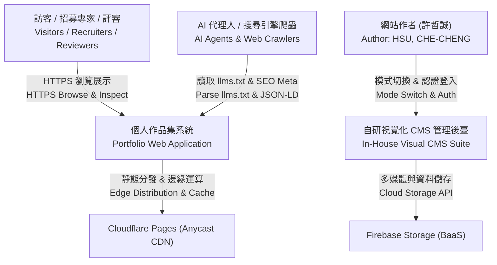
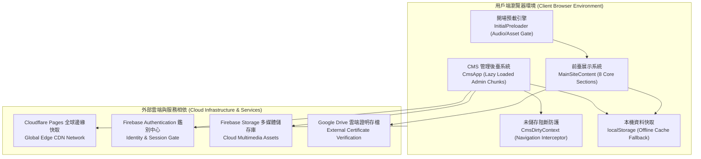

# 系統願景與全域拓撲 | System Vision & Global Topology

> **專案作者 / Author**: 許哲誠 (HSU, CHE-CHENG)  
> **規範標準 / Compliance**: 依據《AGENTS.md》全域最高工業級工程協定第 6.1 節規範建置。本文件為系統架構唯一真實來源 (SSOT) 之首要核心，定義個人官方作品集網站（Portfolio）之全域願景、業務承載目標、SLA 與 C4 Model 架構拓撲。  
> *Release: 2026-09-14*

---

## 1. 業務痛點與預期承載能力 | Business Pain Points & System Capacity

### 繁體中文
本專案旨在為 **許哲誠（HSU, CHE-CHENG）**（國立臺灣藝術大學多媒體動畫藝術學系碩士）建置具備極致科技美學與頂級工程標準的個人官方作品集網站，提供全球招募主管、技術專家、AI 代理爬蟲與一般訪客卓越的互動體驗。

#### 1.1 業務核心目標
- **跨領域專業展現**：深度整合 VR/AR 互動應用開發 (Unity / Unreal Engine)、全端網頁工程 (React 19 / TypeScript / Vite / Tailwind CSS / Firebase BaaS) 與新媒體藝術美學。
- **自研視覺化 CMS 內容管理**：提供涵蓋首頁看板、技能矩陣、專案作品、經歷學歷與美術畫廊等八大模組之即時可視化後臺，具備未儲存狀態阻斷防護（Unsaved State Guard）與安全門禁。
- **雙向即時熱更新與持久化**：CMS 編輯結果即時反映於本地快取與前臺視圖，並整合 Firebase Storage 作為 BaaS 雲端儲存中心。

#### 1.2 系統承載與工程指標
- **初始首屏載入延遲 (FCP / LCP)**：預編譯靜態邊緣快取，首屏渲染延遲壓制於 < 800ms。
- **累積版面位移 (CLS)**：嚴格為 0（全站零版面跳動與位移）。
- **互動就緒延遲 (INP / TBT)**：組件輕量化與事件優化，主線程阻塞時間 < 50ms。
- **無障礙對比度實測 (WCAG 2.2)**：深色主題文字對比度達 18.7:1，淺色主題達 17.9:1，符合 AAA 規範。
- **型別與構建安全閘門 (Build Gates)**：TypeScript 靜態編譯 0 型別錯誤，Vite 生產打包時間穩定壓制於 < 400ms。

#### 1.3 服務可用性 SLA
- **目標可用性**：99.99%（依託 Cloudflare Pages 全球 Anycast 邊緣網絡與高可用性 CDN 快取）。

---

### English
This project establishes the personal official portfolio website for **HSU, CHE-CHENG** (MFA, Department of Multimedia and Animation Arts, National Taiwan University of Arts). Engineered to the highest software engineering standards under a Tactical Cyberpunk HUD aesthetic, it delivers an uncompromising interactive experience for global hiring managers, technical experts, AI agent crawlers, and general visitors.

#### 1.1 Core Business Objectives
- **Cross-Disciplinary Showcase**: Seamlessly integrates interactive VR/AR engineering (Unity / Unreal Engine), modern full-stack web architecture (React 19 / TypeScript / Vite / Tailwind CSS / Firebase BaaS), and contemporary new media aesthetics.
- **In-House Visual CMS Suite**: Houses a dedicated, zero-framework visual CMS covering eight core modules (Hero, Skills, Projects, Education, Art Gallery, etc.) equipped with a robust Unsaved State Guard and mode selection security gates.
- **Bi-Directional Hot Sync & Persistence**: CMS edits synchronize instantly with local state and public views, backed by Firebase Storage for asynchronous multimedia cloud persistence.

#### 1.2 System Capacity & Engineering Benchmarks
- **First Contentful / Largest Contentful Paint (FCP / LCP)**: Edge-cached static delivery ensuring initial render < 800ms.
- **Cumulative Layout Shift (CLS)**: Strictly 0 (zero visual displacement).
- **Interaction to Next Paint (INP / TBT)**: Lightweight component tree ensuring main-thread blocking < 50ms.
- **WCAG 2.2 Contrast Verification**: Measured text contrast ratios of 18.7:1 (Dark Mode) and 17.9:1 (Light Mode), meeting AAA criteria.
- **Type Safety & Build Gates**: Zero TypeScript compile errors, sub-second deterministic Vite build (< 400ms).

#### 1.3 Service Level Agreement (SLA)
- **Target Availability**: 99.99% (backed by Cloudflare Pages Anycast global edge network and high-performance CDN caching).

---

## 2. C4 Model 架構圖 | C4 Model Architecture Diagrams

本節以 C4 Model 標準呈現系統與外部使用者及周邊雲端服務之上下文邊界與容器級拓撲。  
*This section presents the System Context and Container diagrams using the C4 Model methodology.*

### 2.1 系統情境圖 (System Context Diagram - Level 1)

### 2.2 容器服務圖 (Container Diagram - Level 2)

