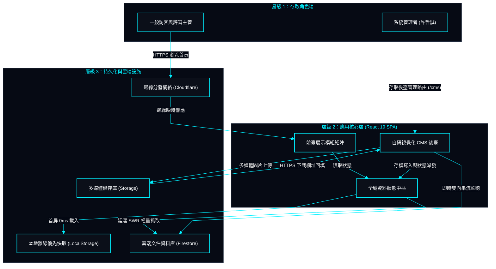
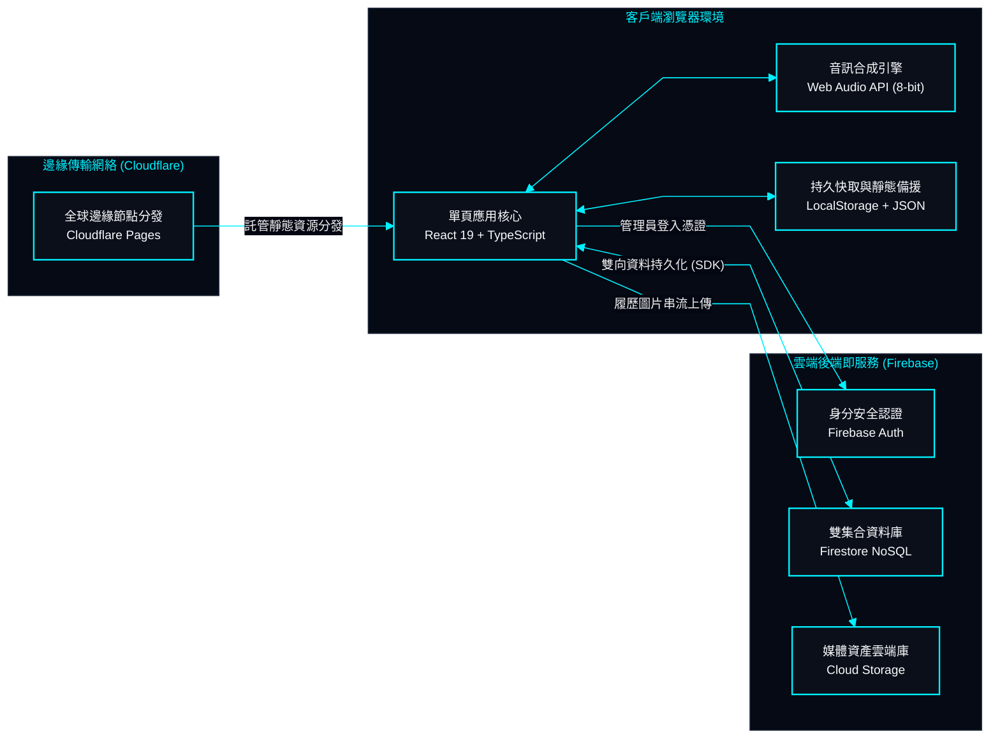
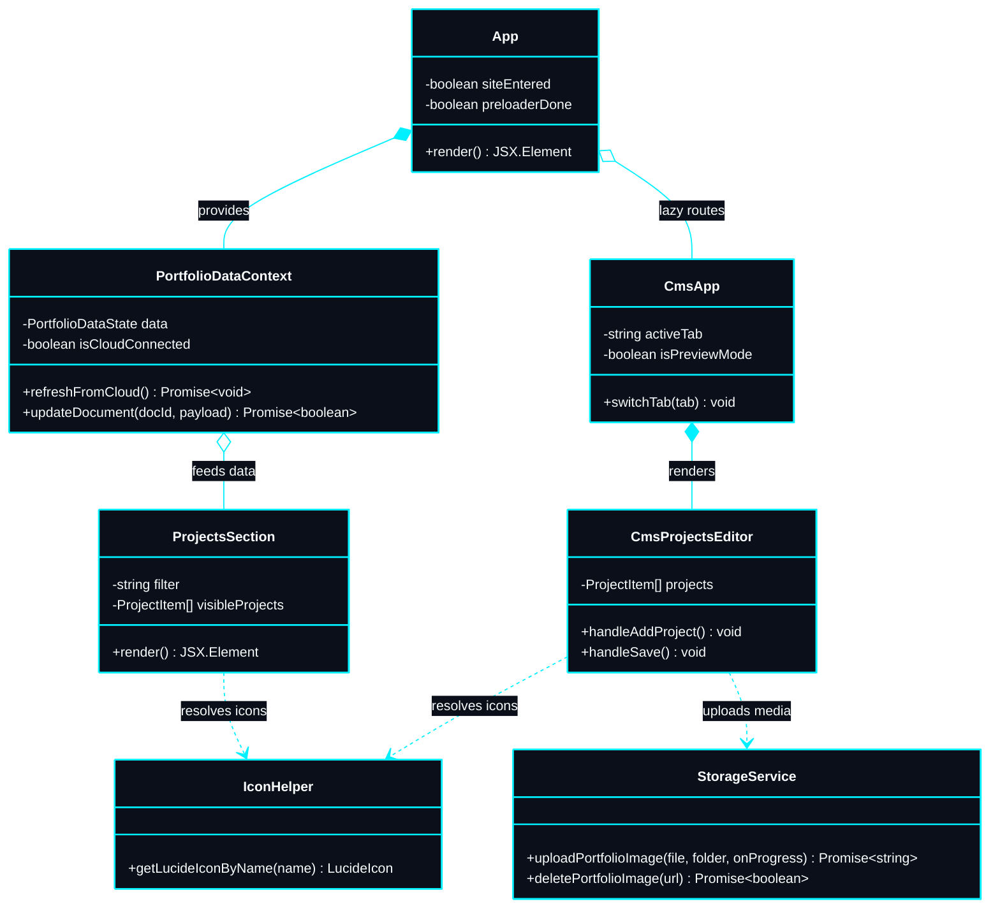

# 系統願景與 C4 Model (01-overview.md)

> **專案名稱**: 許哲誠個人專業雙軌作品集與全功能視覺化內容管理系統 (Portfoliowebsite)  
> **更新日期**: 2026-09-30  
> **系統定位**: 現代化高效能 SPA 作品集網站，具備雙專業角色路徑分流、多國語系 (臺灣繁體中文 / 英文)、雙主題切換 (暗色 / 亮色)、離線安全降級機制與完整的視覺化 CMS 內容管理後臺。

---

## 1. 系統願景與核心痛點解決

### 1.1 核心痛點
1. **跨領域履歷焦點模糊**: 開發者兼具「全端網頁軟體開發」與「即時 3D 互動應用」雙重專業背景，傳統單一作品集容易造成面試官或 HR 評估時專業焦點發散。
2. **展示層硬編碼維護困難**: 傳統靜態作品集若需調整技能權重、專案排序或文案微調，必須頻繁修改原始碼與重新編譯部署。
3. **外部服務相依風險**: 完全依賴雲端資料庫時，一旦遇到網路不穩定、配額耗盡或服務中斷，展示端易出現白畫面或嚴重阻塞。

### 1.2 系統願景與解決方案
- **雙角色無縫分流 (Dual-Profile Routing Architecture)**:
  - `/` 與 `/f`: 導向**全端開發 (Fullstack Dev)** 履歷模板，強調 Spring Boot、React、Node.js、SQL 資料庫架構與模組化系統整合能力。
  - `/i`: 導向**互動應用開發 (Interactive App Dev)** 履歷模板，強調 Unity 3D、即時物理模擬、電腦圖學、Shader 與互動硬體整合。
- **全資料驅動與自研視覺化 CMS (`/cms`)**:
  - 前臺展示層 100% 透過 Single Source of Truth (SSOT) 資料模型驅動，展示層零硬編碼判斷。
  - 獨立路由分割載入 CMS 編輯後臺，提供即時欄位編輯、拖曳排序、圖片上傳、密碼安全認證與雙向雲端同步。
- **雙軌備援與離線降級 (Graceful Fallback)**:
  - 實作「本地靜態 JSON」與「Google Cloud Firebase Firestore」雙層備援機制。
  - 當網路離線或 Firebase 未配置時，前端無感秒級降級至本地 JSON，保證全天候 100% 可用性。

---

## 2. 系統多層級架構拓撲 (System Architecture & C4 Model)

### 2.1 系統層級與存取上下文拓撲 (System Context Tier)

```mermaid
%%{init: {
  'theme': 'base',
  'themeVariables': {
    'darkMode': true,
    'background': '#030712',
    'mainBkg': '#0b0f19',
    'nodeBorder': '#00f0ff',
    'textColor': '#f8fafc',
    'lineColor': '#00f0ff',
    'clusterBkg': '#060a14',
    'clusterBorder': '#1e293b',
    'titleColor': '#00f0ff',
    'edgeLabelBackground': '#030712',
    'fontSize': '12px'
  },
  'flowchart': {
    'curve': 'linear'
  },
  'themeCSS': 'rect, .node rect { rx: 0px !important; ry: 0px !important; }'
}}%%
flowchart TD
    classDef hudCard fill:#0b0f19,stroke:#00f0ff,stroke-width:1.5px,color:#f8fafc,rx:0px,ry:0px;

    subgraph Tier1 ["層級 1：存取角色端"]
        Visitor["一般訪客與評審主管"]:::hudCard
        Admin["系統管理者 (許哲誠)"]:::hudCard
    end

    subgraph Tier2 ["層級 2：應用核心層 (React 19 SPA)"]
        Showcase["前臺展示模組矩陣"]:::hudCard
        CmsSuite["自研視覺化 CMS 後臺"]:::hudCard
        DataContext["全域資料狀態中樞"]:::hudCard
    end

    subgraph Tier3 ["層級 3：持久化與雲端設施"]
        Cache["本地離線優先快取 (LocalStorage)"]:::hudCard
        Firestore["雲端文件資料庫 (Firestore)"]:::hudCard
        Storage["多媒體儲存庫 (Storage)"]:::hudCard
        EdgeCDN["邊緣分發網絡 (Cloudflare)"]:::hudCard
    end

    Visitor -->|"HTTPS 瀏覽首頁"| EdgeCDN
    EdgeCDN -->|"邊緣瞬時響應"| Showcase
    Admin -->|"存取後臺管理路由 (/cms)"| CmsSuite
    Showcase -->|"讀取狀態"| DataContext
    CmsSuite -->|"存檔寫入與狀態派發"| DataContext
    DataContext -->|"首屏 0ms 載入"| Cache
    DataContext -->|"延遲 SWR 輕量抓取"| Firestore
    CmsSuite -->|"即時雙向串流監聽"| Firestore
    CmsSuite -->|"多媒體圖片上傳"| Storage
    Storage -->|"HTTPS 下載網址回填"| CmsSuite

    style Tier1 fill:#060a14,stroke:#1e293b,stroke-width:1px,color:#00f0ff
    style Tier2 fill:#060a14,stroke:#1e293b,stroke-width:1px,color:#00f0ff
    style Tier3 fill:#060a14,stroke:#1e293b,stroke-width:1px,color:#00f0ff
```

---

### 2.2 容器與執行環境分層 (Container Environment)

```mermaid
%%{init: {
  'theme': 'base',
  'themeVariables': {
    'darkMode': true,
    'background': '#030712',
    'mainBkg': '#0b0f19',
    'nodeBorder': '#00f0ff',
    'textColor': '#f8fafc',
    'lineColor': '#00f0ff',
    'clusterBkg': '#060a14',
    'clusterBorder': '#1e293b',
    'titleColor': '#00f0ff',
    'edgeLabelBackground': '#030712',
    'fontSize': '12px'
  },
  'flowchart': {
    'curve': 'linear'
  },
  'themeCSS': 'rect, .node rect { rx: 0px !important; ry: 0px !important; }'
}}%%
flowchart LR
    classDef hudCard fill:#0b0f19,stroke:#00f0ff,stroke-width:1.5px,color:#f8fafc,rx:0px,ry:0px;

    subgraph Browser ["客戶端瀏覽器環境"]
        SPA["單頁應用核心<br>React 19 + TypeScript"]:::hudCard
        WebAudio["音訊合成引擎<br>Web Audio API (8-bit)"]:::hudCard
        LocalStore["持久快取與靜態備援<br>LocalStorage + JSON"]:::hudCard
    end

    subgraph CloudBaaS ["雲端後端即服務 (Firebase)"]
        AuthSvc["身分安全認證<br>Firebase Auth"]:::hudCard
        DB_FS["雙集合資料庫<br>Firestore NoSQL"]:::hudCard
        StorageSvc["媒體資產雲端庫<br>Cloud Storage"]:::hudCard
    end

    subgraph CDN ["邊緣傳輸網絡 (Cloudflare)"]
        Cloudflare["全球邊緣節點分發<br>Cloudflare Pages"]:::hudCard
    end

    SPA <--> WebAudio
    SPA <--> LocalStore
    SPA -->|"管理員登入憑證"| AuthSvc
    SPA <-->|"雙向資料持久化 (SDK)"| DB_FS
    SPA -->|"履歷圖片串流上傳"| StorageSvc
    Cloudflare -->|"託管靜態資源分發"| SPA

    style Browser fill:#060a14,stroke:#1e293b,stroke-width:1px,color:#00f0ff
    style CloudBaaS fill:#060a14,stroke:#1e293b,stroke-width:1px,color:#00f0ff
    style CDN fill:#060a14,stroke:#1e293b,stroke-width:1px,color:#00f0ff
```

---

### 2.3 元件核心分層與職責契約 (Component Diagram)

```mermaid
%%{init: {
  'theme': 'base',
  'themeVariables': {
    'darkMode': true,
    'background': '#030712',
    'mainBkg': '#0b0f19',
    'nodeBorder': '#00f0ff',
    'textColor': '#f8fafc',
    'lineColor': '#00f0ff',
    'edgeLabelBackground': '#030712',
    'fontSize': '12px'
  },
  'themeCSS': 'rect, .node rect { rx: 0px !important; ry: 0px !important; }'
}}%%
classDiagram
    direction TB

    class App {
        -boolean siteEntered
        -boolean preloaderDone
        +render() JSX.Element
    }

    class PortfolioDataContext {
        -PortfolioDataState data
        -boolean isCloudConnected
        +refreshFromCloud() Promise~void~
        +updateDocument(docId, payload) Promise~boolean~
    }

    class StorageService {
        +uploadPortfolioImage(file, folder, onProgress) Promise~string~
        +deletePortfolioImage(url) Promise~boolean~
    }

    class IconHelper {
        +getLucideIconByName(name) LucideIcon
    }

    class ProjectsSection {
        -string filter
        -ProjectItem[] visibleProjects
        +render() JSX.Element
    }

    class CmsApp {
        -string activeTab
        -boolean isPreviewMode
        +switchTab(tab) void
    }

    class CmsProjectsEditor {
        -ProjectItem[] projects
        +handleAddProject() void
        +handleSave() void
    }

    App *-- PortfolioDataContext : provides
    PortfolioDataContext o-- ProjectsSection : feeds data
    App o-- CmsApp : lazy routes
    CmsApp *-- CmsProjectsEditor : renders
    CmsProjectsEditor ..> StorageService : uploads media
    ProjectsSection ..> IconHelper : resolves icons
    CmsProjectsEditor ..> IconHelper : resolves icons

    style App fill:#0b0f19,stroke:#00f0ff,stroke-width:1.5px,color:#f8fafc,rx:0px,ry:0px
    style PortfolioDataContext fill:#0b0f19,stroke:#00f0ff,stroke-width:1.5px,color:#f8fafc,rx:0px,ry:0px
    style StorageService fill:#0b0f19,stroke:#00f0ff,stroke-width:1.5px,color:#f8fafc,rx:0px,ry:0px
    style IconHelper fill:#0b0f19,stroke:#00f0ff,stroke-width:1.5px,color:#f8fafc,rx:0px,ry:0px
    style ProjectsSection fill:#0b0f19,stroke:#00f0ff,stroke-width:1.5px,color:#f8fafc,rx:0px,ry:0px
    style CmsApp fill:#0b0f19,stroke:#00f0ff,stroke-width:1.5px,color:#f8fafc,rx:0px,ry:0px
    style CmsProjectsEditor fill:#0b0f19,stroke:#00f0ff,stroke-width:1.5px,color:#f8fafc,rx:0px,ry:0px
```

---

## 3. 架構決策與邊界防護

1. **展示層零業務邏輯判斷**:
   - 前臺 UI 元件 (如 `Projects.tsx`, `Skills.tsx`) 僅負責依照 Props 渲染清單，不依賴 `window.location` 亦不以 `if (profile === 'fullstack')` 判斷隱藏欄位。所有顯隱狀態與項目排列完全由 `PortfolioDataContext` 輸出之 SSOT 資料決定。
2. **CMS 獨立路由與代碼分割**:
   - CMS 包含複雜編輯元件與拖曳邏輯，透過 `React.lazy` 動態載入，確保一般求職訪客與 HR 載入主站時只下載必要代碼，首屏體積極小化。
3. **資安邊界防護**:
   - 外部唯讀開放，寫入強制通過 Firebase Auth 檢驗。前端配置 `firestore.rules` 與 `storage.rules` 雙重實體安全規則，防止未授權篡改。
