# 系統架構、目錄拓撲與模組相依性 | System Architecture, Directory Topology & Dependencies

> **專案作者 / Author**: 許哲誠 (HSU, CHE-CHENG)  
> **協定標準 / Compliance**: 依據《AGENTS.md》全域最高工程中樞協定規範建置。本文件定義專案之代碼庫架構、DDD 職責分層、目錄樹狀拓撲與核心模組間之依賴邊界。  
> *Release: 2026-09*

---

## 1. 目錄樹狀結構拓撲 | Directory Tree Topology

本專案遵循現代 Web 前端工程標準命名慣例（一般檔案與目錄採用 `kebab-case`、React 組件採用 `PascalCase.tsx`）。

```text
my-portfolio-website/
├── docs/                      # 全域系統設計文檔庫 (SSOT) / System Design Architecture Suite
│   └── system-design/         # 系統分析規格清單 (遵循 AGENTS.md 條款 3.2 拓撲)
│       ├── 01-overview.md     # 願景、承載力與 C4 模型 / Vision, Capacity & C4 Diagrams
│       ├── 02-tech-stack.md   # 技術選型與依賴庫規範 / Tech Stack Matrix & Trade-offs
│       ├── 03-architecture.md # 代碼庫結構與模組拓撲 / Architecture & Module Topology
│       ├── 04-specs-frontend.md # 前端展示模組與 UI 規格 / Frontend & CMS Specifications
│       ├── 05-specs-database.md # 資料庫集合與 SWR 快取 / Database ERD & SWR Cache
│       ├── 06-flowcharts.md   # 核心操作流程與狀態機 / Core Business Flowcharts
│       ├── 07-uml-diagrams.md # UML 類別圖與循序圖 / UML Class & Sequence Diagrams
│       ├── 08-ui-ux-standards.md # Cyber HUD 與無障礙標準 / UI/UX & Accessibility Standards
│       └── 09-devops-deployment.md # 邊緣運算部署與 CI/CD / Edge Deployment & CI/CD
├── public/                    # 靜態公開資產與 SEO 規範檔案 / Static Public Assets & SEO Artifacts
│   ├── assets/                # 本地 WebP 圖片與多媒體 / Compressed WebP Media Assets
│   ├── tech-icons/            # 實體 SVG 技術圖示庫 / Localized Vector Brand Icons
│   ├── favicon.svg            # 向量網站圖標 / Scalable Vector Favicon
│   ├── llms.txt               # AI 爬蟲標準規格檔 / AI Agent Web Crawler Specification
│   ├── robots.txt             # 搜尋引擎檢索指令 / Search Engine Crawling Rules
│   ├── sitemap.xml            # 網站地圖 / XML Sitemap
│   └── site.webmanifest       # PWA 清單檔案 / Progressive Web App Manifest
├── src/
│   ├── cms/                   # 自研 CMS 視覺化管理後臺 (獨立代碼分割) / In-House Visual CMS Suite
│   │   ├── components/        # 各模組獨立編輯器 / Modular Editors (Hero, Skills, Projects, etc.)
│   │   ├── context/           # 未儲存狀態阻斷防護 / Unsaved State Guard (CmsDirtyContext)
│   │   └── CmsApp.tsx         # CMS 管理後臺主入口 / CMS Admin Root Application
│   ├── components/            # 前臺展示核心組件 / Public Showcase Components (PascalCase.tsx)
│   │   ├── icons/             # 集中式 TechIcon 渲染器 / Centralized TechIcon Dispatcher
│   │   ├── Hero.tsx           # 首頁看板與微表情機甲機器人 / Hero Banner & Interactive Robot
│   │   ├── About.tsx          # 關於我與核心指標卡 / About Me & Experience Metric Cards
│   │   ├── Skills.tsx         # 專業技能矩陣 / Professional Skills & Radar Clusters
│   │   ├── Projects.tsx       # 專案作品矩陣與燈箱 / Featured Projects & Media Lightbox
│   │   ├── Education.tsx      # 學歷、經歷、研習與論文 / Academics, Experience & Publications
│   │   ├── Certifications.tsx # 專業證照與檢定庫 / Professional Licenses & Certifications
│   │   ├── ArtGallery.tsx     # 美術畫廊與 3D 檢視器 / Multimedia Art Gallery & 3D Viewer
│   │   ├── Navbar.tsx         # 導覽列與即時開關 / Header Navigation & Mode Switches
│   │   └── ...                # 輔助音效、粒子背景與無障礙組件 / Ambient & Accessibility Helpers
│   ├── context/               # 全域 Context (PortfolioDataContext, LangContext, ThemeContext)
│   ├── data/                  # 靜態與預設結構化 JSON 資料庫 / Baseline JSON Databases
│   ├── hooks/                 # 自定義 Hooks (useScrollReveal, useAudio 等)
│   ├── services/              # 雲端與外部服務層 (firebase.ts, portfolioDataService.ts)
│   ├── types/                 # 全域型別合約定義 (portfolio.ts)
│   ├── utils/                 # 工具函式庫 (audioSynth, seo 等)
│   ├── App.tsx                # 前端主應用入口與視圖分流路由 / App Entrypoint & Route Dispatcher
│   ├── index.css              # 全域 CSS 變數、Cyber Cut 樣式與動畫 / Global Design Tokens
│   └── main.tsx               # DOM 渲染掛載起點 / DOM Mount Root
├── CHANGELOG.md               # 唯一全域修訂歷程紀錄 (SSOT)
├── package.json
├── tsconfig.json
├── vite.config.js
└── wrangler.json
```

---

## 2. 模組分層與職責邊界 | Layered Architecture & Responsibilities

本節確立各代碼模組之單一職責原則 (SRP) 與高內聚低耦合防線。

### 2.1 領域模型與型別層 (`src/types/`) | Domain Models & Types

本層定義全站核心實體契約，杜絕 `any` 弱型別傳遞，確保編譯期嚴格防禦。

- `portfolio.ts`：宣告 `HeroData`, `ProjectItem`, `SkillCategory`, `CertificationItem`, `ExperienceItem`, `ArtItem`, `SiteSettings` 等全站九大資料實體規格，作為前後臺與資料庫通訊的唯一契約。

### 2.2 服務與雲端基礎設施層 (`src/services/`) | Services & Infrastructure

本層封裝外部通訊細節，隔離 Firebase SDK 與業務邏輯。

- `firebase.ts`：初始化 Firebase App、Firestore、Auth 與 Storage，統一管理連線狀態。
- `portfolioDataService.ts`：提供資料庫讀取、寫入與初始資料播種函式，嚴格落實例外拋出防禦，杜絕靜默吞例外。

### 2.3 狀態與雙向串流中樞層 (`src/context/`) | Context & Streaming State Hub

本層架構離線優先快取（SWR）與即時串流監聽管線。

- `PortfolioDataContext.tsx`：以本地靜態 JSON 為 0ms 首屏底座，同時透過 Firestore `onSnapshot` 監聽 9 大文檔集合，實現前臺零整理無感熱更新。
- `LangContext.tsx`：管理全站多語系狀態（繁中 / 英文），同步 HTML lang 標籤。
- `ThemeContext.tsx`：管理全站主題態（深色賽博龐克 / 現代簡約淺色）。
- `CmsDirtyContext.tsx`：追蹤 CMS 編輯器表單之異動狀態（`isDirty`），提供未存檔導航阻斷防護。

### 2.4 呈現展示層 (`src/components/`, `src/cms/components/`) | Presentation Layer

前臺展示組件與 CMS 編輯器組件物理隔離。

- **前臺組件**：專注於次秒級極速渲染、流暢 60fps 動態視覺與 WCAG AAA 無障礙展示。
- **CMS 編輯器**：專注於直覺式的即時編輯體驗，提供可視性開關、表單檢驗與安全儲存操作。

---

## 3. 模組依賴關係拓撲圖 | Dependency Topology Diagram

本圖揭示系統各層檔案之引用階層、單向資料流向以及前臺與 CMS 之首屏物理分割邊界。

```mermaid
%%{init: {
  'theme': 'base',
  'themeVariables': {
    'darkMode': true,
    'background': '#030712',
    'mainBkg': '#0b0f19',
    'nodeBorder': '#00f0ff',
    'textColor': '#f8fafc',
    'lineColor': '#00f0ff',
    'clusterBkg': '#060a14',
    'clusterBorder': '#1e293b',
    'titleColor': '#00f0ff',
    'edgeLabelBackground': '#030712',
    'fontSize': '12px'
  },
  'flowchart': {
    'curve': 'linear'
  }
}}%%
flowchart TB
    classDef hudCard fill:#0b0f19,stroke:#00f0ff,stroke-width:1.5px,color:#f8fafc;

    subgraph Core ["入口與全域狀態層 (Core & Context Layer)"]
        Main["main.tsx (掛載起點)"]:::hudCard --> App["App.tsx (視圖分流路由)"]:::hudCard
        App --> DataCtx["context/PortfolioDataContext.tsx (SWR 狀態中樞)"]:::hudCard
        App --> LangCtx["context/LangContext.tsx (多語系)"]:::hudCard
        App --> ThemeCtx["context/ThemeContext.tsx (主題態)"]:::hudCard
    end

    subgraph Services ["雲端服務層 (Services & Types)"]
        DataCtx --> DataService["services/portfolioDataService.ts"]:::hudCard
        DataService --> FBSdk["services/firebase.ts (Firebase SDK)"]:::hudCard
        DataService --> TypeDef["types/portfolio.ts (型別定義)"]:::hudCard
    end

    subgraph Frontend ["前臺展示層 (Public Showcase - 0ms 首屏物理載入)"]
        App --> MainSite["MainSiteContent.tsx (展示主外殼)"]:::hudCard
        MainSite --> Hero["Hero.tsx & SciFiRobotAvatar.tsx"]:::hudCard
        MainSite --> About["About.tsx (自傳背景)"]:::hudCard
        MainSite --> Skills["Skills.tsx (技能矩陣)"]:::hudCard
        MainSite --> Projects["Projects.tsx (專案作品)"]:::hudCard
        MainSite --> Certs["Certifications.tsx (證照清單)"]:::hudCard
        MainSite --> Edu["Education.tsx (學歷經歷)"]:::hudCard
        MainSite --> Gallery["ArtGallery.tsx (畫廊與3D檢視)"]:::hudCard
        MainSite --> Nav["Navbar.tsx & SideNav.tsx"]:::hudCard
    end

    subgraph CmsModule ["自研 CMS 管理系統 (chunk-cms 獨立延遲載入)"]
        App -.->|"非同步動態載入 / Dynamic import"| CmsApp["cms/CmsApp.tsx (後臺主入口)"]:::hudCard
        CmsApp --> CmsDirty["cms/context/CmsDirtyContext.tsx (未存檔阻斷)"]:::hudCard
        CmsApp --> CmsEditors["cms/components/Cms*Editor.tsx (各模組編輯器)"]:::hudCard
        CmsEditors --> DataCtx
    end

    style Core fill:#060a14,stroke:#1e293b,stroke-width:1px,color:#00f0ff
    style Services fill:#060a14,stroke:#1e293b,stroke-width:1px,color:#00f0ff
    style Frontend fill:#060a14,stroke:#1e293b,stroke-width:1px,color:#00f0ff
    style CmsModule fill:#060a14,stroke:#1e293b,stroke-width:1px,color:#00f0ff
```


