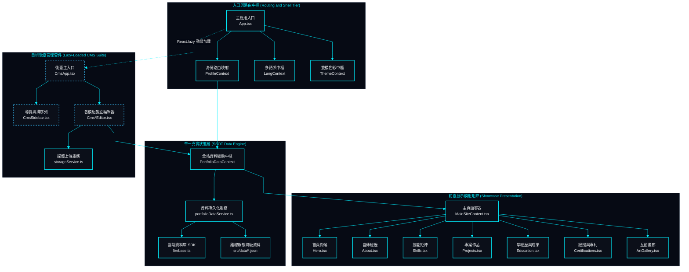

# 分層結構與模組依賴 (03-architecture.md)

> **專案作者**: 許哲誠 (HSU, CHE-CHENG)  
> **更新日期**: 2026-09-30  
> **軟體工程準則**: 貫徹 SOLID 設計原則、Clean Code 與單一職責分離 (SRP)

---

## 1. 系統分層架構 (Layered Architecture)

本系統採行嚴格的垂直分層與單向依賴架構，徹底杜絕展示層與資料基礎設施層的緊耦合：

```mermaid
%%{init: {
  'theme': 'base',
  'themeVariables': {
    'darkMode': true,
    'background': '#030712',
    'mainBkg': '#0b0f19',
    'nodeBorder': '#00f0ff',
    'textColor': '#f8fafc',
    'lineColor': '#00f0ff',
    'clusterBkg': '#060a14',
    'clusterBorder': '#1e293b',
    'titleColor': '#00f0ff',
    'edgeLabelBackground': '#030712',
    'fontSize': '12px'
  },
  'flowchart': {
    'curve': 'linear'
  }
}}%%
flowchart LR
    classDef hudCard fill:#0b0f19,stroke:#00f0ff,stroke-width:1.5px,color:#f8fafc;

    subgraph Layer1 ["1. 展示層 (Presentation)"]
        L1["前臺展示元件矩陣<br>自研 CMS 視覺化後臺"]:::hudCard
    end

    subgraph Layer2 ["2. 應用狀態層 (Application)"]
        L2["全域狀態中樞與雙軌分流<br>Profile / Lang / Data Context"]:::hudCard
    end

    subgraph Layer3 ["3. 領域模型層 (Domain)"]
        L3["單一真實資料契約<br>portfolio.ts (SSOT)"]:::hudCard
    end

    subgraph Layer4 ["4. 資料設施層 (Infrastructure)"]
        L4["Firebase 雲端持久化服務<br>本地靜態 JSON 降級備援"]:::hudCard
    end

    Layer1 -->|"訂閱狀態 / 派發事件"| Layer2
    Layer2 -->|"調用領域實體契約"| Layer3
    Layer3 -->|"底層資料持久化與備援"| Layer4

    style Layer1 fill:#060a14,stroke:#1e293b,stroke-width:1px,color:#00f0ff
    style Layer2 fill:#060a14,stroke:#1e293b,stroke-width:1px,color:#00f0ff
    style Layer3 fill:#060a14,stroke:#1e293b,stroke-width:1px,color:#00f0ff
    style Layer4 fill:#060a14,stroke:#1e293b,stroke-width:1px,color:#00f0ff
```

---

## 2. 各層職責與邊界定義

### 2.1 展示層 (Presentation Layer)
- **位置**: `src/components/`, `src/cms/components/`
- **職責邊界**:
  - 專注於使用者介面渲染、樣式排版、CSS 動畫、動態互動反饋與無障礙標籤。
  - **展示層零硬編碼**: 嚴格禁止元件內部自行根據 URL 或狀態執行條件寫死（例如 `if (profile === 'fullstack')`）。元件只依賴 Context 傳入的真實資料陣列進行渲染。
  - **懶載入保護**: 後臺管理介面 (`src/cms/`) 透過 `React.lazy` 動態載入，與主站展示代碼進行物理切分，絕不污染前臺主資源包。

### 2.2 應用狀態層 (Application & Context Layer)
- **位置**: `src/context/`, `src/cms/context/`
- **核心 Context 矩陣**:
  1. **`ProfileContext`**: 管理當前專業身份路徑 (`fullstack` | `interactive`)，負責網址路由與資料集合對應。
  2. **`PortfolioDataContext`**: 系統核心 SSOT。負責整合遠端 Firestore、本地 LocalStorage 快取與靜態 JSON 降級，並對外提供即時資料與儲存介面。
  3. **`LangContext`**: 提供多國語系切換 (`zh` | `en`) 與本地偏好記憶。
  4. **`ThemeContext`**: 提供主題切換 (`dark` | `light`)，並動態將主題變數注入 `:root` 與 `document.documentElement`。
  5. **`CmsDirtyContext`**: 監控 CMS 編輯器欄位異動狀態，提供使用者未儲存防呆警告與離開攔截。
  6. **`CmsModeContext`**: 控制 CMS 目前操作之目標 Profile，支援雙專業獨立資料維護。

### 2.3 領域模型層 (Domain Layer)
- **位置**: `src/types/portfolio.ts`
- **職責邊界**:
  - 定義全站作品集前端展示與 CMS 編輯之統一資料模型契約 (Single Source of Truth)。
  - 包含 `HeroSectionData`, `AboutSectionData`, `SkillsSectionData`, `ProjectsSectionData`, `ExperienceSectionData`, `CertificationsSectionData`, `GallerySectionData`, `SiteSettingsData`。
  - 嚴格區隔多語系欄位 (`zh` / `en`) 與跨語系共用結構（如日期、排序序號、外連網址、標籤陣列）。

### 2.4 資料基礎設施層 (Data & Infrastructure Layer)
- **位置**: `src/services/`, `src/data/`
- **職責邊界**:
  - `portfolioDataService.ts`: 封裝所有與 Firebase Firestore 的 CRUD 互動。提供 `getPortfolioDoc`、`savePortfolioDoc`、`seedFirestoreFromLocalJson` 等原子方法。
  - `firebase.ts`: 初始化 Firebase App、Firestore 與 Storage 實例。具備未配置保護與錯誤降級。
  - `storageService.ts`: 處理媒體圖片上傳、路徑組織與 URL 獲取。
  - `src/data/*.json`: 內建靜態備援資料庫，確保在完全無網路或未配置 Firebase 時前臺依然完美運行。

---

## 3. 模組依賴結構圖 (Mermaid)

```mermaid
%%{init: {
  'theme': 'base',
  'themeVariables': {
    'darkMode': true,
    'background': '#030712',
    'mainBkg': '#0b0f19',
    'nodeBorder': '#00f0ff',
    'textColor': '#f8fafc',
    'lineColor': '#00f0ff',
    'clusterBkg': '#060a14',
    'clusterBorder': '#1e293b',
    'titleColor': '#00f0ff',
    'edgeLabelBackground': '#030712',
    'fontSize': '12px'
  },
  'flowchart': {
    'curve': 'linear'
  }
}}%%
flowchart TD
    classDef hudCard fill:#0b0f19,stroke:#00f0ff,stroke-width:1.5px,color:#f8fafc;
    classDef lazyCard fill:#0b0f19,stroke:#38bdf8,stroke-width:1.5px,stroke-dasharray: 4 4,color:#f8fafc;

    subgraph EntryTier ["入口與路由中樞 (Routing and Shell Tier)"]
        App["主應用入口<br>App.tsx"]:::hudCard
        ProfileProvider["身份路由映射<br>ProfileContext"]:::hudCard
        LangProvider["多語系中樞<br>LangContext"]:::hudCard
        ThemeProvider["雙模色彩中樞<br>ThemeContext"]:::hudCard
    end

    subgraph StateTier ["單一真實狀態層 (SSOT Data Engine)"]
        DataProvider["全站資料驅動中樞<br>PortfolioDataContext"]:::hudCard
        DataService["資料持久化服務<br>portfolioDataService.ts"]:::hudCard
        FirebaseSDK["雲端資料庫 SDK<br>firebase.ts"]:::hudCard
        LocalFallback["離線靜態降級資料<br>src/data/*.json"]:::hudCard
    end

    subgraph ShowcaseTier ["前臺展示模組矩陣 (Showcase Presentation)"]
        MainSite["主頁面容器<br>MainSiteContent.tsx"]:::hudCard
        HeroSec["首頁問候<br>Hero.tsx"]:::hudCard
        AboutSec["自傳經歷<br>About.tsx"]:::hudCard
        SkillsSec["技能矩陣<br>Skills.tsx"]:::hudCard
        ProjectsSec["專案作品<br>Projects.tsx"]:::hudCard
        EduSec["學經歷與成果<br>Education.tsx"]:::hudCard
        CertsSec["證照與專利<br>Certifications.tsx"]:::hudCard
        GallerySec["互動畫廊<br>ArtGallery.tsx"]:::hudCard
    end

    subgraph CmsTier ["自研後臺管理套件 (Lazy-Loaded CMS Suite)"]
        CmsEntry["後臺主入口<br>CmsApp.tsx"]:::lazyCard
        CmsSidebar["導覽與排序列<br>CmsSidebar.tsx"]:::lazyCard
        CmsEditors["各模組獨立編輯器<br>Cms*Editor.tsx"]:::lazyCard
        StorageSvc["媒體上傳服務<br>storageService.ts"]:::hudCard
    end

    App --> ProfileProvider
    App --> LangProvider
    App --> ThemeProvider
    ProfileProvider --> DataProvider

    DataProvider --> DataService
    DataService --> FirebaseSDK
    DataService --> LocalFallback

    DataProvider --> MainSite
    MainSite --> HeroSec
    MainSite --> AboutSec
    MainSite --> SkillsSec
    MainSite --> ProjectsSec
    MainSite --> EduSec
    MainSite --> CertsSec
    MainSite --> GallerySec

    App -.->|"React.lazy 動態加載"| CmsEntry
    CmsEntry --> CmsSidebar
    CmsEntry --> CmsEditors
    CmsEditors --> DataProvider
    CmsEditors --> StorageSvc

    style EntryTier fill:#060a14,stroke:#1e293b,stroke-width:1px,color:#00f0ff
    style StateTier fill:#060a14,stroke:#1e293b,stroke-width:1px,color:#00f0ff
    style ShowcaseTier fill:#060a14,stroke:#1e293b,stroke-width:1px,color:#00f0ff
    style CmsTier fill:#060a14,stroke:#1e293b,stroke-width:1px,color:#00f0ff
```

---

## 4. SOLID 原則實踐事實

1. **單一職責原則 (SRP)**:
   - 每個區塊編輯器（如 `CmsProjectsEditor.tsx`, `CmsSkillsEditor.tsx`）僅專注於該領域表單與互動；底層網路傳輸全部委託 `portfolioDataService`，不涉及 UI 細節。
2. **開放封閉原則 (OCP)**:
   - 全站資料模型 `portfolio.ts` 透過泛型與可擴充介面定義，新增欄位或模組只需擴充介面與對應子元件，無須修改主路由中樞與狀態廣播核心。
3. **介面隔離原則 (ISP)**:
   - 多語系字典結構與設定結構細粒化拆分，例如 `SiteLanguageSetting` 與 `HeroLocaleData` 各自獨立，避免出現包羅萬象的「胖資料結構」。
4. **依賴反轉原則 (DIP)**:
   - 展示層元件不直接實例化 Firestore SDK，而是依賴 `PortfolioDataContext` 提供的抽象狀態與回呼函式，具備高度可測試性與可抽換性。
