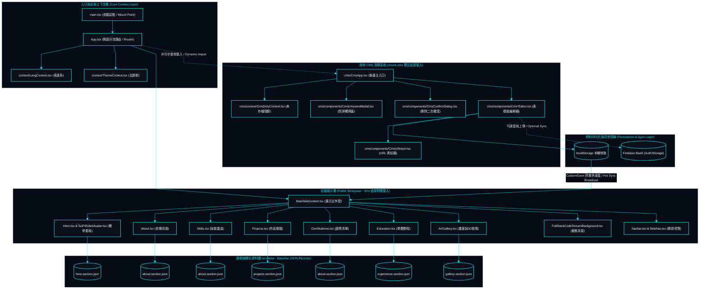

# 專案結構與模組職責 | Project Structure & Module Responsibilities

> **專案作者 / Author**: 許哲誠 (HSU, CHE-CHENG)  
> **規範標準 / Compliance**: 依據《AGENTS.md》全域最高工業級工程協定第 6.3 節規範建置。定義專案實體目錄樹狀結構、命名慣例、各層職責邊界與物理代碼分割拓撲。  
> *Release: 2026-09-14*

---

## 1. 目錄樹狀結構 | Directory Tree Topology

本專案遵循現代 Web 前端工程標準命名慣例（一般檔案 `kebab-case`、元件 `PascalCase.tsx`）。  
*The project strictly adheres to modern frontend conventions: `kebab-case` for configurations/assets, `PascalCase.tsx` for components.*

```text
my-portfolio-website/
├── docs/                      # 全域動態追蹤與系統設計文檔庫 / Dynamic Engineering & System Design Docs
│   ├── check-list.md          # 單次對話點收清單 / Single-Session Verification Checklist
│   ├── change-log.md          # 全中文修訂歷程 / Pure Chinese Append-Only Changelog
│   └── system-design/         # 系統架構設計唯一真實來源 (SSOT) / Architecture Design Suite
│       ├── 01-overview.md     # 願景、承載力與 C4 模型 / Vision, Capacity & C4 Diagrams
│       ├── 02-tech-stack.md   # 技術選型與依賴庫規範 / Tech Stack Matrix & Trade-offs
│       ├── 03-project-structure.md # 目錄結構與模組拓撲 / Directory Tree & Topology
│       ├── 04-functional-specs.md  # 八大模組與 CMS 規格 / Functional Specifications
│       ├── 05-flowcharts.md   # 核心操作流程與狀態機 / Core Business Flowcharts
│       ├── 07-uml-diagrams.md # UML 類別圖與跨層循序圖 / UML Class & Sequence Diagrams
│       └── 10-ui-ux-standards.md # Cyber HUD 與無障礙標準 / UI/UX & Accessibility Standards
├── public/                    # 靜態公開資產與 SEO 規範檔案 / Static Public Assets & SEO Artifacts
│   ├── assets/                # 本地 WebP 圖片與畫廊多媒體 / Compressed WebP Media Assets
│   ├── tech-icons/            # 實體 SVG 技術圖示庫 / Localized Vector Brand Icons
│   ├── favicon.svg            # 向量網站圖標 / Scalable Vector Favicon
│   ├── llms.txt               # AI 爬蟲標準規格檔 / AI Agent Web Crawler Specification
│   ├── robots.txt             # 搜尋引擎檢索指令 / Search Engine Crawling Rules
│   ├── sitemap.xml            # 網站地圖 / XML Sitemap
│   └── site.webmanifest       # PWA 清單檔案 / Progressive Web App Manifest
├── src/
│   ├── cms/                   # 自研 CMS 視覺化管理後臺 (獨立代碼分割) / In-House Visual CMS Suite
│   │   ├── components/        # 各模組獨立編輯器 / Modular Editors (Hero, Skills, Projects, etc.)
│   │   ├── context/           # 未儲存狀態阻斷防護 / Unsaved State Guard (CmsDirtyContext)
│   │   └── CmsApp.tsx         # CMS 管理後臺主入口 / CMS Admin Root Application
│   ├── components/            # 前臺展示核心元件 / Public Showcase Components (PascalCase.tsx)
│   │   ├── icons/             # 集中式 TechIcon 渲染器 / Centralized TechIcon Dispatcher
│   │   ├── Hero.tsx           # 首頁看板與微表情機器人 / Hero Banner & Interactive Robot Avatar
│   │   ├── About.tsx          # 關於我與核心指標卡 / About Me & Experience Metric Cards
│   │   ├── Skills.tsx         # 專業技能矩陣 / Professional Skills & Radar Clusters
│   │   ├── Projects.tsx       # 專案作品矩陣與燈箱 / Featured Projects & Media Lightbox
│   │   ├── Education.tsx      # 學歷、經歷、研習與論文 / Academics, Experience & Publications
│   │   ├── Certifications.tsx # 專業證照與檢定 / Professional Licenses & Certifications
│   │   ├── ArtGallery.tsx     # 美術畫廊與 3D 檢視器 / Multimedia Art Gallery & 3D Viewer
│   │   ├── Navbar.tsx         # 導覽列與即時開關 / Header Navigation & Mode Switches
│   │   └── ...                # 輔助音效、粒子背景與無障礙組件 / Ambient & Accessibility Helpers
│   ├── context/               # 全域 React Context (LangContext, ThemeContext)
│   ├── data/                  # 靜態與預設 JSON 結構資料庫 / Static JSON Schema Databases
│   ├── hooks/                 # 自定義 Hooks (useScrollReveal, useAudio 等)
│   ├── utils/                 # 工具函式庫 (audioSynth, seo 等)
│   ├── App.tsx                # 前端主應用入口與視圖分流路由 / App Entrypoint & Route Dispatcher
│   ├── index.css              # 全域 CSS 變數、Cyber Cut 樣式與動畫 / Global Design Tokens & Utilities
│   └── main.tsx               # DOM 渲染掛載起點 / DOM Mount Root
├── package.json
├── tsconfig.json
└── vite.config.js
```

---

## 2. 模組分層職責說明 | Layered Architecture & Responsibilities

本節確立各代碼模組之單一職責原則 (SRP) 與高內聚低耦合防線。  
*Establishes strict Single Responsibility Principles (SRP) and structural decoupling:*

### 2.1 資料層 (`src/data/`) | Data Layer
- **繁體中文**：存放全域預設之結構化 JSON 檔案，定義各模組之資料模型 Schema，做為前臺與 CMS 初始化之原生資料基準（Single Source of Truth）。
- **English**: Houses baseline structured JSON records defining module schemas, serving as the immutable Single Source of Truth (SSOT) for initial application hydration.

### 2.2 狀態與上下文層 (`src/context/`, `src/cms/context/`) | Context & State Layer
- **繁體中文**：
  - `LangContext`: 管理雙語狀態 (`zh` / `en`)，即時同步 HTML lang 屬性與全域翻譯詞庫。
  - `ThemeContext`: 管理深淺主題切換 (`dark` / `light`)，派發 class 與 CSS 色彩變數。
  - `CmsDirtyContext`: 追蹤 CMS 編輯器表單之異動狀態（`isDirty`），為路由跳轉、關閉視窗與模式切換提供嚴密安全阻斷攔截。
- **English**:
  - `LangContext`: Manages dual-language state (`zh` / `en`) and synchronizes dynamic document language tags.
  - `ThemeContext`: Toggles dual HUD visual palettes (`dark` / `light`) with seamless token swapping.
  - `CmsDirtyContext`: Tracks form mutation dirty states (`isDirty`) to provide intercepting guards against accidental navigation or tab closure.

### 2.3 呈現層 (`src/components/`, `src/cms/components/`) | Presentation Layer
- **繁體中文**：前臺組件專注於次秒級載入、流暢 60fps 動效與 WCAG AAA 無障礙展示；CMS 編輯器專注於純粹直覺的內容編輯，提供排序、刪除二次確認對話框（`CmsConfirmDialog`）與即時本機/雲端同步。
- **English**: Public components prioritize sub-second rendering, 60fps fluid micro-interactions, and WCAG AAA compliance. Admin components provide tactile editing, reordering controls, deletion confirmation dialogs, and instant persistence.

---

## 3. 模組與檔案依賴關係拓撲圖 | Dependency Topology Diagram

本圖揭示系統各層檔案之引用階層、單向資料流向以及前臺與 CMS 之首屏物理分割邊界。  
*Illustrates cross-module invocation boundaries, unidirectional data flows, and code splitting:*


