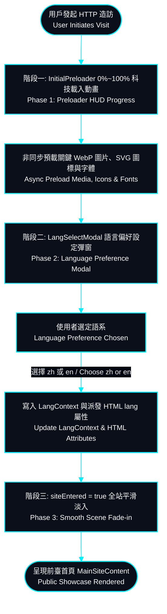
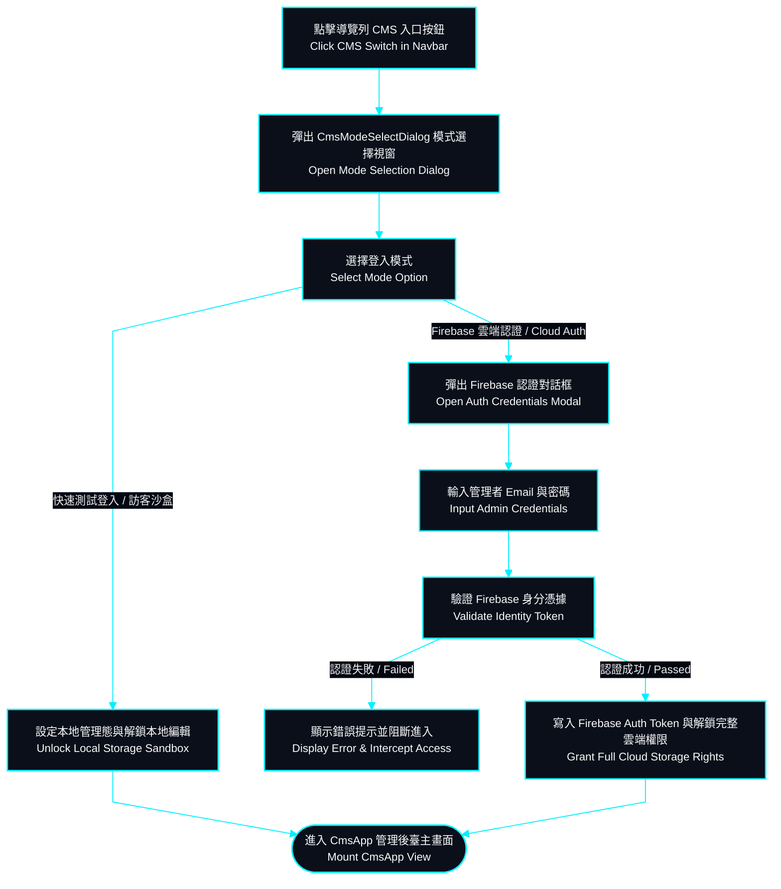
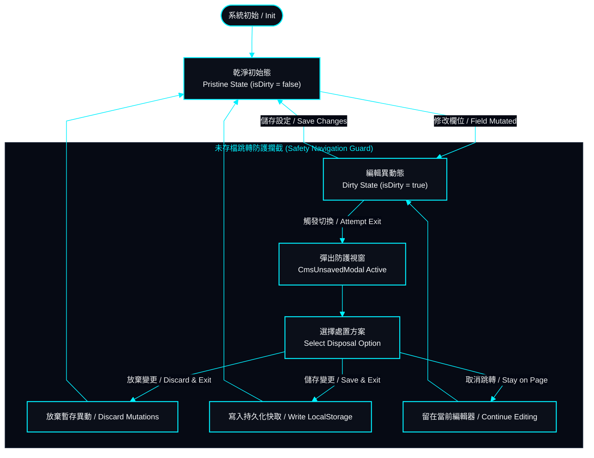
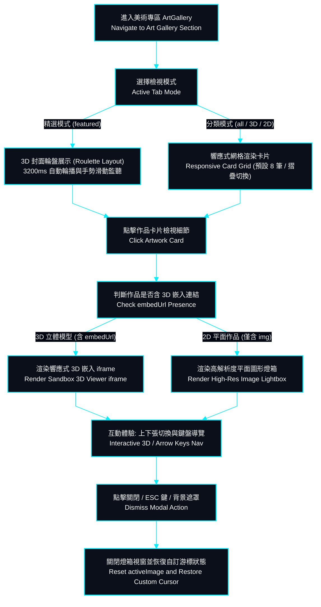

# 核心業務流程圖與狀態轉移 | Flowcharts & State Machine Specifications

> **專案作者 / Author**: 許哲誠 (HSU, CHE-CHENG)  
> **規範標準 / Compliance**: 依據《AGENTS.md》全域最高工業級工程協定第 6 章規範建置。定義系統之**使用者操作路徑、業務邏輯流程 (Flowchart) 與核心狀態機轉移 (State Diagram)**。本文件不包含 UML 類別圖與循序圖（由 `07-uml-diagrams.md` 獨立專職承擔），落實嚴格分責分離。  
> *Release: 2026-09-14*

---

## 1. 首屏造訪與語言門禁載入流程 | Initial Visit & Language Selection Flowchart

本流程定義訪客首次進入網站時之多階段加載動畫、字體與多媒體資產非同步預載、以及多語系初始化之完整路徑。  
*Defines the progressive hydration sequence, asset preloading, and dual-language preference initialization upon first visit:*

---

## 2. CMS 模式選擇與身分驗證門禁流程 | CMS Mode Selection & Auth Flowchart

本流程規範從前臺切換至管理員後臺時之認證邊界與錯誤防禦邏輯。  
*Specifies security gates, mode toggles, and fallback paths when transitioning into the admin environment:*

---

## 3. CMS 未存檔狀態智慧阻斷狀態轉移機 | Unsaved State Guard State Machine

本狀態機詳細規範當管理者修改表單欄位後，觸發切換模組、點擊外部連結或關閉視窗時之防誤觸多層防禦狀態轉移。  
*State transition model for preventing accidental data loss during active editing sessions:*

---

## 4. 美術畫廊多媒體與 3D 嵌入檢視流程 | Art Gallery & 3D Embed Viewer Flowchart

本流程定義前臺畫廊多模式展示（精選 3D 輪盤與分類響應式網格）、燈箱預覽（ArtStation 3D 嵌入檢視器與 2D 靜態作品燈箱）與鍵盤手勢導覽之實際動態展示路徑。  
*Defines category filtering, featured roulette carousel, and modal lightbox for 3D embedded iframes and 2D media:*

