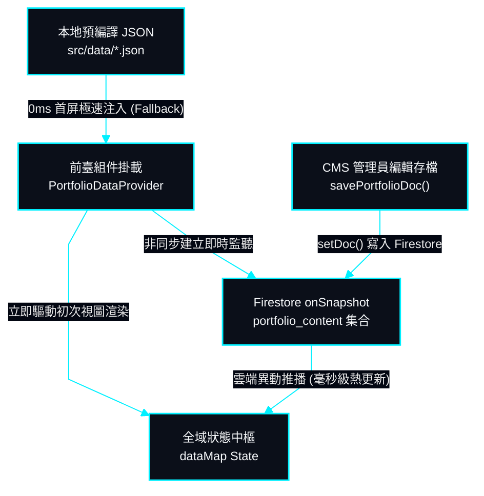

# 資料庫集合架構、快取策略與正規化結構 | Database Schema, SWR Cache & Normalized Entities

> **專案作者 / Author**: 許哲誠 (HSU, CHE-CHENG)  
> **協定標準 / Compliance**: 依據《AGENTS.md》全域最高工程中樞協定規範建置。本文件定義 Firebase Firestore NoSQL 集合結構、九大實體文檔規格、SWR 離線優先快取策略與即時串流資料流。  
> *Release: 2026-09*

---

## 1. Firestore 集合與文檔結構 | Firestore Collection & Documents Architecture

本節定義雲端資料庫之核心集合命名、文檔 ID 劃分與單一真實來源（SSOT）契約。

系統採用單一集合聚類模型，集合名稱為 `portfolio_content`。該集合劃分為九大特定文檔 ID，物理隔離各業務模組，確保細粒度寫入與高並發隔離：

| 文檔 ID (Doc ID) | 業務對應模組 (Module) | 結構型別定義 (TypeScript Interface) |
| :--- | :--- | :--- |
| `site-settings` | 網站全域戰術設定 | `SiteSettings` |
| `hero-section` | 首頁機甲看板與微表情配置 | `HeroData` |
| `about-section` | 關於我自傳、學位與指標卡 | `AboutSectionData` |
| `skills-section` | 兩大核心領域與技術矩陣 | `SkillCategory[]` |
| `projects-section` | 精選與全專案工程矩陣 | `ProjectItem[]` |
| `experience-section` | 學歷、經歷、研習與期刊論文 | `ExperienceData` |
| `certifications-section` | 國際語言檢定與專業技術證照 | `CertificationItem[]` |
| `gallery-section` | 3D 場景道具與 2D 概念畫廊 | `ArtItem[]` |
| `toeic` | 多益語言檢定單項細粒度開關 | `{ visible: boolean }` |

---

## 2. 離線優先快取與 SWR 即時串流架構 | Offline-First SWR & Real-Time Streaming

本節說明系統如何達成 0ms 首屏極速渲染與毫秒級零重新整理熱更新之平衡。

### 2.1 雙層狀態防禦機制 | Two-Tier Resilience Mechanism

雙層狀態機制確保在無網路、高延遲或未設定 Firebase 金鑰的極端狀況下，全站依然 100% 穩定可用。

- **Layer 1: 本地預編譯靜態基準 (0ms Fallback)**：當組件初始化掛載時，第一時間以 `src/data/` 中的靜態 JSON 填補狀態，確保首屏渲染無白屏、無等待旋轉圖標，累積版面位移 `CLS = 0`。
- **Layer 2: Firestore 雲端即時串流 (onSnapshot Stream)**：連線成功後，背景監聽器自動接收雲端最新資料並無感覆蓋本地狀態。前臺訪客無需手動點擊重新整理即可即刻看見最新專案或文案調整。

### 2.2 資料播種機制 | Initial Data Seeding Pipeline

為確保新部署環境或空資料庫能即刻運行，系統設計了自動播種管線。

- 呼叫 `seedFirestoreFromLocalJson()` 可將本地靜態 JSON 檔案一鍵批次寫入 Firestore `portfolio_content` 集合，迅速完成雲端環境初始化。
