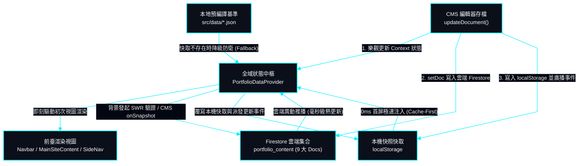

# 資料庫集合架構、快取策略與正規化結構 | Database Schema, SWR Cache & Normalized Entities

> **專案作者 / Author**: 許哲誠 (HSU, CHE-CHENG)  
> **協定標準 / Compliance**: 依據《AGENTS.md》全域最高工程中樞協定規範建置。本文件定義 Firebase Firestore NoSQL 集合結構、九大實體文檔規格、SWR 離線優先快取策略與前後臺雙向即時串流同步契約。  
> *Release: 2026-09*

---

## 1. Firestore 集合與文檔結構 | Firestore Collection & Documents Architecture

本節定義雲端資料庫之核心集合命名、文檔 ID 劃分與單一真實來源（SSOT）契約。

系統採用單一集合聚類模型，全站核心資料統一收斂於 `portfolio_content` 集合。該集合嚴格劃分為 **九大文檔 ID (PortfolioDocId)**，物理隔離各業務模組，確保細粒度寫入、獨立樂觀更新與高並發隔離：

| 雲端文檔 ID (Doc ID) | 業務對應模組 (Module) | 本機快照 Key (`localStorage`) | 前臺即時更新廣播事件 (Custom Event) | 前後臺同步狀態 (Sync Status) |
| :--- | :--- | :--- | :--- | :--- |
| `site_settings` | 網站全域設定 (標題/動效/排版/可見度) | `portfolio_site_settings_data` | `portfolio_site_settings_data_updated` | **100% 完整雙向同步** |
| `hero` | 首頁機甲看板、聯絡資訊與開關 | `portfolio_hero_data` | `portfolio_hero_data_updated` | **100% 完整雙向同步** |
| `about` | 關於我自傳、學位與指標卡 | `portfolio_about_data` | `portfolio_about_data_updated` | **100% 完整雙向同步** |
| `skills` | 技能矩陣 (全端/互動/軟體/多媒體) | `portfolio_skills_data` | `portfolio_skills_data_updated` | **100% 完整雙向同步** |
| `projects` | 專案矩陣、精選順序與標籤連結 | `portfolio_projects_data` | `portfolio_projects_data_updated` | **100% 完整雙向同步** |
| `experience` | 學歷、經歷、研習與論文期刊 | `portfolio_experience_data` | `portfolio_experience_data_updated` | **100% 完整雙向同步** |
| `certifications` | 國家技能檢定與原廠認證列表 | `portfolio_certifications_data` | `portfolio_certifications_data_updated` | **100% 完整雙向同步** |
| `gallery` | 3D 場景建模、3D 道具與 2D 畫廊 | `portfolio_gallery_data` | `portfolio_gallery_data_updated` | **100% 完整雙向同步** |
| `site_translations` | 全站多語系自訂翻譯文字字典 | `portfolio_custom_translations` | `portfolio_translations_updated` | **100% 完整雙向同步** |

---

## 2. 前後臺完整同步之九大資料結構詳細規格 | 9 Document Entity Schemas

本節詳細規範各文檔於 Firestore 中的 JSON 結構，嚴格確認所有欄位於 CMS 管理後臺修改後，皆能即時送達 Firestore 並與前臺完全同步。

### 2.1 網站全域設定文檔 (`site_settings`)

本模組儲存全站基礎架構配置，控制全域視圖層之呈現行為。

```typescript
interface SiteSettingsDoc {
  codeAnimationSpeed: number;             // 背景程式碼流速度倍率 (0.0x ~ 3.0x)
  modules_order: string[];                // 全站模組前臺渲染順序 (例: ['home', 'about', 'projects', 'skills', 'experience', 'awards', 'gallery'])
  modules_visibility: {                   // 全站模組獨立前臺顯示開關 (true: 顯示, false: 隱藏)
    home: boolean;                        // 首頁 (恆常 true 置頂鎖定)
    about: boolean;                       // 關於我模組
    projects: boolean;                    // 專案作品模組
    skills: boolean;                      // 專業技能模組
    experience: boolean;                  // 經歷模組
    awards: boolean;                      // 專業證照模組
    gallery: boolean;                     // 美術畫廊模組
  };
  zh: {
    htmlTitle: string;                    // 繁體中文網頁標題
    headerTop: string;                    // 導覽列頂部英文品牌字
    headerBottom: string;                 // 導覽列底部作者名稱
    navNames: Record<string, string>;     // 導覽列各項目中文自訂文字
  };
  en: {
    htmlTitle: string;                    // 英文網頁標題
    headerTop: string;                    // 導覽列頂部英文品牌字
    headerBottom: string;                 // 導覽列底部作者英文名
    navNames: Record<string, string>;     // 導覽列各項目英文自訂文字
  };
}
```

### 2.2 首頁看板文檔 (`hero`)

本模組定義首頁機器人看板狀態、社群連結、聯絡方式與個別顯示開關。

```typescript
interface HeroDoc {
  links: {
    github: string;                       // GitHub 個人主頁 URL
    artstation: string;                   // ArtStation 個人主頁 URL
  };
  contacts: {
    phone: string;                        // 聯絡電話
    email: string;                        // 電子郵件信箱
    line: string;                         // LINE 帳號 ID
  };
  showGithub: boolean;                    // GitHub 按鈕顯示開關
  showArtstation: boolean;                // ArtStation 按鈕顯示開關
  showPhone: boolean;                     // 電話號碼顯示開關
  showEmail: boolean;                     // Email 顯示開關
  showLine: boolean;                      // LINE ID 顯示開關
  zh: {
    title: string;                        // 主標題姓名 (許哲誠)
    subtitle: string;                     // 副標題職稱
    description: string;                  // 首頁引言自我介紹
  };
  en: {
    title: string;                        // 英文主標題姓名 (HSU, CHE-CHENG)
    subtitle: string;                     // 英文副標題職稱
    description: string;                  // 英文自我介紹引言
  };
}
```

### 2.3 關於我文檔 (`about`)

本模組儲存大頭照 URL、自傳三大章節內容以及指標數據卡（含開關與圖標選擇）。

```typescript
interface AboutDoc {
  avatarUrl: string;                      // 個人頭像資源路徑
  zh: {
    title: string;                        // 模組標題 (關於我)
    intro: string;                        // 模組前言導讀
    heading: string;                      // 區塊主標題
    p1: string;                           // 核心自傳前導段落
    bio: {
      title: string;                      // 自傳彈窗標題 (個人自傳)
      p1_title: string;                   // 第一章標題 (從遊戲程式到探索資工)
      p1: string;                         // 第一章內文
      p2_title: string;                   // 第二章標題 (系統架構思維與全端垂直整合)
      p2: string;                         // 第二章內文
      p3_title: string;                   // 第三章標題 (工程信念：系統架構與代碼品質)
      p3: string;                         // 第三章內文
    };
    stats: Array<{
      id: string;                         // 指標 ID ('exp' | 'projects' | 'toeic')
      title: string;                      // 主數值標題
      label: string;                      // 說明文字標籤
      icon: string;                       // 圖標名稱 ('graduation' | 'briefcase' | 'award')
      visible: boolean;                   // 單項前臺顯示開關
    }>;
  };
  en: {
    title: string;
    intro: string;
    heading: string;
    p1: string;
    bio: {
      title: string;
      p1_title: string;
      p1: string;
      p2_title: string;
      p2: string;
      p3_title: string;
      p3: string;
    };
    stats: Array<{
      id: string;
      title: string;
      label: string;
      icon: string;
      visible: boolean;
    }>;
  };
}
```

### 2.4 專業技能文檔 (`skills`)

本模組管理技能分類、展示階層權重（主要/通用/次要）與細部技術清單。

```typescript
interface SkillsDoc {
  zh: Array<{
    category: string;                     // 技能類別名稱 (如: 全端開發, 互動應用開發)
    catTier: 'primary' | 'common' | 'secondary'; // 視覺權重層級
    catType: 'fullstack' | 'game' | 'common' | 'media'; // 類別識別碼
    items: Array<{
      label: string;                      // 技術領域標籤 (如: 程式語言, 前端框架)
      rowType: 'tech' | 'text';           // 呈現模式 (高亮科技標籤或純文字敘述)
      content: string;                    // 技術棧詳細內容 (以 '/' 分隔)
    }>;
  }>;
  en: Array<{
    category: string;
    catTier: 'primary' | 'common' | 'secondary';
    catType: 'fullstack' | 'game' | 'common' | 'media';
    items: Array<{
      label: string;
      rowType: 'tech' | 'text';
      content: string;
    }>;
  }>;
}
```

### 2.5 專案作品文檔 (`projects`)

本模組儲存作品集清單、精選作品置頂順序、媒體展示連結與榮譽紀錄。

```typescript
interface ProjectItem {
  id: string;                             // 專案唯一代碼 (如: awakening, extinction)
  title_zh: string;                       // 專案中文標題
  title_en: string;                       // 專案英文標題
  category: 'interactive' | 'frontend' | 'fullstack' | 'linebot'; // 分類標籤
  featured: boolean;                      // 是否納入首頁精選展示
  featuredOrder?: number;                 // 精選展示順序 (1 ~ 10)
  order: number;                          // 列表排序權重
  image: string;                          // 專案封面預覽圖 URL
  videoUrl?: string;                      // 展示影片連結 (YouTube / Direct)
  ytId?: string;                          // YouTube 影片 ID
  demoUrl?: string;                       // 線上展示或網站網址
  githubUrl?: string;                     // GitHub 原始碼儲存庫 URL
  buttonOrder?: string[];                 // 互動按鈕順序 (['video', 'demo', 'github'])
  honors?: string[];                      // 中文得獎與補助紀錄清單
  honors_en?: string[];                   // 英文得獎紀錄清單
  desc: string;                           // 中文專案概要
  desc_en: string;                        // 英文專案概要
  contributions: string[];                // 中文架構貢獻與技術實作重點
  contributions_en: string[];             // 英文架構貢獻重點
  tags: string[];                         // 技術棧標籤陣列
  date: string;                           // 開發歷程區間 (如: 2025.09 - 2026.05)
  date_en: string;                        // 英文歷程區間
}
type ProjectsDoc = ProjectItem[];
```

### 2.6 經歷文檔 (`experience`)

本模組管理學歷歷程、工作經歷、研習歷程與論文期刊發表，包含全域 Google Drive 證明文件超連結。

```typescript
interface ExperienceDoc {
  driveLinks: Record<string, string>;     // 證明文件雲端硬碟 URL 對照表
  zh: {
    degrees: Array<{                      // 1. 學歷模組
      id: string;
      school: string;
      period: string;
      desc: string;
      type: 'master' | 'bachelor';
      iconType: string;
      buttons: Array<{ key: string; label: string; linkKey: string }>;
    }>;
    workExperience: Array<{               // 2. 工作經歷模組
      id: string;
      title: string;
      company: string;
      period: string;
      desc: string;
      achievements?: string[];
      tags?: string[];
      iconType: string;
    }>;
    workshops: Array<{                    // 3. 研習歷程模組
      id: string;
      title: string;
      org: string;
      period: string;
      hours: string;
      desc: string;
      proofDriveUrlKey?: string;
      iconType: string;
    }>;
    publications: Array<{                 // 4. 學術論文與期刊模組 (綠色順位主題)
      id: string;
      title: string;
      venue: string;
      period: string;
      desc: string;
      fullpaperDriveUrlKey?: string;
      slidesDriveUrlKey?: string;
      iconType: string;
    }>;
  };
  en: { ... };                            // 英文對應結構
}
```

### 2.7 專業證照文檔 (`certifications`)

本模組管理多益檢定成績與國家級/國際原廠專業技術認證清單。

```typescript
interface CertificationsDoc {
  toeic: {
    score: string;                        // 多益分數 (如: TOEIC 755)
    driveUrl: string;                     // 多益成績證明 Google Drive URL
  };
  driveFolderUrl: string;                 // 全證照雲端硬碟資料夾連結
  driveLinks: Record<string, string>;     // 各證照專屬掃描檔 Drive 連結
  zh: Array<{
    group: string;                        // 證照分類名稱 (國家技能檢定 / 國際原廠認證)
    iconType: string;                     // 分類圖標
    items: Array<{
      name: string;                       // 證照名稱
      org: string;                        // 發證單位
      linkKey: string;                    // 對應 driveLinks 之索引鍵
    }>;
  }>;
  en: Array<{
    group: string;
    iconType: string;
    items: Array<{
      name: string;
      org: string;
      linkKey: string;
    }>;
  }>;
}
```

### 2.8 美術畫廊文檔 (`gallery`)

本模組管理 3D 場景、3D 精細道具模型（含 ArtStation 3D 即時互動嵌入）與 2D 手繪/麥克筆設計。

```typescript
interface GalleryItem {
  id: string;                             // 作品代碼 (如: 3d-prop-01)
  cat: '3d-scene' | '3d-prop' | 'sketch' | 'marker'; // 分類標籤
  img: string;                            // 封面縮圖 URL
  embedUrl?: string;                      // ArtStation 3D 互動模型嵌入連結
  featured?: boolean;                     // 是否設為首頁 3D 精選作品
  featuredOrder?: number;                 // 精選展示順序 (1 ~ 10)
}
type GalleryDoc = GalleryItem[];
```

### 2.9 全站自訂翻譯文字字典 (`site_translations`)

本模組提供 CMS 動態覆蓋前臺各處微文字（如按鈕標籤、區塊前言、燈箱提示等）之 SSOT 雲端字典。

```typescript
interface SiteTranslationsDoc {
  zh: Record<string, string>;             // 繁體中文全站 key-value 翻譯字典
  en: Record<string, string>;             // 英文全站 key-value 翻譯字典
}
```

---

## 3. 離線優先快取與 SWR 即時串流架構 | Offline-First SWR & Real-Time Streaming

本節說明系統如何達成 0ms 首屏極速渲染與毫秒級零重新整理熱更新之平衡。



### 3.1 三層狀態防衛架構 | Three-Tier Resilience Architecture

本架構兼具極致首屏載入速度 (FCP < 0.3s) 與跨裝置、跨分頁實時一致性。

1. **第一層：本機持久化快照 (0ms Cache)**：
   - 掛載時優先從 `localStorage` 讀取上次成功獲取的模組資料。
   - 杜絕任何首屏等待動畫、網路骨架屏或版面重排（`CLS = 0`）。
2. **第二層：本地靜態 JSON 備援基準 (Safety Fallback)**：
   - 若訪客首次造訪或本機快取遭清除，自動回退至 `src/data/*.json`。
   - 即使 Firebase 雲端斷線或配額耗盡，全站亦 100% 正常運作。
3. **第三層：Firestore 雲端即時串流 (Cloud SSOT)**：
   - **CMS 模式**：自動掛載 9 組 `onSnapshot` 監聽器，雲端資料庫一經寫入立即推播至所有開啟的後臺與視圖。
   - **前臺展示模式 (SWR)**：首屏渲染完成後，背景延遲 5 秒發動非阻塞 `refreshFromCloud()`，靜默拉取最新雲端內容並自動覆寫本機快照。

### 3.2 前後臺雙向同步稽核防衛清單

本系統已於 `PortfolioDataContext.tsx` 與各 CMS 編輯器中落實以下防衛契約：

- **未存檔攔截警告 (`isDirty`)**：無論是修改輸入框、拖曳排序、或是切換側邊欄模組顯示開關，系統均立即調用 `setIsDirty(true)`。若管理者試圖在未存檔前離開頁面或切換標籤，將彈出二次確認彈窗予以阻斷。
- **寫入雙重保證 (`updateDocument`)**：任何 CMS 存檔操作均同步執行：
  1. 樂觀更新 React Context 狀態（即時響應）。
  2. 寫入本地 `localStorage` 快照並派發模組專屬事件（同 Tab 0ms 熱更新）。
  3. `setDoc` 寫入 Firestore 雲端資料庫，並自動記錄 `_updatedAt: serverTimestamp()`。
- **前臺三向同步連動**：
  前臺 `MainSiteContent`、`Navbar` 與 `SideNav` 同步監聽 `data.site_settings.modules_visibility` 與 `portfolio_modules_visibility_updated` 事件，無論使用者從雲端更新或本地切換開關，模組與導覽列皆同步無感切換。
