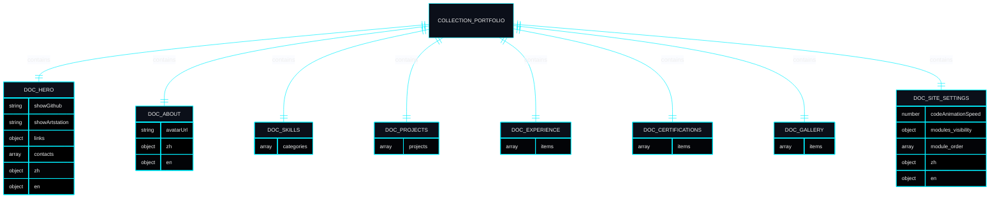

# 資料庫模型、資料字典與快取架構 (05-specs-database.md)

> **專案作者**: 許哲誠 (HSU, CHE-CHENG)  
> **更新日期**: 2026-09-30  
> **資料庫型態**: Google Cloud Firestore (Document NoSQL) 搭配瀏覽器端持久化快取

---

## 1. 資料庫實體關聯圖 (Mermaid ERD)

本系統採雙集合分離架構，`portfolio_fullstack_dev` 與 `portfolio_interactive_app_dev` 共享相同的實體結構定義：

```mermaid
%%{init: {
  'theme': 'base',
  'themeVariables': {
    'darkMode': true,
    'background': '#030712',
    'mainBkg': '#0b0f19',
    'nodeBorder': '#00f0ff',
    'textColor': '#f8fafc',
    'lineColor': '#00f0ff',
    'titleColor': '#00f0ff',
    'edgeLabelBackground': '#030712',
    'attributeBackgroundColorOdd': '#060a14',
    'attributeBackgroundColorEven': '#0b0f19',
    'fontSize': '12px'
  },
  'themeCSS': '.er.relationshipLabelBox { fill: #030712 !important; stroke: none !important; } .er.relationshipLabel { fill: #00f0ff !important; font-weight: bold; } .er.entityBox { fill: #0b0f19 !important; stroke: #00f0ff !important; } .er.entityLabel { fill: #00f0ff !important; } .er.attributeBoxOdd { fill: #060a14 !important; stroke: #1e293b !important; } .er.attributeBoxEven { fill: #0b0f19 !important; stroke: #1e293b !important; }'
}}%%
erDiagram
    COLLECTION_PORTFOLIO ||--|| DOC_HERO : contains
    COLLECTION_PORTFOLIO ||--|| DOC_ABOUT : contains
    COLLECTION_PORTFOLIO ||--|| DOC_SKILLS : contains
    COLLECTION_PORTFOLIO ||--|| DOC_PROJECTS : contains
    COLLECTION_PORTFOLIO ||--|| DOC_EXPERIENCE : contains
    COLLECTION_PORTFOLIO ||--|| DOC_CERTIFICATIONS : contains
    COLLECTION_PORTFOLIO ||--|| DOC_GALLERY : contains
    COLLECTION_PORTFOLIO ||--|| DOC_SITE_SETTINGS : contains

    DOC_HERO {
        string showGithub
        string showArtstation
        object links
        array contacts
        object zh
        object en
    }

    DOC_ABOUT {
        string avatarUrl
        object zh
        object en
    }

    DOC_SKILLS {
        array categories
    }

    DOC_PROJECTS {
        array projects
    }

    DOC_EXPERIENCE {
        array items
    }

    DOC_CERTIFICATIONS {
        array items
    }

    DOC_GALLERY {
        array items
    }

    DOC_SITE_SETTINGS {
        number codeAnimationSpeed
        object modules_visibility
        array module_order
        object zh
        object en
    }
```

---

## 2. 實體資料字典 (Data Dictionary)

### 2.1 首頁問候區塊 (`hero`)
- **`links`** (Object):
  - `github` (string): GitHub 個人頁面 URL。
  - `artstation` (string): ArtStation 作品集 URL。
- **`contacts`** (Array of Objects):
  - `id` (string): 唯一識別碼（如 `email`, `phone`, `location`）。
  - `label` (string): 顯示標籤文字。
  - `value` (string): 聯絡資訊內容。
  - `link` (string, 選用): 點擊外連跳轉目標。
  - `visible` (boolean): 前臺是否渲染。
- **`zh` / `en`** (Object): 包含 `greeting`, `name`, `title`, `subtitle`, `description`, `btn_projects`, `btn_contact`, `badge`。

### 2.2 關於我區塊 (`about`)
- **`avatarUrl`** (string): 個人去背大頭照 URL（支援本地路徑或 Firebase Storage URL）。
- **`zh` / `en`** (Object):
  - `title` (string): 區塊標題（如「關於我」）。
  - `intro` (string): 簡短一句話職涯定位。
  - `heading` (string): 次標題。
  - `p1` (string): 完整自傳第一段。
  - `stats` (Array): 統計數據列表（包含 `id`, `title`, `label`, `icon`, `visible`）。
  - `bio` (Object): 結構化成長歷程自述（包含 `p1_title`, `p1`, `p2_title`, `p2`）。

### 2.3 專業技能區塊 (`skills`)
- **`categories`** (Array of Objects):
  - `id` (string): 分類唯一鍵（如 `frontend`, `backend`, `system`, `interactive`）。
  - `title` (string): 分類名稱。
  - `icon` (string): Lucide 圖標識別碼。
  - `skills` (Array of Objects):
    - `name` (string): 技能名稱（如 `React`, `Java Spring Boot`, `Unity C#`）。
    - `level` (number): 掌握百分比 (1-100)。
    - `icon` (string): 技術圖標代碼。
    - `visible` (boolean): 是否在前臺展示。
    - `details` (Array): 具體實作成果與應用場景條列。

### 2.4 專案作品區塊 (`projects`)
- **`projects`** (Array of Objects):
  - `id` (string): 專案唯一代號（如 `portfolio-site`, `vr-exhibition`）。
  - `title` (string): 專案主名稱。
  - `subtitle` (string): 專案技術定位或副標題。
  - `description` (Object): 中英雙語詳細介紹（`zh`, `en`）。
  - `highlights` (Array of Strings): 核心成就或技術亮點。
  - `tags` (Array of Strings): 所採用的技術堆疊標籤。
  - `image` (string): 專案封面圖 URL。
  - `links` (Object): 包含 `demo`, `github`, `video` 外連。
  - `visible` (boolean): 顯隱狀態開關。
  - `featured` (boolean): 是否標註為精選主打專案。

### 2.5 學經歷區塊 (`experience`)
- **`items`** (Array of Objects):
  - `id` (string): 經歷識別碼。
  - `period` (string): 起訖年份區間（如 `2023 - 2025`）。
  - `role` (string): 職位名稱。
  - `company` (string): 公司或任職機構。
  - `type` (string): 類別 (`work` | `education` | `assistant`)。
  - `achievements` (Array of Strings): 核心職責與重要量化成果。
  - `skills` (Array of Strings): 涉及技術標籤。
  - `visible` (boolean): 顯隱控制。

### 2.6 網站全域配置 (`site_settings`)
- **`codeAnimationSpeed`** (number): 背景程式碼流瀑布速度係數。
- **`modules_visibility`** (Record<string, boolean>): 各區塊開關（如 `gallery: false` 在全端模式下預設隱藏畫廊）。
- **`module_order`** (Array of Strings): 首頁區塊縱向排列順位清單。
- **`zh` / `en`** (SiteLanguageSetting): 網頁 HTML Title、頂部狀態列文案、導覽列導向名稱。

---

## 3. 快取策略與資料失效架構 (Cache Invalidation)

1. **三級儲存讀取階層**:

```mermaid
%%{init: {
  'theme': 'base',
  'themeVariables': {
    'darkMode': true,
    'background': '#030712',
    'mainBkg': '#0b0f19',
    'nodeBorder': '#00f0ff',
    'textColor': '#f8fafc',
    'lineColor': '#00f0ff',
    'clusterBkg': '#060a14',
    'clusterBorder': '#1e293b',
    'titleColor': '#00f0ff',
    'edgeLabelBackground': '#030712',
    'fontSize': '12px'
  },
  'flowchart': {
    'curve': 'linear'
  }
}}%%
flowchart LR
    classDef hudCard fill:#0b0f19,stroke:#00f0ff,stroke-width:1.5px,color:#f8fafc;
    classDef fallbackCard fill:#060a14,stroke:#38bdf8,stroke-width:1.5px,stroke-dasharray: 4 4,color:#f8fafc;

    L1["Level 1: 記憶體狀態<br>React Context (0ms)"]:::hudCard
    L2["Level 2: 本地快照<br>LocalStorage (~2ms)"]:::hudCard
    L3["Level 3: 雲端資料庫<br>Firestore (~150ms)"]:::hudCard
    L4["安全降級備援<br>本地靜態 JSON"]:::fallbackCard

    L1 -->|"初次渲染 / 刷新"| L2
    L2 -->|"背景非同步校驗"| L3
    L3 -->|"離線 / 異常降級"| L4
```
2. **快取更新與失效機制**:
   - 當 CMS 管理員在後臺執行「儲存」時，即刻同步寫入 Firestore 與覆寫 Level 2 LocalStorage。
   - 同步觸發 `window.dispatchEvent` 發出全域快取更新事件，前臺監聽器即時接收並刷新 React 記憶體狀態，達成免重新整理即時同步。
