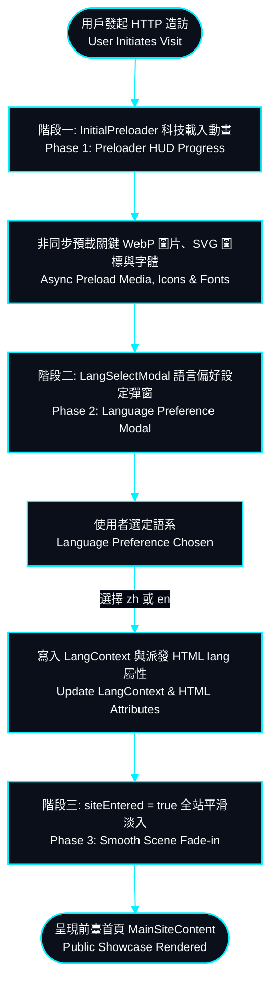
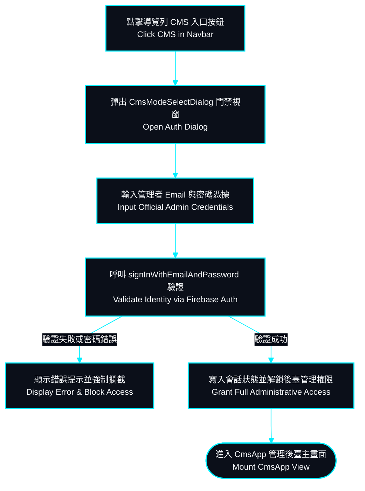
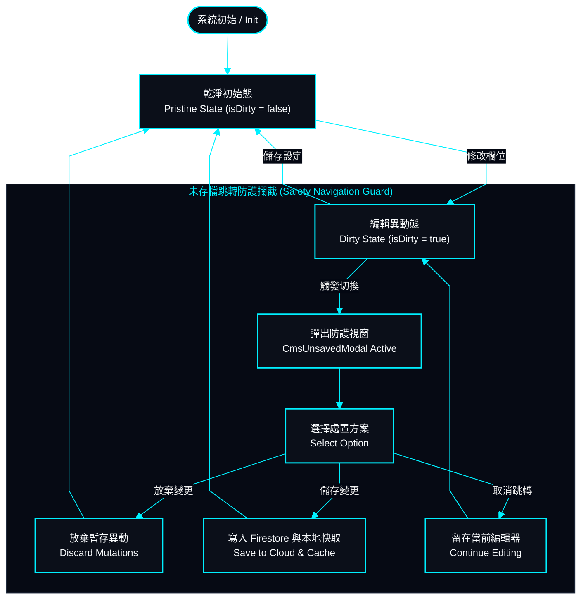
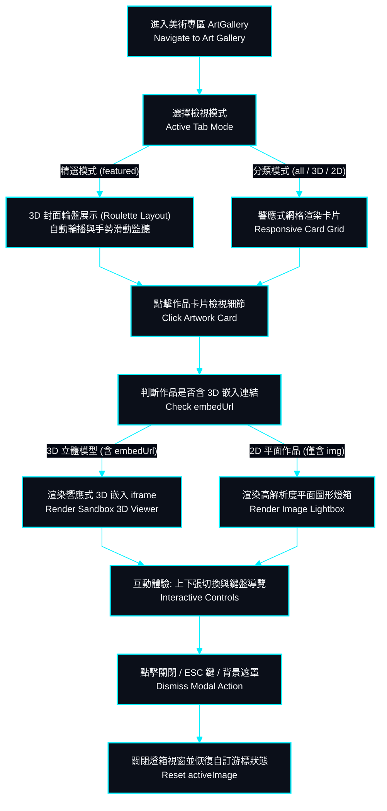

# 核心業務流程圖與狀態轉移 | Flowcharts & State Machine Specifications

> **專案作者 / Author**: 許哲誠 (HSU, CHE-CHENG)  
> **協定標準 / Compliance**: 依據《AGENTS.md》全域最高工程中樞協定規範建置。本文件定義系統之使用者操作路徑、業務邏輯流程 (Flowchart) 與核心狀態機轉移 (State Diagram)。  
> *Release: 2026-09*

---

## 1. 首屏造訪與語言門禁載入流程 | Initial Visit & Language Selection Flowchart

本流程定義訪客首次進入網站時之多階段加載動畫、多媒體資產非同步預載、以及多語系初始化之完整路徑。

---

## 2. CMS 官方身分驗證門禁流程 | CMS Official Auth Security Flowchart

本流程規範從前臺切換至管理員後臺時之官方憑證校驗與防護阻斷邏輯。

---

## 3. CMS 未存檔狀態智慧阻斷狀態轉移機 | Unsaved State Guard State Machine

本狀態機規範當管理者修改表單欄位後，觸發切換模組、點擊外部連結或關閉視窗時之防誤觸多層防禦狀態轉移。

---

## 4. 美術畫廊多媒體與 3D 嵌入檢視流程 | Art Gallery & 3D Embed Viewer Flowchart

本流程定義前臺畫廊多模式展示（精選 3D 輪盤與分類響應式網格）、燈箱預覽（ArtStation 3D 嵌入檢視器與 2D 靜態作品燈箱）之動態展示路徑。

