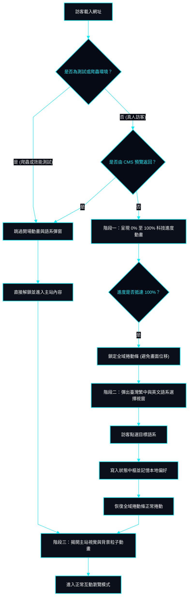
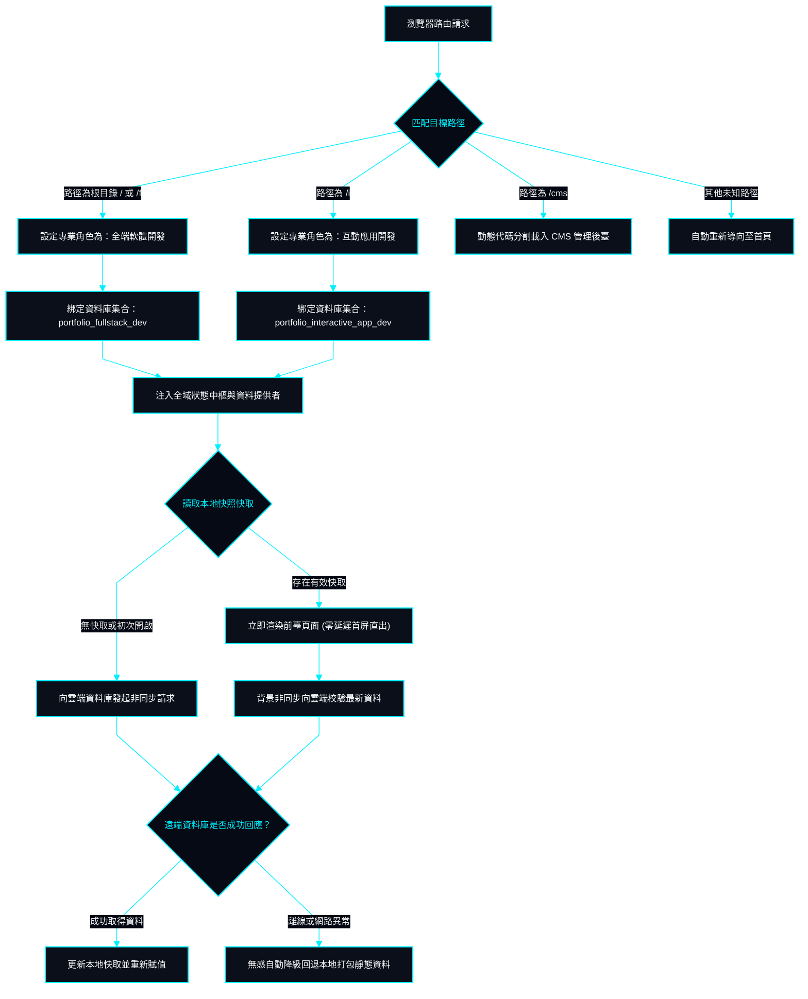
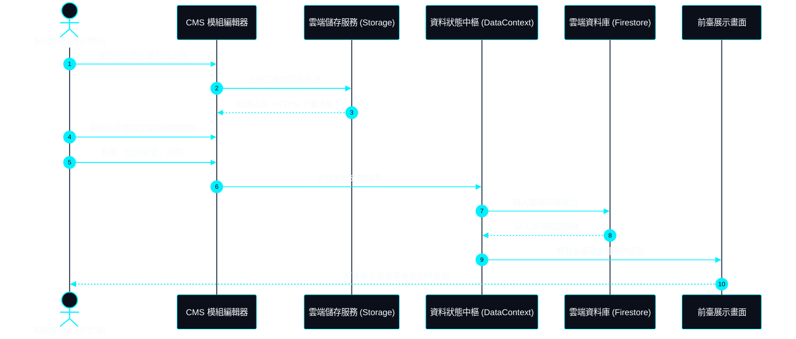
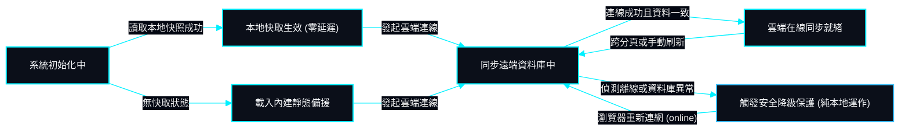

# 系統業務流程與狀態機圖表 (06-flowcharts.md)

> **專案作者**: 許哲誠 (HSU, CHE-CHENG)  
> **更新日期**: 2026-09-30  
> **圖表標準**: Mermaid 流程圖 (Flowchart) 與時序圖 (Sequence Diagram) 統一採深色霓虹科技風 (Tech HUD Style)，全篇以臺灣繁體中文為核心閱讀語言，嚴禁任何紫色雜色與語法解析錯誤。

---

## 1. 訪客進入與開場生命週期流程 (Site Entry Lifecycle)

```mermaid
%%{init: {
  'theme': 'base',
  'themeVariables': {
    'darkMode': true,
    'background': '#030712',
    'mainBkg': '#0b0f19',
    'nodeBorder': '#00f0ff',
    'textColor': '#f8fafc',
    'lineColor': '#00f0ff',
    'clusterBkg': '#060a14',
    'clusterBorder': '#1e293b',
    'titleColor': '#00f0ff',
    'edgeLabelBackground': '#030712',
    'fontSize': '12px'
  },
  'flowchart': {
    'curve': 'linear'
  }
}}%%
flowchart TD
    classDef hudCard fill:#0b0f19,stroke:#00f0ff,stroke-width:1.5px,color:#f8fafc;
    classDef decision fill:#060a14,stroke:#00f0ff,stroke-width:1.5px,color:#00f0ff;

    Start["訪客載入網址"]:::hudCard --> CheckEnv{"是否為測試或爬蟲環境？"}:::decision
    CheckEnv -->|"是 (爬蟲或效能測試)"| Bypass["跳過開場動畫與語系彈窗"]:::hudCard
    CheckEnv -->|"否 (真人訪客)"| CheckCmsSession{"是否由 CMS 預覽返回？"}:::decision
    
    CheckCmsSession -->|"是"| Bypass
    CheckCmsSession -->|"否"| ShowPreloader["階段一：呈現 0% 至 100% 科技進度動畫"]:::hudCard
    
    ShowPreloader --> PreloaderFinish{"進度是否抵達 100%？"}:::decision
    PreloaderFinish -->|"是"| LockScroll["鎖定全域捲動條 (避免畫面位移)"]:::hudCard
    LockScroll --> ShowLangModal["階段二：彈出臺灣繁中與英文語系選擇視窗"]:::hudCard
    
    Bypass --> EnterDirect["直接解鎖並進入主站內容"]:::hudCard
    ShowLangModal --> UserChooseLang["訪客點選目標語系"]:::hudCard
    UserChooseLang --> SetLangState["寫入狀態中樞並記憶本地偏好"]:::hudCard
    SetLangState --> UnlockScroll["恢復全域捲動條正常捲動"]:::hudCard
    UnlockScroll --> RevealMainSite["階段三：揭開主站視覺與背景粒子動畫"]:::hudCard
    EnterDirect --> RevealMainSite
    RevealMainSite --> End["進入正常互動瀏覽模式"]:::hudCard
```

---

## 2. 雙專業角色路徑分流與資料注入流程 (Dual-Profile Routing Flow)

```mermaid
%%{init: {
  'theme': 'base',
  'themeVariables': {
    'darkMode': true,
    'background': '#030712',
    'mainBkg': '#0b0f19',
    'nodeBorder': '#00f0ff',
    'textColor': '#f8fafc',
    'lineColor': '#00f0ff',
    'clusterBkg': '#060a14',
    'clusterBorder': '#1e293b',
    'titleColor': '#00f0ff',
    'edgeLabelBackground': '#030712',
    'fontSize': '12px'
  },
  'flowchart': {
    'curve': 'linear'
  }
}}%%
flowchart TD
    classDef hudCard fill:#0b0f19,stroke:#00f0ff,stroke-width:1.5px,color:#f8fafc;
    classDef decision fill:#060a14,stroke:#00f0ff,stroke-width:1.5px,color:#00f0ff;

    RouteReq["瀏覽器路由請求"]:::hudCard --> MatchPath{"匹配目標路徑"}:::decision
    
    MatchPath -->|"路徑為根目錄 / 或 /f"| SetFullstack["設定專業角色為：全端軟體開發"]:::hudCard
    MatchPath -->|"路徑為 /i"| SetInteractive["設定專業角色為：互動應用開發"]:::hudCard
    MatchPath -->|"路徑為 /cms"| LazyLoadCms["動態代碼分割載入 CMS 管理後臺"]:::hudCard
    MatchPath -->|"其他未知路徑"| RedirectHome["自動重新導向至首頁"]:::hudCard
    
    SetFullstack --> MapCollectionF["綁定資料庫集合：portfolio_fullstack_dev"]:::hudCard
    SetInteractive --> MapCollectionI["綁定資料庫集合：portfolio_interactive_app_dev"]:::hudCard
    
    MapCollectionF --> InjectContext["注入全域狀態中樞與資料提供者"]:::hudCard
    MapCollectionI --> InjectContext
    
    InjectContext --> ReadData{"讀取本地快照快取"}:::decision
    ReadData -->|"存在有效快取"| RenderFast["立即渲染前臺頁面 (零延遲首屏直出)"]:::hudCard
    ReadData -->|"無快取或初次開啟"| FetchRemote["向雲端資料庫發起非同步請求"]:::hudCard
    
    RenderFast --> FetchRemoteSync["背景非同步向雲端校驗最新資料"]:::hudCard
    FetchRemote --> CheckFetch{"遠端資料庫是否成功回應？"}:::decision
    FetchRemoteSync --> CheckFetch
    
    CheckFetch -->|"成功取得資料"| UpdateCache["更新本地快取並重新賦值"]:::hudCard
    CheckFetch -->|"離線或網路異常"| FallbackJSON["無感自動降級回退本地打包靜態資料"]:::hudCard
```

---

## 3. CMS 內容編輯與雲端持久化時序圖 (CMS Persistence Flow)

```mermaid
%%{init: {
  'theme': 'base',
  'themeVariables': {
    'darkMode': true,
    'background': '#030712',
    'actorBkg': '#0b0f19',
    'actorBorder': '#00f0ff',
    'actorTextColor': '#f8fafc',
    'actorLineColor': '#334155',
    'signalColor': '#00f0ff',
    'signalTextColor': '#f8fafc',
    'labelBoxBkgColor': '#0b0f19',
    'labelBoxBorderColor': '#334155',
    'labelTextColor': '#f8fafc',
    'noteBorderColor': '#00f0ff',
    'noteBkgColor': '#08131e',
    'noteTextColor': '#f8fafc'
  }
}}%%
sequenceDiagram
    autonumber
    actor Admin as 系統管理者 (許哲誠)
    participant CMS as CMS 模組編輯器
    participant Storage as 雲端儲存服務 (Storage)
    participant Context as 資料狀態中樞 (DataContext)
    participant Firestore as 雲端資料庫 (Firestore)
    participant View as 前臺展示畫面

    Admin->>CMS: 選取封面圖片並發起上傳
    CMS->>Storage: 上傳二進位圖片串流
    Storage-->>CMS: 回傳永久 HTTPS 下載連結
    Admin->>CMS: 編輯中英雙語文案與顯隱開關
    Admin->>CMS: 點擊「儲存變更」按鈕
    CMS->>Context: 派發更新文檔請求
    Context->>Firestore: 寫入雲端目標集合
    Firestore-->>Context: 寫入成功確認回執
    Context->>View: 觸發前臺狀態即時熱更新
    View-->>Admin: 前臺展示畫面零重載即時呈現
```

---

## 4. 離線與網路異常防護狀態轉移圖 (Offline Resilient State Flow)

```mermaid
%%{init: {
  'theme': 'base',
  'themeVariables': {
    'darkMode': true,
    'background': '#030712',
    'mainBkg': '#0b0f19',
    'nodeBorder': '#00f0ff',
    'textColor': '#f8fafc',
    'lineColor': '#00f0ff',
    'clusterBkg': '#060a14',
    'clusterBorder': '#1e293b',
    'titleColor': '#00f0ff',
    'edgeLabelBackground': '#030712',
    'fontSize': '12px'
  },
  'flowchart': {
    'curve': 'linear'
  }
}}%%
flowchart LR
    classDef hudCard fill:#0b0f19,stroke:#00f0ff,stroke-width:1.5px,color:#f8fafc;
    classDef alertCard fill:#0b0f19,stroke:#38bdf8,stroke-width:1.5px,color:#f8fafc;

    S1["系統初始化中"]:::hudCard -->|"讀取本地快照成功"| S2["本地快取生效 (零延遲)"]:::hudCard
    S1 -->|"無快取狀態"| S3["載入內建靜態備援"]:::hudCard

    S2 -->|"發起雲端連線"| S4["同步遠端資料庫中"]:::hudCard
    S3 -->|"發起雲端連線"| S4

    S4 -->|"連線成功且資料一致"| S5["雲端在線同步就緒"]:::hudCard
    S4 -->|"偵測離線或資料庫異常"| S6["觸發安全降級保護 (純本地運作)"]:::alertCard

    S6 -->|"瀏覽器重新連網 (online)"| S4
    S5 -->|"跨分頁或手動刷新"| S4
```
