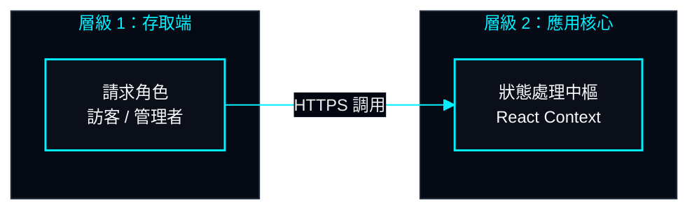
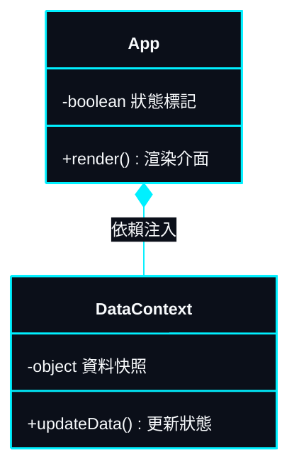
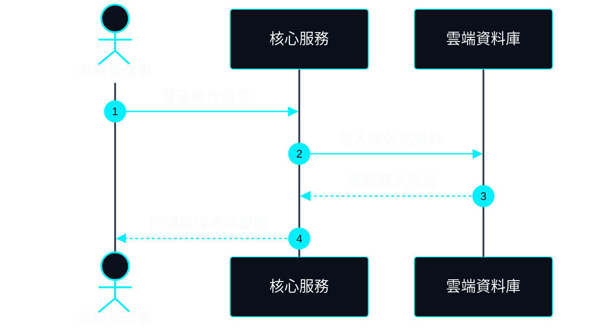

# 前端 UI/UX 與無障礙規範標準 (07-ui-ux-standards.md)

> **專案作者**: 許哲誠 (HSU, CHE-CHENG)  
> **更新日期**: 2026-09-30  
> **設計理念**: 以招募主管 (HR) 與技術主管閱讀視角為出發點，追求極致清晰度、科技美學質感與高無障礙標準。

---

## 1. 臺灣在地化排版與閱讀體驗準則

### 1.1 字體選型與層級階梯
- **系統字體堆疊 (Font Family Stack)**:
  - 繁體中文內文: `Noto Sans TC`, `PingFang TC`, `Microsoft JhengHei`, sans-serif。
  - 英文字母與數字標籤: `Inter`, `Outfit`, system-ui。
  - 程式碼、終端機與技術標籤: `Fira Code`, `JetBrains Mono`, monospace。
- **字級與行高規範**:
  - 主標題 (`h1`): `2.5rem - 3.75rem` (40px - 60px)，行高 `1.15`，字重 `800`。
  - 區塊標題 (`h2`): `1.875rem - 2.25rem` (30px - 36px)，行高 `1.25`，字重 `700`。
  - 內文與經歷自述: `1rem - 1.125rem` (16px - 18px)，行高 `1.75 - 1.8`，避免過密排版造成閱讀疲勞。

### 1.2 招募評估文案原則
- **杜絕行銷空泛用語**: 嚴格禁止「一站式」、「賦能」、「顛覆性」等空洞宣傳字眼，全面改以具體技術事實、架構決策理由與量化成果陳述。
- **自傳閱讀減負**: 段落文字控制在 3-4 行以內自動分段，搭配粗體關鍵字與標籤導引，確保面試官能於 15 秒內精準掌握候選人核心技術實力。

---

## 2. 雙模式主題色彩系統 (Dual-Theme System)

系統基於 CSS 變數定義全域動態色彩，支援無縫平滑過渡：

```css
:root {
  /* 預設深色科技模式 (Dark Mode) */
  --bg-dark: #030712;
  --bg-card: rgba(15, 23, 42, 0.75);
  --text-main: #f8fafc;
  --text-muted: #94a3b8;
  --neon-cyan: #06b6d4;
  --neon-purple: #8b5cf6;
  --border-color: rgba(255, 255, 255, 0.1);
  --glass-bg: rgba(255, 255, 255, 0.03);
}

[data-theme='light'] {
  /* 淺色簡約專業模式 (Light Mode) */
  --bg-dark: #f8fafc;
  --bg-card: rgba(255, 255, 255, 0.85);
  --text-main: #0f172a;
  --text-muted: #475569;
  --neon-cyan: #0284c7;
  --neon-purple: #7c3aed;
  --border-color: rgba(0, 0, 0, 0.08);
  --glass-bg: rgba(255, 255, 255, 0.6);
}
```

### 2.1 雙主題視覺細節防護
1. **個人大頭照 (About Avatar)**:
   - **深色模式**: 保留 RGBA Alpha 通道透光效果，容器背景維持 `bg-transparent`，搭配周圍青藍色外擴微光。
   - **淺色模式**: 徹底移除暗角覆蓋層與黑色掃描線條紋，濾鏡設定為 `brightness(1.08) contrast(1.02) saturate(1.05)`，確保臉部通透白皙，融入淺色背景。
2. **警示操作色彩一致性**:
   - 全系統所有「刪除項目 (Trash)」、「重置 (Reset)」以及「狀態為隱藏 (Hidden)」之圖標與標籤，**一律強制使用紅色系警示標記** (`#ef4444` / `text-red-500`)，強化直覺安全感。

---

## 3. 無障礙標準 (Accessibility - WCAG 2.1 AA)

1. **色彩對比度**:
   - 內文與背景對比度符合 WCAG AA 級標準以上（常規文字 $\ge 4.5:1$，大標題 $\ge 3:1$）。
2. **鍵盤可導航性 (Keyboard Focus Rings)**:
   - 所有互動元素（按鈕、外連卡片、切換開關、CMS 輸入框）均具備清晰的 `:focus-visible` 外框輪廓，確保純鍵盤使用者能順暢瀏覽。
3. **語意化 HTML 與 ARIA 屬性**:
   - 區塊均採用 `<header>`, `<nav>`, `<main>`, `<section>`, `<article>`, `<footer>` 等語意標籤。
   - 純圖標按鈕（如音效切換、語系切換、垃圾桶）均配置明確的 `aria-label` 供螢幕閱讀器朗讀。
4. **低動態偏好適應 (`prefers-reduced-motion`)**:
   - 當使用者作業系統開啟「減少動態效果」時，自動關閉粒子追蹤、音效合成動畫與跑馬燈快速位移。

---

## 4. 全域技術文件與 Mermaid 圖表視覺設計標準 (Documentation HUD Standard)

為維持專案內所有技術文件 (`README.md`、`docs/system-design/*`、`docs/*`) 閱讀體驗的高度專業感與科技美學，全域強制實施「深色 HUD 霓虹科技風」(Tech HUD Cyberpunk Style) 圖表規範。

### 4.1 核心防護原則 (Engineering Rules)
1. **嚴禁純文字 ASCII 方塊圖**: 任何系統分層、階層架構或資料流，**一律禁止使用 `┌─┐│└─┘` 等純文字方塊或純文字箭頭**，一律強制轉譯為高清晰度的深色 Mermaid 圖表。
2. **嚴禁預設白底與醜陋配色**: 嚴格禁止使用 Mermaid 預設淺灰底色、粗圓弧線或未定義 `themeVariables` 的白底圖表。
3. **強制宣告 `init` 主題變數**: 所有 Mermaid 區塊必須於第一行宣告 `%%{init: {...}}%%`，鎖定專案專屬之科技青藍與深藍黑配色。
4. **階梯卡片樣式標準**: 節點必須定義 `classDef hudCard`，背景為 `#0b0f19`，邊框為 `#00f0ff`，文字為 `#f8fafc`。
5. **長度限制與橫向優先 (Horizontal-First & Viewport Fit)**:
   - **嚴禁細長垂直高塔圖**: 嚴格禁止單列由上往下堆疊 4 個以上 subgraph / 節點，避免造成讀者需滾動多屏才能看完。
   - **橫向優先佈局 (`flowchart LR`)**: 分層架構、流程階段與管線，優先採用 `flowchart LR` 由左至右寬幅展開，符合 16:9 桌面螢幕視野。
   - **一屏完整可視 (Single Viewport)**: 節點文字高度精煉，內部換行控制在 1-2 行以內，圖表高度控制在 350px 內，保證一屏盡覽。
6. **嚴禁紫色與雜亂配色 (Color Consistency)**: 全圖色彩嚴格收斂於深黑底 `#030712`、主卡片 `#0b0f19`、科技青 `#00f0ff`、白字 `#f8fafc` 與邊框灰 `#1e293b` / 冷調藍 `#38bdf8`。**嚴禁使用紫色、洋紅等雜亂配色**，維持高階科技感。
7. **臺灣繁體中文優先 (Traditional Chinese First)**: Docs 內所有文檔與圖表是提供臺灣招募官與評審專家閱讀，**節點與流程文字一律以臺灣繁體中文為主體**，必要時採「中文 (英文專有名詞)」對照，嚴禁堆砌大段純英文。
8. **嚴格語法防護 (Zero Syntax Error)**: 節點文字若含有括號 `()`、斜線 `/`、問號等特殊字元，必須強制使用雙引號包覆 `["..."]`；連線標籤強制使用 `-->|"標籤"|`，確保在 Mermaid 12.0+ 與各平臺預覽 100% 正常渲染零報錯。

### 4.2 全域統一色票規格 (Palette Specification)

| 屬性變數 | 色票代碼 | 視覺定位與使用情境 |
| :--- | :--- | :--- |
| `background` | `#030712` | 圖表底層全域暗黑背景，無縫融入 GitHub 深色模式。 |
| `mainBkg` | `#0b0f19` | 核心卡片、節點容器深藍底色。 |
| `nodeBorder` / `lineColor` | `#00f0ff` | 霓虹科技青色（高亮科技邊框與資料訊號流連線）。 |
| `textColor` | `#f8fafc` | 高對比亮白文字，確保極致可讀性。 |
| `clusterBkg` | `#060a14` | Subgraph 邊界容器微暗底色。 |
| `clusterBorder` | `#1e293b` | Subgraph 外圍分隔沉穩邊框。 |
| `titleColor` | `#00f0ff` | 圖表主標題高亮色。 |
| `edgeLabelBackground` | `#030712` | 連線文字標籤防遮擋深色底塊。 |

### 4.3 標準 Mermaid HUD 範本庫

#### 1. 流程圖與架構圖標準範本 (`flowchart LR`)



#### 2. UML 類別關聯圖範本 (`classDiagram`)



#### 3. 循序時序圖範本 (`sequenceDiagram`)



