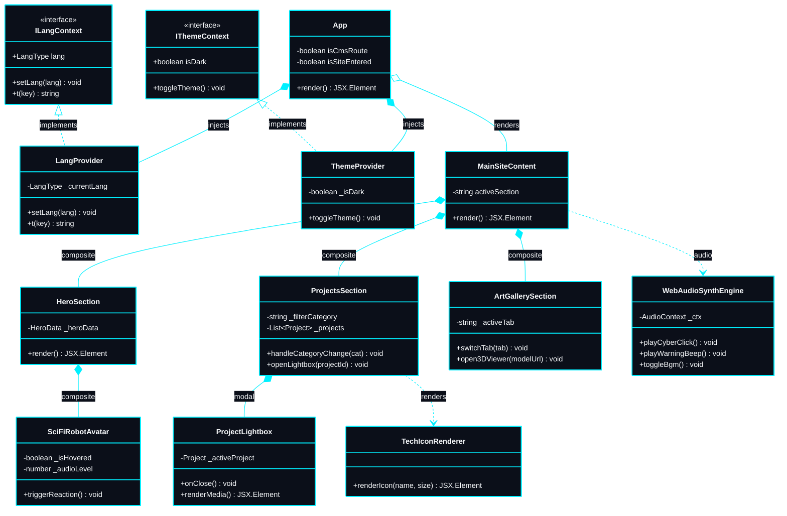
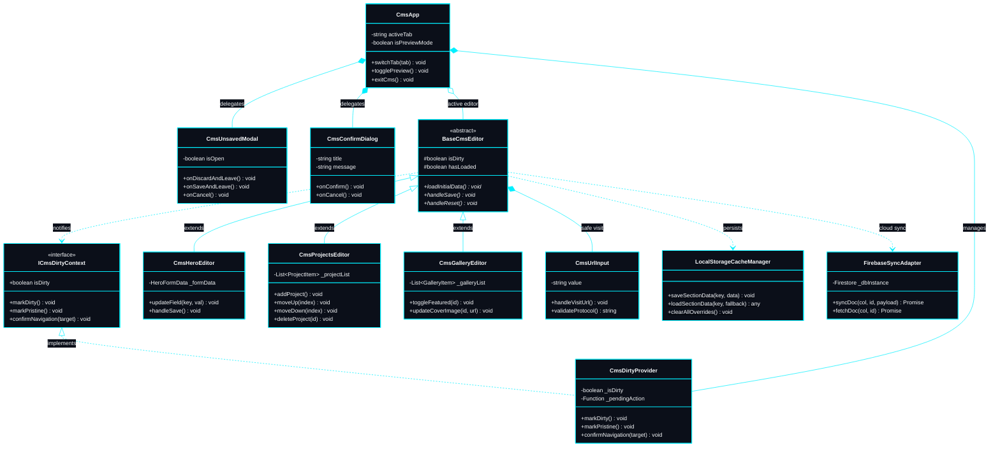
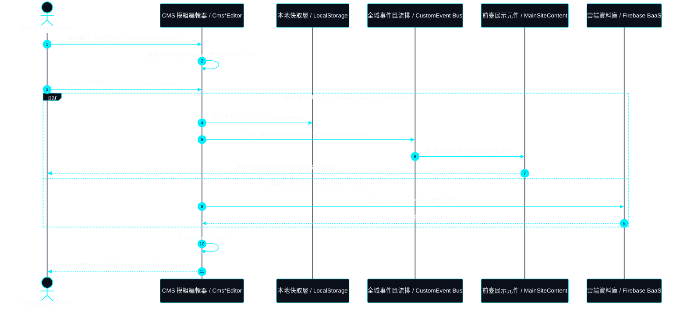
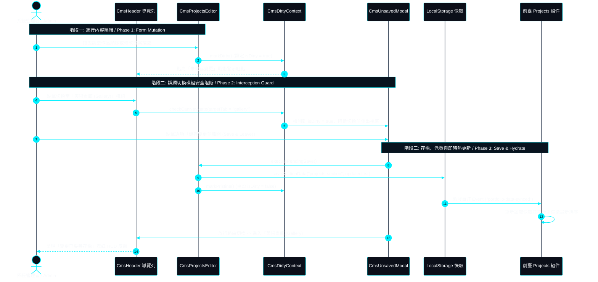

# 物件導向類別圖與系統互動循序圖 | UML Class & Sequence Diagrams

> **專案作者 / Author**: 許哲誠 (HSU, CHE-CHENG)  
> **規範標準 / Compliance**: 依據《AGENTS.md》全域最高工業級工程協定第 6 章規範建置。定義系統之**物件導向架構（Class Diagram）與跨層動態循序圖（Sequence Diagram）**。本文件不包含業務流程圖與操作狀態機（統一由 `05-flowcharts.md` 承擔），全面採用標準 **Mermaid** 語法，確保在 VS Code、GitHub 及任何 Markdown 預覽器開箱即用、免額外套件原生即時圖形渲染。  
> *Release: 2026-09-14*

---

## 1. 前臺展示系統類別關聯圖 | Public Showcase Class Diagram

本圖定義前臺展示視圖之元件階層、全域狀態 Context 與底層工具依賴關係。  
*Visualizes component composition, context injection, and utility dependencies across public showcase views:*

---

## 2. 自研 CMS 後臺架構類別關係圖 | In-House CMS Architecture Class Diagram

本圖清楚展示自研 CMS 之抽象基礎編輯器、未存檔狀態阻斷 Context、刪除二次確認對話框以及本機/雲端資料配接器。  
*Illustrates abstract base editors, unsaved state interceptors, modal portals, and persistence adapters:*

---

## 3. CMS 編輯至前臺即時雙向熱更新循序圖 | Bi-Directional Hot Sync Sequence Diagram

本圖展示管理者在 CMS 後臺進行資料異動時，如何透過 LocalStorage、自訂 CustomEvent 事件匯流排與 Firebase BaaS 達成前端視圖之 0 延遲同步刷新。  
*Demonstrates instant state synchronization between admin mutations and public views via CustomEvent and LocalStorage:*

---

## 4. 路由切換與未存檔安全阻斷循序圖 | Unsaved State Interception Sequence Diagram

本圖詳細定義管理者在未儲存狀態下觸發切換模組時，安全阻斷視窗之判斷邏輯與狀態恢復時序。  
*Detailed chronological trace of dirty state interception and graceful recovery actions:*

