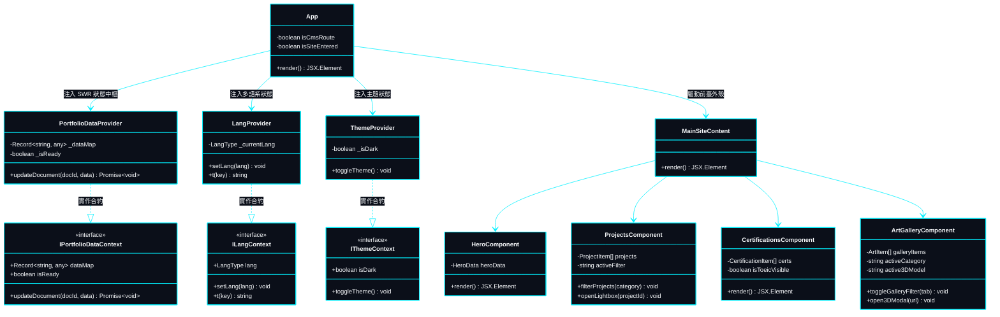
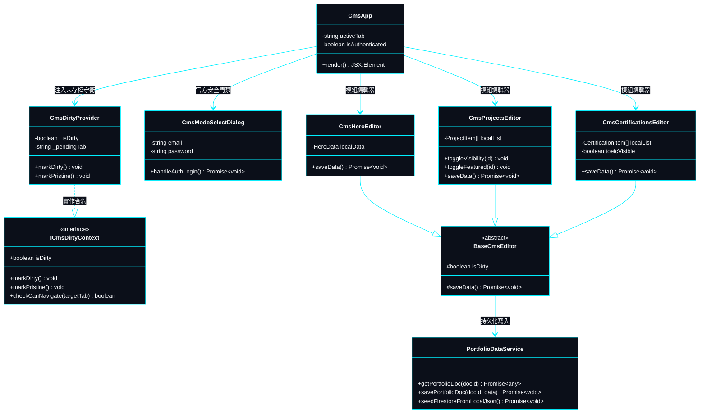
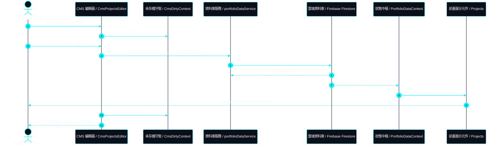
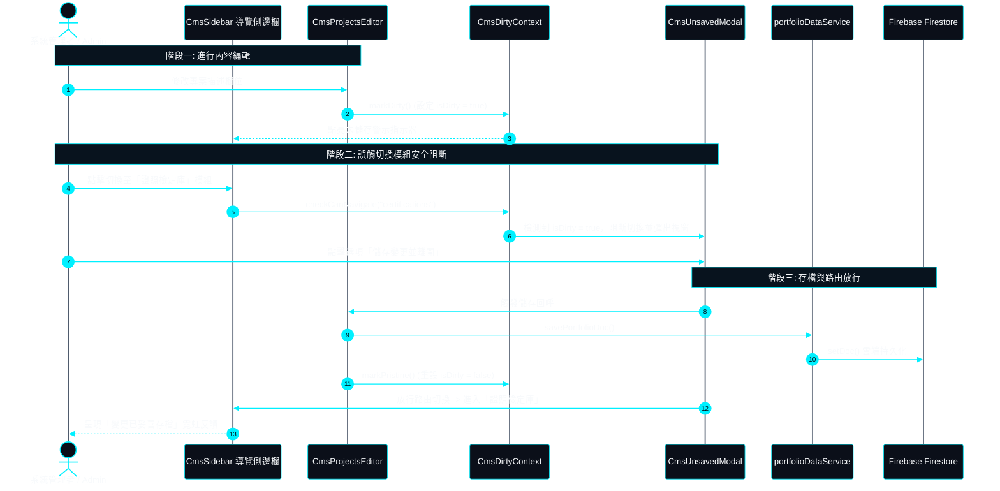

# 物件導向類別圖與系統互動循序圖 | UML Class & Sequence Diagrams

> **專案作者 / Author**: 許哲誠 (HSU, CHE-CHENG)  
> **協定標準 / Compliance**: 依據《AGENTS.md》全域最高工程中樞協定規範建置。定義系統之物件導向架構（Class Diagram）與跨層動態循序圖（Sequence Diagram）。全面採用標準 **Mermaid** 語法，確保沉穩科技風與防崩潰規範。  
> *Release: 2026-09*

---

## 1. 前臺展示系統類別關聯圖 | Public Showcase Class Diagram

本圖定義前臺展示視圖之組件階層、全域狀態 Context 與底層工具依賴關係。

---

## 2. 自研 CMS 後臺架構類別關係圖 | In-House CMS Architecture Class Diagram

本圖定義 CMS 後臺各模組編輯器、門禁控制器、未存檔攔截守衛與資料庫服務層之架構依賴。

---

## 3. CMS 編輯至前臺即時雙向熱更新循序圖 | Bi-Directional Hot Sync Sequence Diagram

本圖展示管理者在 CMS 後臺進行資料異動時，如何透過 `PortfolioDataContext` 與 Firebase Firestore 達成前臺視圖之毫秒級無感熱更新。

---

## 4. 路由切換與未存檔安全阻斷循序圖 | Unsaved State Interception Sequence Diagram

本圖詳細定義管理者在未儲存狀態下觸發切換模組時，安全阻斷視窗之判斷邏輯與狀態恢復時序。

