# 容器建置、維運與效能指標 (08-devops.md)

> **專案作者**: 許哲誠 (HSU, CHE-CHENG)  
> **更新日期**: 2026-09-30  
> **維運目標**: 達成 100% 靜態邊緣 CDN 託管、0 弱點依賴、秒級全域冷啟動與自動化建置校驗

---

## 1. 自動化建置管線 (Build & Verification Pipeline)

在發布生產環境或進行版控合併前，必須通過以下嚴格的工程驗證流水線：

```mermaid
%%{init: {
  'theme': 'base',
  'themeVariables': {
    'darkMode': true,
    'background': '#030712',
    'mainBkg': '#0b0f19',
    'nodeBorder': '#00f0ff',
    'textColor': '#f8fafc',
    'lineColor': '#00f0ff',
    'titleColor': '#00f0ff',
    'edgeLabelBackground': '#030712',
    'fontSize': '12px'
  },
  'flowchart': {
    'curve': 'linear'
  },
  'themeCSS': 'rect, .node rect { rx: 0px !important; ry: 0px !important; }'
}}%%
flowchart LR
    classDef hudCard fill:#0b0f19,stroke:#00f0ff,stroke-width:1.5px,color:#f8fafc,rx:0px,ry:0px;
    classDef distCard fill:#060a14,stroke:#38bdf8,stroke-width:1.5px,color:#f8fafc,rx:0px,ry:0px;

    A["依賴安裝<br>pnpm install"]:::hudCard --> B["靜態語法檢驗<br>oxlint"]:::hudCard
    B --> C["測試驗證 (77 項)<br>vitest run"]:::hudCard
    C --> D["型別檢查<br>tsc --noEmit"]:::hudCard
    D --> E["生產打包編譯<br>vite build"]:::hudCard
    E --> F["靜態資源產出<br>dist/ 邊緣目錄"]:::distCard
```



### 1.1 執行指令清單
- **靜態掃描**: `pnpm run lint`（調用 Rust 版 oxlint，30ms 內完成 80+ 檔案語法與死碼掃描）。
- **測試驗證**: `pnpm test`（執行 14 個測試套件、77 項單元與整合測試，包含 CMS 流程與 Firebase 降級機制）。
- **生產編譯**: `pnpm run build`（TypeScript 型別檢查 + Vite 模組分割壓縮，產出於 `dist/` 目錄）。

---

## 2. 邊緣託管與部署架構 (Edge Hosting)

### 2.1 託管平臺與設定
- **託管平臺**: Cloudflare Pages / Workers 或 Vercel Edge Network。
- **設定檔**: `wrangler.json`
  ```json
  {
    "name": "portfoliowebsite",
    "compatibility_date": "2025-03-01",
    "pages_build_output_dir": "dist"
  }
  ```
- **SPA 路由重寫**:
  - 設定所有未匹配路徑一律回退轉發至 `/index.html`（HTTP 200），確保 React Router 之 `/f`、`/i` 與 `/cms` 重新整理時不出現 404。

### 2.2 Firebase 資安規則部署
Firebase 規則檔已納入 Git 版本控制，管理員可透過 Firebase CLI 一鍵同步雲端安全策略：
```bash
# 部署 Firestore 安全規則
firebase deploy --only firestore:rules

# 部署 Storage 儲存庫規則
firebase deploy --only storage:rules
```

---

## 3. 核心網頁效能指標 (Core Web Vitals 目標)

| 指標名稱 | 縮寫 | 目標閾值 | 達成手段 |
| :--- | :--- | :--- | :--- |
| **最大內容繪製** | **LCP** | `< 1.2s` | 個人 WebP 圖片預載入、首屏靜態資料 LocalStorage 快取秒級直出。 |
| **首次輸入延遲** | **FID / INP** | `< 50ms` | CMS 編輯器與圖標庫全面代碼分割 (Code Splitting)，主執行緒無長任務 (Long Tasks)。 |
| **累積版面位移** | **CLS** | `0.00` | 圖片與 Canvas 容器預先保留寬高比 (Aspect Ratio)，開場進度條覆蓋層防止排版跳動。 |
| **首字節時間** | **TTFB** | `< 80ms` | Cloudflare 邊緣 CDN Anycast 快取與 HTTP/3 協定。 |

---

## 4. 依賴安全審查標準 (Zero CVE Policy)

- 專案強制實施零已知漏洞政策。
- 每次依賴升級或建置前執行：
  ```bash
  pnpm audit
  ```
- 若出現上游依賴之傳遞性漏洞（Transitive Dependencies），強制使用 `package.json` 中的 `pnpm.overrides` 進行版本釘選修正，直到終端輸出 `No known vulnerabilities found` 始得發布。
