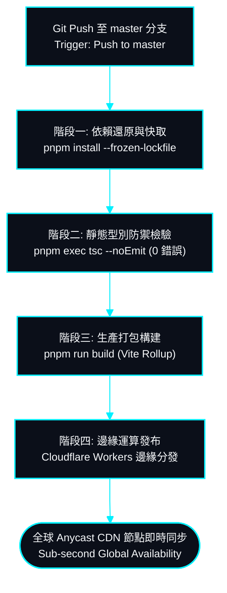

# 持續整合、邊緣運算部署與運維監控 | DevOps, Edge Deployment & CI/CD Pipeline

> **專案作者 / Author**: 許哲誠 (HSU, CHE-CHENG)  
> **協定標準 / Compliance**: 依據《AGENTS.md》全域最高工程中樞協定規範建置。本文件定義 GitHub Actions 自動化 CI 檢驗管線、Cloudflare Workers 邊緣運算部署流程與運維健康監控標準。  
> *Release: 2026-09*

---

## 1. CI/CD 自動化建置管線 | Automated CI/CD Pipeline

本節定義代碼從本地提交至全球邊緣網絡發布之自動化驗收與部署流水線。

---

## 2. 品質門禁與驗收標準 | Quality Gates & Acceptance Benchmarks

在任何發布管線中，必須 100% 通過以下三道嚴格品質閘門始得進入生產環境。

- **閘門 1: 依賴一致性防護**：強制使用 `pnpm` 套件管理器並檢查 lockfile，杜絕幽靈相依或套件版本漂移。
- **閘門 2: 0 型別錯誤靜態防禦**：TypeScript 強制全域編譯檢查，禁止存在任何隱式 `any` 或未定型別拋出。
- **閘門 3: 次秒級確定性打包**：Rollup 代碼分塊壓縮時間嚴格控制於 1000ms 內，確保高效發布。

---

## 3. Cloudflare Workers 邊緣運算架構 | Cloudflare Workers Edge Architecture

本節說明專案如何利用 Cloudflare Workers 的邊緣運算特性達成高可用性與極致快取。

- **全球 Anycast CDN 拓撲**：靜態 HTML、JS、CSS 與 WebP 資材自動推播至全球 300+ 邊緣節點，訪客就近存取。
- **單頁應用 (SPA) 路由代理**：Workers 邊緣層自動攔截前端路由，所有深層路徑請求（如 `/cms`）統一重定向至 `index.html` 進行客戶端路由分流，杜絕 404 錯誤。
- **高強度安全性標頭**：預設注入 `X-Content-Type-Options`, `X-Frame-Options` 與 CSP 安全防禦策略。
